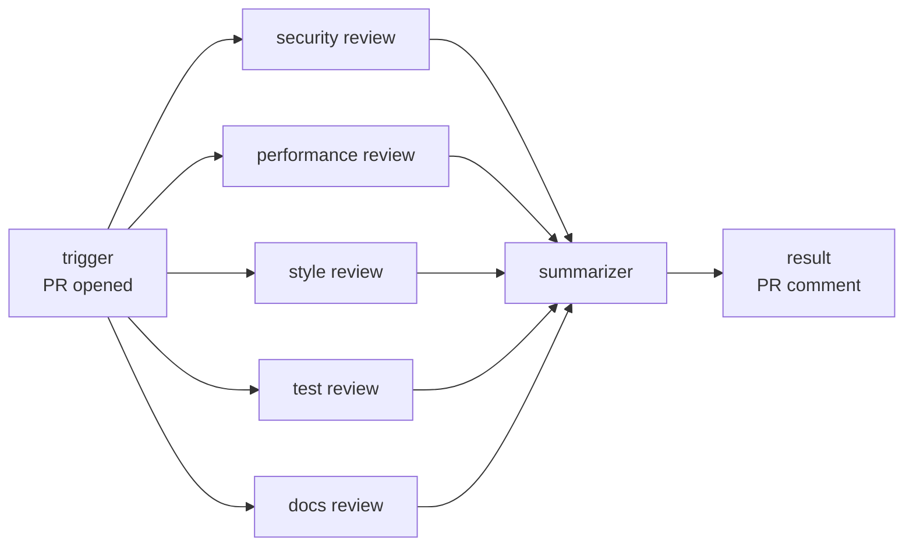
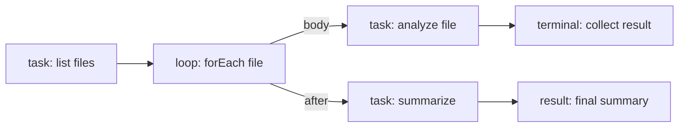

# E1-S1 decision: Workflow JSON v1 shape and interface evolution

| Tracking | Value |
| --- | --- |
| Status | Decided |
| Source | [E1-S1 task at the migration revision](https://github.com/RostrumAI/rostrum/blob/4da89f6316abd44f6ef499a27b87c60aca35e610/docs/tasks/epic-01/e1-s1-define-workflow-interface-v1.md) |
| Last updated | 2026-08-15 |

## Decision

Workflow JSON v1 is a single JSON object in camelCase. Its top level declares the interface version, workflow identity, named inputs, an unordered list of steps, and a list of conditionals. The primary authoring surface is a visual editor (to be built); the JSON shape is optimized for machine generation and parsing, not human readability.

The step graph is a directed acyclic graph (DAG). Each step declares `successors` (unconditional fan-out to one or more next steps), `conditional` (references a conditional for evaluated routing), `loop` (bounded iteration over a collection), or neither (terminal). A conditional's branches and default fallback may end the workflow instead of routing to a next step. Steps declare `dependencies` — step IDs that must complete before the step starts — enabling fan-in. All successors of a step run in parallel with no ordering guarantee. A step that is a dependency of another step must be reachable on all paths from `firstNode` to that step; this prevents a step from requiring results from a predecessor that may not have executed on every branch path.

Conditionals are a separate top-level shape. Each conditional declares which step outputs it depends on, a list of branch rules (each with a label, priority, boolean condition, and target step), and a default fallback. Conditions support `all` (AND) and `any` (OR) composition with leaf predicates that reference step outputs.

Loops are bounded `forEach` iteration. A step with a `loop` field iterates over a collection, executing a body subgraph for each element. A required `maxIterations` cap prevents unbounded execution. No `while` or `until` loops are expressible in v1.

All identifiers are UUID v7 strings. UUID v7 is time-ordered, enabling chronological sorting without relying on array position. Data moves between steps through structured `{ "ref": "..." }` references resolved against workflow inputs, upstream step outputs, and loop variables. Step types are registered by name and contribute a configuration schema; Rostrum selects the document schema and the step-type registry from the declared `interfaceVersion`, and every future release retains the v1 rule set so v1 documents validate identically forever.

The authored document carries no lifecycle fields: creation time, revision, published-version identity, and digest are server-managed and belong to E1-S3, not to the workflow JSON an author writes.

## Context

E1-S0 fixed the stack — TypeBox as the single schema language, JSON Schema 2020-12 as the public contract dialect — and its proof of concept sketched a provisional shape. That scaffold was removed after verification; it proved the toolchain, not the shape. E1-S1 now fixes the shape itself.

The epic constrains v1 to be settled before the validator and JSON Schema become public contracts. v1 describes sequential steps, branching, fan-out, fan-in, bounded loops, and terminal results, with inputs, connections, data references, conditional logic, and step-type extension answered unambiguously for a new engineer. Only unbounded and `while`/`until` loops are deferred to a future interface version.

The shape must satisfy four consumers with one definition:

- the visual editor and automated authors, which read and write the JSON;
- the shared validator (E1-04), which checks it mechanically;
- the Control API (E1-06), which carries it across the service boundary;
- the future daemon (Epic 02), which executes it.

Unknown fields and unknown step types must produce clear validation errors, not be silently ignored, so an author cannot ship a workflow Rostrum will misinterpret.

## Why these choices

| Aspect | Choice | Reason |
| --- | --- | --- |
| Field casing | camelCase | Matches the TypeScript/TypeBox toolchain and API conventions; no casing translation layer. Not chosen for human readability — the primary authoring surface is a visual editor. |
| Interface version | Top-level `interfaceVersion` string, exact-match (`"v1"`) | A capability token, not a number or semver. Exact matching means Rostrum never guesses a version's rules. Versioning methodology and runtime impact are under investigation in E1-S4. |
| Identity | `id` (UUID v7, stable), `name` (required), `description` (optional) | UUID v7 for all identifiers enables chronological sorting and machine generation; `name` and `description` are visual-editor-facing labels. |
| Inputs | Name-keyed object `inputs` where each value is a JSON Schema 2020-12 fragment | References address inputs by name; an object forbids duplicate input names by construction and uses the schema language E1-S0 already standardized. |
| Steps | Unordered array `steps` of step objects | Array order is irrelevant; execution order is determined entirely by the DAG topology. The visual editor determines display order. Duplicate step `id` is a validation error. |
| Step identity and type | `id` (UUID v7), `type` (step-type name) | `id` is the reference target; `type` selects the step's config schema from the registry. |
| Step configuration | `config` object validated against the step type's schema | The single extension point: a new step type contributes a `type` name plus a config schema, with no change to the base shape. |
| Data references | Structured `{ "ref": "..." }` value | Static and schema-checkable, unlike string interpolation, so unresolved references are detected before execution. |
| Control flow | `successors` (unconditional fan-out) XOR `conditional` (evaluated routing) XOR neither (terminal); `loop` as an iteration modifier | DAG-native: a step points forward to its successors. Multiple successors run in parallel. Conditionals are a separate shape for declarative routing. |
| Dependencies | `dependencies` array of step UUIDs | Enables fan-in: a step waits for all dependencies to complete before starting. A dependency must be reachable on all paths from `firstNode` to the step (merge-after-branch restriction). |
| Conditionals | Separate top-level `conditionals` array; steps reference by UUID | Separates routing logic from step definitions, making conditions inspectable by the visual editor and validator. Each branch has a priority (lowest wins) and a boolean condition supporting `all`/`any` groups. |
| Loops | `loop` field on steps: bounded `forEach` over a collection | `maxIterations` is required, preventing infinite loops. Only bounded iteration over a finite collection; no `while`/`until` in v1. |
| Terminal results | A step with neither `successors` nor `conditional`, typed `result`, whose `inputs` are the workflow outputs | Makes "where the workflow finishes and what it produces" a concrete, branchable step instead of a detached global output block. |
| Conditional endings | A branch rule or the default branch may omit `next`, ending the workflow with the conditional step's outputs as the terminal result | Covers the common "end workflow" default scenario without forcing a `result` step on a path that produces nothing new. |
| Lifecycle fields | Excluded from authored JSON | `createdAt`, revision, version number, and digest are server-assigned; mixing them into authored JSON couples the document to a specific save or publish event. E1-S3 defines them. |

## Specification outline

Every field is named here. Required fields are marked **required**; a field that can be omitted defaults to the stated empty value. All names are camelCase. All identifiers are UUID v7 strings.

### Top-level object

| Field | Type | Required | Meaning |
| --- | --- | --- | --- |
| `interfaceVersion` | string | **required** | The workflow interface version. v1 is the literal `"v1"`. Rostrum selects the document schema and rule set from this value. |
| `id` | string (UUID v7) | **required** | Stable workflow identifier, unique within a workspace. Referenced by the Control API and future execution requests. |
| `name` | string | **required** | Visual-editor-facing workflow name. |
| `description` | string | optional | Visual-editor-facing description. Defaults to absent. |
| `firstNode` | string (UUID v7) | **required** | The `id` of the step where execution begins. |
| `inputs` | object | optional | Workflow inputs. Each key is an input name; each value is a JSON Schema 2020-12 fragment describing the accepted value. Defaults to `{}`. |
| `steps` | array | **required** | Unordered list of step objects. Minimum length 1. Execution order follows the DAG topology, not array order. |
| `conditionals` | array | optional | List of conditional objects. Defaults to `[]`. See "Conditional shape" below. |

### Step object

Every step shares the same base shape; `config` is the step-type-specific part.

| Field | Type | Required | Meaning |
| --- | --- | --- | --- |
| `id` | string (UUID v7) | **required** | Step identifier, unique across the workflow's `steps`. The target of `firstNode`, `successors`, `dependencies`, `branches[].next`, `default.next`, and `loop.body`. |
| `type` | string | **required** | Step-type name. Selects the config schema and validation rules from the registry. |
| `config` | object | optional | Step-type-specific configuration, validated against the step type's config schema. Defaults to `{}`. |
| `inputs` | object | optional | Bindings from this step's input names to literal values or references. Defaults to `{}`. |
| `outputs` | object | optional | Declared outputs. Each key is an output name; each value is a JSON Schema 2020-12 fragment describing the produced value. Defaults to `{}`. |
| `successors` | array of strings (UUID v7) | optional | Step IDs to execute after this step completes. All successors run in parallel with no ordering guarantee. Mutually exclusive with `conditional`. |
| `dependencies` | array of strings (UUID v7) | optional | Step IDs that must complete before this step starts. Enables fan-in. A dependency must be reachable on all paths from `firstNode` to this step. Defaults to `[]`. |
| `conditional` | string (UUID v7) | optional | The `id` of a conditional object that evaluates this step's routing. Mutually exclusive with `successors`. |
| `loop` | object | optional | Bounded iteration configuration. See "Loop shape" below. Can coexist with `successors` (body runs per iteration, successors run after all iterations complete) or with neither (terminal loop). Mutually exclusive with `conditional`. |

Control-flow rule: a step has exactly one of `successors` or `conditional`, or neither (terminal). A step may additionally have `loop`. A step with neither `successors` nor `conditional` is terminal. A terminal step outside a loop body must be typed `result`; within a loop body, the terminal step may be any type, and its outputs are collected as that iteration's result (Loop rule 7). A conditional branch or default without `next` is also an ending: the workflow ends on that path, and the run's terminal result is the conditional step's resolved outputs.

### DAG topology rules

The step graph is a directed acyclic graph (DAG). The following rules are enforced at validation time:

1. **Acyclic:** No step may transitively depend on itself. A cycle is a blocking validation error.
2. **Forward-only edges:** `successors`, `branches[].next`, `default.next`, and `loop.body` must reference steps that do not transitively lead back to the current step.
3. **Dependency reachability:** Every step listed in a step's `dependencies` must be reachable on all paths from `firstNode` to that step. This prevents a step from waiting on a predecessor that may not execute on every branch path (merge-after-branch restriction). This is a v1 limitation that a future interface version may relax.
4. **Fan-out parallelism:** When a step has multiple `successors`, all successors start in parallel when the step completes. There is no ordering guarantee among parallel successors.
5. **Fan-in via dependencies:** A step with multiple `dependencies` starts only after all dependencies have completed. This enables join points where parallel branches converge.
6. **Terminal steps:** A step with neither `successors` nor `conditional` is terminal. A terminal step outside a loop body must be typed `result`; a loop body's terminal step may be any type, and its outputs are collected per iteration (Loop rule 7).
7. **Path endings:** Every reachable path must end at a terminal `result` step or at a conditional branch/default whose `next` is omitted. An end-workflow branch ends the run with the conditional step's outputs as the terminal result.

### Data references

A binding value is either a JSON literal (string, number, boolean, object, array, or null) or a reference object with the exact shape `{ "ref": "<path>" }`. A path is one of:

- `inputs.<name>` — a workflow input;
- `step.<stepId>.<outputName>` — an output declared by a step that completes before this reference resolves;
- `loop.<variable>` — the current element in a loop iteration (available only within loop body steps).

A reference resolves to the referenced value at execution time. The terminal result's workflow outputs are written the same way: a `result` step binds its `inputs`, and the resolved object is the run's terminal result.

A JSON object whose only key is `ref` with a string value is always interpreted as a reference, never as a literal. Passing such a literal object requires an escape syntax deferred to E1-03 if a real workflow needs it.

### Conditional shape

Conditionals are a separate top-level shape. A step that uses conditional routing references a conditional by its `id` via the step's `conditional` field. The conditional declares which step outputs it depends on, a list of branch rules, and a default fallback.

| Field | Type | Required | Meaning |
| --- | --- | --- | --- |
| `id` | string (UUID v7) | **required** | Conditional identifier. Referenced by a step's `conditional` field. |
| `dependencies` | array of strings (UUID v7) | **required** | Step IDs whose outputs are needed to evaluate the branch conditions. Every step referenced in a branch condition must be listed here. These steps must complete before the conditional is evaluated. |
| `branches` | array | **required** | Ordered array of branch rule objects. See below. Minimum length 1. |
| `default` | object | **required** | Fallback branch taken when no branch condition matches. See below. |

#### Branch rule object

| Field | Type | Required | Meaning |
| --- | --- | --- | --- |
| `label` | string | **required** | Visual-editor-facing name for the branch. |
| `priority` | integer (≥ 0) | **required** | Branch priority. Lower number = higher precedence. Among branches whose conditions evaluate to true, the branch with the lowest priority number is selected. |
| `condition` | object | **required** | Boolean condition expression. See "Condition expressions" below. |
| `next` | string (UUID v7) | optional | Step ID to execute if this branch is selected. Omitted: the workflow ends on this branch (see "Ending the workflow from a conditional"). |

#### Default branch object

| Field | Type | Required | Meaning |
| --- | --- | --- | --- |
| `label` | string | **required** | Visual-editor-facing name for the default branch. |
| `next` | string (UUID v7) | optional | Step ID to execute when no branch condition matches. Omitted: the workflow ends when the default is selected (see "Ending the workflow from a conditional"). |

**Ending the workflow from a conditional:** A branch rule or the default branch may omit `next`, making that outcome end the workflow instead of routing to another step. This covers the common "end workflow" default scenario — for example, a fallback when no branch condition matches — without requiring a `result` step on that path. When the workflow ends this way, the run's terminal result is the resolved outputs of the step that owns the conditional.

#### Condition expressions

A condition is either a leaf predicate or a boolean group:

**Leaf predicate:**

```json
{ "ref": "step.<stepId>.<outputName>", "op": "<operator>", "value": <json-value> }
```

Supported operators: `eq`, `neq`, `gt`, `gte`, `lt`, `lte`, `in`, `notin`, `contains`, `truthy`, `falsy`.

For `truthy` and `falsy`, the `value` field is omitted.

**AND group:**

```json
{ "all": [ <condition>, <condition>, ... ] }
```

Evaluates to true only if all child conditions are true.

**OR group:**

```json
{ "any": [ <condition>, <condition>, ... ] }
```

Evaluates to true if any child condition is true.

Groups can be nested to any depth, enabling arbitrary AND/OR composition.

### Loop shape

A step with a `loop` field performs bounded `forEach` iteration over a collection. The loop body is a subgraph within the same `steps` array, starting at the step referenced by `loop.body`.

| Field | Type | Required | Meaning |
| --- | --- | --- | --- |
| `collection` | object (ref) | **required** | Reference to the array value to iterate over, following the data-reference paths: a workflow input (`inputs.<name>`) or a step output (`step.<stepId>.<outputName>`) from a step that completes before iteration begins — including the loop step's own output (Loop rule 8). Must resolve to a finite array at execution time. |
| `maxIterations` | integer (≥ 1) | **required** | Hard cap on the number of iterations. If the collection length exceeds this value, the run fails with a structured error. |
| `variable` | string | **required** | Name under which the current element is accessible in body step inputs via `loop.<variable>`. |
| `body` | string (UUID v7) | **required** | Step ID of the body subgraph's first step. The body subgraph is validated as a separate DAG within the same `steps` array. |

**Loop rules:**

1. The body subgraph must be acyclic (same DAG rules as the top-level graph).
2. The body subgraph must have at least one terminal step (a step with neither `successors` nor `conditional`).
3. No nested loops in v1: a step within a loop body cannot itself declare a `loop` field.
4. Only bounded `forEach` is supported. No `while` or `until` loops are expressible in v1.
5. `loop` can coexist with `successors`: the body runs per iteration, and `successors` fire after all iterations complete.
6. `loop` is mutually exclusive with `conditional`.
7. Body terminal steps' outputs are collected into an array, available as the loop step's output.
8. The loop step's own handler (per its step type) runs before iteration begins, so `collection` may reference the loop step's own outputs in addition to any workflow input or upstream step output.

### Built-in step types

The shape fixes the extension mechanism, not the step catalog. Two demonstrative types are named here to make the mechanism concrete; the authoritative reference step set is selected by E2-S3.

| Type | `config` | `outputs` | Meaning |
| --- | --- | --- | --- |
| `task` | `{ "operation": "<string>" }` plus type-specific fields | Declared by the author | A deterministic unit of work. Its handler (Epic 02) produces the declared outputs. |
| `result` | none required | none | A terminal step. Its `inputs` bind the workflow outputs; the resolved `inputs` object is the run's terminal result. |

## Step-type extension rules

A step type is a registry entry keyed by its `type` string. The entry contributes the step type's contract:

- a JSON Schema 2020-12 fragment for the step's `config` object;
- any additional validation rules beyond the config schema, such as required `outputs` or a constraint on `config` values.

Rostrum validates a step's `config` against the schema registered for its `type`. A step whose `type` is not registered is a blocking finding — the workflow is invalid, not silently reinterpreted. A step type whose `config` schema changes incompatibly is treated as an interface change: additive relaxations keep existing documents valid, while a change that invalidates a previously valid `config` requires a new interface version or a new type name. Adding a step type never changes the base document shape, so it is a backward- and forward-compatible extension in both directions: older releases reject the new type explicitly, and newer releases read existing types identically.

## Interface versioning and evolution

- Rostrum supports a set of interface versions by retaining one immutable rule set per version: the document schema plus the step-type registry for that version. v1 is the first such set.
- Selecting rules is an exact match on `interfaceVersion`. An unknown version is a blocking finding, never a silent fallback to v1 or to the nearest version.
- Additive change within a version — a new optional top-level field, a new step type, a relaxed validation — is allowed only if every previously valid v1 document remains valid. A new step type is additive: it extends the registry, and older releases reject it explicitly as unsupported rather than misreading it.
- Breaking change requires a new interface version (`"v2"`, `"v3"`, ...). Rostrum retains the v1 rule set alongside it, so a v1 document keeps validating and executing exactly as before. There is no automatic upgrade or rewriting: a v1 document stays v1.
- Future releases continue to recognize v1 because the v1 schema, step-type registry, and validation rules are frozen and shipped forward, not replaced. Recognition means "validated and executed with v1 semantics", not "migrated to the newest version".
- [E1-S4](e1-s4-interface-versioning-methodology.md) defines operational and metadata changes, interface-version bump triggers, and the effect of version changes on active runs. It does not alter the exact-match token contract for v1.

## Representative examples

### Valid — sequential with terminal result

```json
{
  "interfaceVersion": "v1",
  "id": "0192b0a0-7e1d-7000-8000-000000000001",
  "name": "Greet and summarize",
  "description": "Bind a name, produce a greeting, return it.",
  "firstNode": "0192b0a0-7e1d-7000-8000-000000000002",
  "inputs": {
    "name": { "type": "string" }
  },
  "steps": [
    {
      "id": "0192b0a0-7e1d-7000-8000-000000000002",
      "type": "task",
      "config": { "operation": "greet" },
      "inputs": { "name": { "ref": "inputs.name" } },
      "outputs": { "greeting": { "type": "string" } },
      "successors": ["0192b0a0-7e1d-7000-8000-000000000003"]
    },
    {
      "id": "0192b0a0-7e1d-7000-8000-000000000003",
      "type": "result",
      "inputs": { "greeting": { "ref": "step.0192b0a0-7e1d-7000-8000-000000000002.greeting" } }
    }
  ]
}
```

### Valid — conditional branching with two terminal results

```json
{
  "interfaceVersion": "v1",
  "id": "0192b0a0-7e1d-7000-8000-000000000010",
  "name": "Classify a score",
  "firstNode": "0192b0a0-7e1d-7000-8000-000000000011",
  "inputs": {
    "score": { "type": "number" }
  },
  "steps": [
    {
      "id": "0192b0a0-7e1d-7000-8000-000000000011",
      "type": "task",
      "config": { "operation": "threshold" },
      "inputs": { "score": { "ref": "inputs.score" } },
      "outputs": { "decision": { "type": "string" } },
      "conditional": "0192b0a0-7e1d-7000-8000-000000000012"
    },
    {
      "id": "0192b0a0-7e1d-7000-8000-000000000013",
      "type": "result",
      "inputs": { "decision": { "ref": "step.0192b0a0-7e1d-7000-8000-000000000011.decision" } }
    },
    {
      "id": "0192b0a0-7e1d-7000-8000-000000000014",
      "type": "result",
      "inputs": { "decision": { "ref": "step.0192b0a0-7e1d-7000-8000-000000000011.decision" } }
    }
  ],
  "conditionals": [
    {
      "id": "0192b0a0-7e1d-7000-8000-000000000012",
      "dependencies": ["0192b0a0-7e1d-7000-8000-000000000011"],
      "branches": [
        {
          "label": "high-score",
          "priority": 0,
          "condition": { "ref": "step.0192b0a0-7e1d-7000-8000-000000000011.decision", "op": "eq", "value": "high" },
          "next": "0192b0a0-7e1d-7000-8000-000000000013"
        },
        {
          "label": "low-score",
          "priority": 1,
          "condition": { "ref": "step.0192b0a0-7e1d-7000-8000-000000000011.decision", "op": "eq", "value": "low" },
          "next": "0192b0a0-7e1d-7000-8000-000000000014"
        }
      ],
      "default": {
        "label": "fallback",
        "next": "0192b0a0-7e1d-7000-8000-000000000014"
      }
    }
  ]
}
```

### Valid — fan-out and fan-in (PR review workflow)

A PR-opened trigger spawns 5 review agents in parallel. When all 5 complete, a summarizer collects their outputs, then a terminal result produces the PR comment.



```json
{
  "interfaceVersion": "v1",
  "id": "0192b0a0-7e1d-7000-8000-000000000020",
  "name": "PR review fan-out",
  "description": "Spawn 5 review agents, summarize, comment on PR.",
  "firstNode": "0192b0a0-7e1d-7000-8000-000000000021",
  "inputs": {
    "prNumber": { "type": "number" },
    "repository": { "type": "string" }
  },
  "steps": [
    {
      "id": "0192b0a0-7e1d-7000-8000-000000000021",
      "type": "task",
      "config": { "operation": "pr-trigger" },
      "inputs": {
        "prNumber": { "ref": "inputs.prNumber" },
        "repository": { "ref": "inputs.repository" }
      },
      "outputs": { "diff": { "type": "string" } },
      "successors": [
        "0192b0a0-7e1d-7000-8000-000000000022",
        "0192b0a0-7e1d-7000-8000-000000000023",
        "0192b0a0-7e1d-7000-8000-000000000024",
        "0192b0a0-7e1d-7000-8000-000000000025",
        "0192b0a0-7e1d-7000-8000-000000000026"
      ]
    },
    {
      "id": "0192b0a0-7e1d-7000-8000-000000000022",
      "type": "task",
      "config": { "operation": "security-review" },
      "inputs": { "diff": { "ref": "step.0192b0a0-7e1d-7000-8000-000000000021.diff" } },
      "outputs": { "findings": { "type": "string" } }
    },
    {
      "id": "0192b0a0-7e1d-7000-8000-000000000023",
      "type": "task",
      "config": { "operation": "performance-review" },
      "inputs": { "diff": { "ref": "step.0192b0a0-7e1d-7000-8000-000000000021.diff" } },
      "outputs": { "findings": { "type": "string" } }
    },
    {
      "id": "0192b0a0-7e1d-7000-8000-000000000024",
      "type": "task",
      "config": { "operation": "style-review" },
      "inputs": { "diff": { "ref": "step.0192b0a0-7e1d-7000-8000-000000000021.diff" } },
      "outputs": { "findings": { "type": "string" } }
    },
    {
      "id": "0192b0a0-7e1d-7000-8000-000000000025",
      "type": "task",
      "config": { "operation": "test-review" },
      "inputs": { "diff": { "ref": "step.0192b0a0-7e1d-7000-8000-000000000021.diff" } },
      "outputs": { "findings": { "type": "string" } }
    },
    {
      "id": "0192b0a0-7e1d-7000-8000-000000000026",
      "type": "task",
      "config": { "operation": "docs-review" },
      "inputs": { "diff": { "ref": "step.0192b0a0-7e1d-7000-8000-000000000021.diff" } },
      "outputs": { "findings": { "type": "string" } }
    },
    {
      "id": "0192b0a0-7e1d-7000-8000-000000000027",
      "type": "task",
      "config": { "operation": "summarize" },
      "inputs": {
        "security": { "ref": "step.0192b0a0-7e1d-7000-8000-000000000022.findings" },
        "performance": { "ref": "step.0192b0a0-7e1d-7000-8000-000000000023.findings" },
        "style": { "ref": "step.0192b0a0-7e1d-7000-8000-000000000024.findings" },
        "test": { "ref": "step.0192b0a0-7e1d-7000-8000-000000000025.findings" },
        "docs": { "ref": "step.0192b0a0-7e1d-7000-8000-000000000026.findings" }
      },
      "outputs": { "summary": { "type": "string" } },
      "dependencies": [
        "0192b0a0-7e1d-7000-8000-000000000022",
        "0192b0a0-7e1d-7000-8000-000000000023",
        "0192b0a0-7e1d-7000-8000-000000000024",
        "0192b0a0-7e1d-7000-8000-000000000025",
        "0192b0a0-7e1d-7000-8000-000000000026"
      ],
      "successors": ["0192b0a0-7e1d-7000-8000-000000000028"]
    },
    {
      "id": "0192b0a0-7e1d-7000-8000-000000000028",
      "type": "result",
      "inputs": { "summary": { "ref": "step.0192b0a0-7e1d-7000-8000-000000000027.summary" } }
    }
  ]
}
```

### Valid — bounded loop over a collection

A workflow receives a list of files, loops over each to run analysis, then produces a summary of all results.



```json
{
  "interfaceVersion": "v1",
  "id": "0192b0a0-7e1d-7000-8000-000000000030",
  "name": "Batch file analysis",
  "description": "Loop over files, analyze each, summarize all.",
  "firstNode": "0192b0a0-7e1d-7000-8000-000000000031",
  "inputs": {
    "files": { "type": "array", "items": { "type": "string" } }
  },
  "steps": [
    {
      "id": "0192b0a0-7e1d-7000-8000-000000000031",
      "type": "task",
      "config": { "operation": "list-files" },
      "inputs": { "files": { "ref": "inputs.files" } },
      "outputs": { "fileList": { "type": "array", "items": { "type": "string" } } },
      "loop": {
        "collection": { "ref": "step.0192b0a0-7e1d-7000-8000-000000000031.fileList" },
        "maxIterations": 50,
        "variable": "file",
        "body": "0192b0a0-7e1d-7000-8000-000000000032"
      },
      "successors": ["0192b0a0-7e1d-7000-8000-000000000033"]
    },
    {
      "id": "0192b0a0-7e1d-7000-8000-000000000032",
      "type": "task",
      "config": { "operation": "analyze-file" },
      "inputs": { "file": { "ref": "loop.file" } },
      "outputs": { "analysis": { "type": "string" } }
    },
    {
      "id": "0192b0a0-7e1d-7000-8000-000000000033",
      "type": "task",
      "config": { "operation": "summarize" },
      "inputs": {
        "analyses": { "ref": "step.0192b0a0-7e1d-7000-8000-000000000031.results" }
      },
      "outputs": { "summary": { "type": "string" } },
      "successors": ["0192b0a0-7e1d-7000-8000-000000000034"]
    },
    {
      "id": "0192b0a0-7e1d-7000-8000-000000000034",
      "type": "result",
      "inputs": { "summary": { "ref": "step.0192b0a0-7e1d-7000-8000-000000000033.summary" } }
    }
  ]
}
```

### Valid — conditional with AND/OR groups

```json
{
  "interfaceVersion": "v1",
  "id": "0192b0a0-7e1d-7000-8000-000000000040",
  "name": "Conditional with grouped logic",
  "firstNode": "0192b0a0-7e1d-7000-8000-000000000041",
  "inputs": {
    "score": { "type": "number" }
  },
  "steps": [
    {
      "id": "0192b0a0-7e1d-7000-8000-000000000041",
      "type": "task",
      "config": { "operation": "evaluate" },
      "inputs": { "score": { "ref": "inputs.score" } },
      "outputs": { "score": { "type": "number" }, "category": { "type": "string" } },
      "conditional": "0192b0a0-7e1d-7000-8000-000000000042"
    },
    {
      "id": "0192b0a0-7e1d-7000-8000-000000000043",
      "type": "result",
      "inputs": { "category": { "ref": "step.0192b0a0-7e1d-7000-8000-000000000041.category" } }
    },
    {
      "id": "0192b0a0-7e1d-7000-8000-000000000044",
      "type": "result",
      "inputs": { "category": { "ref": "step.0192b0a0-7e1d-7000-8000-000000000041.category" } }
    }
  ],
  "conditionals": [
    {
      "id": "0192b0a0-7e1d-7000-8000-000000000042",
      "dependencies": ["0192b0a0-7e1d-7000-8000-000000000041"],
      "branches": [
        {
          "label": "critical-security",
          "priority": 0,
          "condition": {
            "all": [
              { "ref": "step.0192b0a0-7e1d-7000-8000-000000000041.score", "op": "gte", "value": 80 },
              {
                "any": [
                  { "ref": "step.0192b0a0-7e1d-7000-8000-000000000041.category", "op": "eq", "value": "security" },
                  { "ref": "step.0192b0a0-7e1d-7000-8000-000000000041.category", "op": "eq", "value": "critical" }
                ]
              }
            ]
          },
          "next": "0192b0a0-7e1d-7000-8000-000000000043"
        },
        {
          "label": "standard",
          "priority": 1,
          "condition": { "ref": "step.0192b0a0-7e1d-7000-8000-000000000041.score", "op": "lt", "value": 80 },
          "next": "0192b0a0-7e1d-7000-8000-000000000044"
        }
      ],
      "default": {
        "label": "fallback",
        "next": "0192b0a0-7e1d-7000-8000-000000000044"
      }
    }
  ]
}
```

### Incomplete — valid JSON, fails validation

Syntactically valid and saveable as a draft, but not publishable: `successors` names a step that does not exist and the workflow has no terminal result.

```json
{
  "interfaceVersion": "v1",
  "id": "0192b0a0-7e1d-7000-8000-000000000050",
  "name": "Unfinished workflow",
  "firstNode": "0192b0a0-7e1d-7000-8000-000000000051",
  "steps": [
    { "id": "0192b0a0-7e1d-7000-8000-000000000051", "type": "task", "successors": ["0192b0a0-7e1d-7000-8000-000000000099"] }
  ]
}
```

### Invalid — unsupported step type

Fails validation because `no-such-type` is not registered; the error must be explicit, not ignored.

```json
{
  "interfaceVersion": "v1",
  "id": "0192b0a0-7e1d-7000-8000-000000000060",
  "name": "Unknown step type",
  "firstNode": "0192b0a0-7e1d-7000-8000-000000000061",
  "steps": [
    { "id": "0192b0a0-7e1d-7000-8000-000000000061", "type": "no-such-type" }
  ]
}
```

### Invalid — unknown interface version

Fails validation because no rule set exists for `v2` in a release that ships only v1; it is never treated as v1.

```json
{
  "interfaceVersion": "v2",
  "id": "0192b0a0-7e1d-7000-8000-000000000070",
  "name": "Not yet supported",
  "firstNode": "0192b0a0-7e1d-7000-8000-000000000071",
  "steps": [
    { "id": "0192b0a0-7e1d-7000-8000-000000000071", "type": "task", "config": { "operation": "noop" } }
  ]
}
```

## Alternatives considered

| Alternative | Rejected because |
| --- | --- |
| Interface version as integer or semver | Implies numeric ordering Rostrum never needs; exact-match string tokens make "known version" a plain membership test with no ordering or range logic. |
| String-interpolation references (`"${inputs.name}"`) | Requires string parsing, is invisible to the schema, and defeats static reference resolution; structured `{ "ref": "..." }` values are schema-checkable before execution. |
| A separate edge/connection list apart from steps | Spreads control flow across the document and adds a cross-reference layer; `successors`/`dependencies`/`conditionals` on the step keep flow local and inspectable. |
| Single `next` string for sequential flow | Cannot express fan-out or fan-in; `successors` array handles sequential (one element) and parallel (multiple elements) uniformly. |
| Ordered `steps` array | Couples execution order to array position; UUID v7 IDs and DAG topology determine order, not array position. |
| Human-readable step IDs | The primary authoring surface is a visual editor; UUID v7 enables machine generation, chronological sorting, and collision-free identification without human-chosen names. |
| Outcome-based branching (handler produces an outcome string) | Hides conditional logic in the handler, making it invisible to the validator and visual editor; declarative conditions with `all`/`any` groups make routing inspectable and statically checkable. |
| Embedded conditional logic in steps | Couples routing logic to step definitions; a separate `conditionals` shape makes conditions reusable, inspectable, and independently validatable. |
| `while`/`until` loops | Risk of infinite execution; bounded `forEach` with required `maxIterations` prevents unbounded runs while covering the common iteration-over-collection case. |
| One inline `anyOf` union enumerating every step type | Breaks the extension promise: adding a step type would rewrite the base schema, and unknown types would surface as opaque union failures instead of a clear unsupported-type finding. |
| A single top-level `outputs` declaration | Cannot express per-branch terminal results; a terminal `result` step makes each finish point a concrete, referenceable step. |
| `createdAt` (and other lifecycle fields) inside authored JSON | Couples the document to one save or publish event and forces authors to fabricate or omit server-owned values; the boundary keeps authored JSON author-only. |

## Deferred decisions

- The authoritative step-type catalog and each type's config schema and handler semantics are selected by E2-S3 and later epics. This record fixes only the extension mechanism and the two demonstrative types.
- Reference-literal escaping for values that are the literal object `{ "ref": "..." }` is deferred to E1-03 if a workflow requires it.
- Lifecycle identifiers — creation time, draft revision, published-version number, and digest — are E1-S3's scope and are intentionally absent from the authored shape.
- Versioning methodology — what triggers an interface version bump (operational vs metadata changes), and how version changes affect actively running workflows — is E1-S4's scope. The current exact-match token contract for v1 is not altered by this investigation.
- Validation behavior — which checks run, in what order, and what findings they produce — is E1-S2's scope. E1-S2 covers DAG cycle detection, dependency reachability, fan-out/branch target validation, loop bound enforcement, and conditional condition validation.
- Unbounded loops and `while`/`until` loops are deferred to a future interface version. v1 supports only bounded `forEach` iteration with a required `maxIterations` cap.
- Nested loops (a loop body step that itself declares a `loop` field) are deferred to a future interface version.
- Relaxation of the merge-after-branch restriction (allowing a dependency that is not reachable on all paths) is deferred to a future interface version.

## Verification

This record is complete when a reviewer can confirm, by reading it, that:

- the specification outline names every v1 field and covers inputs, steps, connections, branches, data references, terminal results, conditionals, and loops;
- the DAG topology rules are explicit: acyclic requirement, dependency reachability, fan-out parallelism, fan-in via dependencies, terminal step definition, and path endings (every path ends at a `result` step or an end-workflow branch/default);
- the conditional shape is defined as a separate top-level concept with branch rules (label, priority, condition, optional next), default fallback, `all`/`any` condition composition, and leaf predicate operators;
- the loop shape is defined with `collection`, `maxIterations`, `variable`, and `body`; its limitations (no while/until, no nested loops, bounded collections only) and collection sources (workflow inputs or step outputs) are stated;
- all identifiers are UUID v7;
- the interface-version and step-extension rules are explicit;
- the examples include valid workflows demonstrating sequential, conditional, fan-out/fan-in, loop, and grouped conditional logic, plus incomplete and invalid workflows;
- the evolution rules explain how a future release continues to recognize v1;
- the deferred decisions reference E1-S2 (validation), E1-S3 (lifecycle), and E1-S4 (versioning methodology) with clear scope boundaries.

The product owner and implementing engineer approve this decision before E1-S2, E1-S3, and E1-S4 build on it and before E1-03 turns it into the public specification and JSON Schema.
