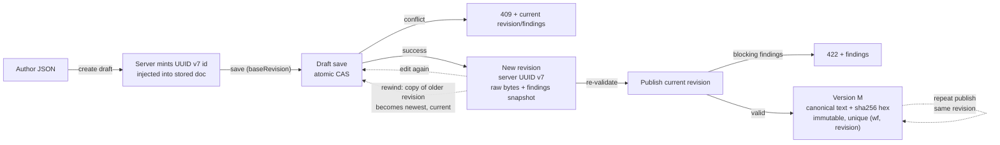

# E1-S3 decision: Draft revision and publication lifecycle

| Tracking | Value |
| --- | --- |
| Status | Decided |
| Source | [E1-S3 task at the migration revision](https://github.com/RostrumAI/rostrum/blob/4da89f6316abd44f6ef499a27b87c60aca35e610/docs/tasks/epic-01/e1-s3-define-draft-publication-lifecycle.md) |
| Last updated | 2026-08-25 |

## Decision

**The three objects.** A **draft** is the workflow's working copy — what the editor shows and what the author edits. Every successful save creates a new **revision**: a checkpoint of the draft holding the exact bytes the author submitted plus a snapshot of validation findings. The draft's current revision is the newest one, and only the current revision can be published. A **published version** is an immutable release: the current revision's content, canonicalized and hashed, stored forever under a per-workflow version number. Publishing never removes the draft; the draft stays editable, and rewinding the draft to an earlier revision is how an author selects an earlier state for publication.

**Identity.** The server assigns the workflow's UUID v7 `id` when the draft is created and injects it into the stored document, so the document is always self-identifying (E1-S1's shape) and the author never mints, collides, or misaddresses ids. The draft shares that `id`. Every identifier is generated by the server: the workflow `id` and each revision `id` (UUID v7), each publish's version number (1, 2, 3, …), and the digest. Revision ids need no counter or sequence — the server mints them statelessly, and because they carry no position, rewinding never renumbers anything. Authors may give a revision a name (a checkpoint label) to keep the history readable.

**Saving.** The first save creates the draft: the server mints the workflow `id`, injects it into the stored document, and returns it — creation and first save are one operation, so every draft has at least one revision; later saves address the workflow by that `id`. Any syntactically valid JSON saves as a draft even when validation reports blocking findings; parse failures (invalid JSON, duplicate keys, `NaN`/`Infinity`, invalid UTF-8) are errors, not drafts. Saves use an optimistic revision check: the client sends the id of the revision it last saw (`baseRevision`), and the server commits only if it is still the draft's current revision. The check is one atomic compare under a short row lock in the same transaction as the revision insert — no partial writes; a stale save fails with a 409 carrying the current revision and findings. Drafts are stored as the exact bytes submitted and retrieved unchanged; the revision row is where the author's JSON lives, so the editor round-trips it and findings' line/column stay anchored to it.

**Publishing.** An author publishes the draft's current revision — the state the editor shows. Publication re-runs validation on the stored content; blocking findings reject the publish (422) without creating anything. A valid revision is canonicalized once (RFC 8785) and stored as an immutable published version with its digest. The version's stored content is the canonical text — valid JSON, which is what the daemon executes; verification is `sha256(retrieved) == digest`. A revision publishes at most once: publishing the same revision again (an unchanged draft) returns the existing version (idempotent), and concurrent publishes of the same revision return the same single version. The draft remains editable after publication; published versions never change.

**Digest.** SHA-256 (lowercase hex) over the RFC 8785 canonical form of the document's definitional content: the metadata fields classified by E1-S4 (`name` and `description` in v1) are removed from the document before canonicalization, so display-only edits never change the digest.



## Context

E1-S1 fixed the authored workflow shape and explicitly excluded lifecycle fields: "creation time, revision, published-version identity, and digest are server-managed and belong to E1-S3, not to the workflow JSON an author writes." E1-S1 also fixed the shape's `id` — a UUID v7 in the document — but not who assigns it; this record assigns the identifiers: the server mints the workflow `id` at draft creation and a fresh revision `id` (UUID v7) per save, assigns per-workflow integer version numbers per publish, and computes the content digest. E1-S0 fixed Postgres with transactional primitives and stated that "revision-check and publication atomicity semantics are designed by E1-S3 and implemented and tested by E1-07."

Epic 01 mandates: drafts save despite blocking findings; single-editor semantics; the draft remains available after publication; published versions are immutable; editing a draft after publication leaves published versions unchanged.

Product review directed the checkpoint model: revisions are named checkpoints, the draft rewinds to any earlier revision (appending a copy of the target as the newest checkpoint), and publishing releases the draft's current revision — the Google Docs version-history model. Review also directed that the server assigns the workflow `id`; E1-S1's shape is preserved because the server injects the id into the stored document, which remains self-identifying. This record adopts both directions and reconciles the task wording ("an author selects a revision for publication"): an author selects what to publish by rewinding, then publishes the current revision.

The consumers of these rules are the Control API (E1-06), the shared workflow library's publication preparation (E1-04), the storage layer (E1-07), the conformance suites (E2-07, E3-08), and the Cloud control plane, which reimplements the same contract — hence the digest must be reproducible across implementations from the document alone.

Full option analysis with per-option pros and cons remains in the [E1-S3 research at the migration revision](https://github.com/RostrumAI/rostrum/blob/4da89f6316abd44f6ef499a27b87c60aca35e610/docs/research/e1-s3-draft-publication-lifecycle-options.md).

**Amendment (2026-08-17):** per E1-S4 decision 4a, the digest scope excludes metadata. The metadata fields classified by E1-S4 (`name`, `description` in v1) are removed from the document before canonicalization, so a name- or description-only edit never changes the digest — a display-only edit must not masquerade as a definition change in version history. The "Exclude metadata from digest" row that appeared in Alternatives considered under the earlier whole-document scope is removed; it is now the adopted rule.

**Amendment (2026-08-25):** per product direction during E1-07 review, rewind no longer deletes revisions. A rewind appends a new revision carrying the target's exact bytes and findings snapshot and makes that copy the current revision; the target and every newer revision remain in place. The published-source boundary is obsolete because nothing is deletable: every published version's source revision survives by construction. Publishing an appended copy of an already-published revision creates a new version number whose digest equals the earlier version's (uniqueness stays per `(workflow_id, revision)`). The "rewind without deleting newer revisions" row that appeared in Alternatives considered under the earlier destructive model is removed; it is now the adopted behavior.

## Why these choices

| Aspect | Choice | Reason |
| --- | --- | --- |
| Workflow identity | Server-assigned UUID v7 `id`, minted at draft creation and injected into the stored document | One identity authority — authors cannot collide or misaddress ids; the document stays self-identifying, satisfying E1-S1's required `id` field; the server-returned `id` is what the Control API and run requests reference |
| Draft identity | The workflow `id`; one draft per workflow | Epic 1 is single-editor; a separate draft id adds a mapping with no consumer |
| Revision identity | Server-generated UUID v7 per save | No per-workflow counter or sequence — the id is minted statelessly inside the save transaction; because the id carries no position, a rewind never renumbers anything (renumbering would break client references and history display); v7 is time-ordered for display; optional names give humans the addressability integers used to |
| Published-version identity | Per-workflow monotonic integer | Matches E1-S1's "published-version number"; "run version 3" is the execution-request mental model; versions are immutable, so there is no mutation path in which a counter could race; semver adds no semantics (interface compatibility is `interfaceVersion`'s job, E1-S4) |
| Revision check | Optimistic `baseRevision` CAS in one transaction | Stateless clients, retry-friendly for automated authors; the CAS is one atomic compare under a short row lock, so races resolve to a 409, not to corruption; the lock is held only for the check and the revision insert, so clients stay stateless and no lock-lifecycle management is needed in Epic 1 |
| Draft storage | Exact submitted bytes, in the revision row | E1-07 requires retrieval "unchanged"; findings' line/column (E1-S2) stay anchored to the author's text; the revision row is the byte-exact source the editor round-trips and the only draft-side copy of the author's JSON |
| Published storage | RFC 8785 canonical text + digest | The published version is one deterministic byte form; verification is `sha256(retrieved) == digest`; the canonical text is valid JSON — the artifact the daemon executes |
| Publication selection | The draft's current revision, always re-validated at publish | Publishing is "release what I see" — the Google Docs model; an author rewinds first if an earlier state is wanted, so there is no path that publishes state the editor is not showing; re-validation makes "published ⇒ validated" a server-enforced invariant |
| Repeated publication | At most once per revision; repeat returns the existing version | Idempotent and conflict-free by construction (unique `(workflow_id, revision)`); rollback stays expressible by rewinding the draft, then saving or publishing |
| Rewind | Appends a copy of an earlier revision as the newest checkpoint; current := the copy; nothing is deleted | "Going back" is honest and keeps history readable while preserving the complete record; published sources stay retrievable by construction; rewind plus publish replaces the old "publish any revision" path |
| Revision naming | Optional author-supplied checkpoint name | "revision 4" is only useful while numbers are stable; a name survives rewind and reads better in an editor; raw UUIDs are machine-facing |
| Normalization | RFC 8785 (JCS) | The only standard canonical JSON; every target implementation (Bun runtime, Cloud control plane, conformance harness) has a JCS implementation; digests are reproducible across languages |
| Hash | SHA-256, lowercase hex | Ubiquitous, FIPS, hardware-accelerated; hex is the content-digest convention (git, Docker) |
| Digest scope | Canonical document minus metadata members (`name`, `description` per E1-S4's field classification) | The digest identifies the workflow definition; a display-only edit must not change it, otherwise a renamed workflow looks like a changed definition in version history (E1-S4 decision 4a); identical definitions hash identically even across workflows |
| Draft after publication | Remains editable; publication is a copy, never a move/delete | Epic 01 mandates the draft stays available; immutable version rows make later edits trivially safe |

## Specification outline

### Identifier model

| Identifier | Type | Assigned by | Scope | Changes when |
| --- | --- | --- | --- | --- |
| Workflow `id` | UUID v7 | Server, at draft creation | Workspace | Never (minted once at creation) |
| Draft | = workflow `id` | — | One per workflow | — |
| Revision | UUID v7 | Server, per successful save | Per workflow | A new one per successful save; the current one changes on every save and on rewind |
| Revision name | string, optional | Author | Per revision | Checkpoint label; editable while the revision exists |
| Published version | integer ≥ 1 | Server | Per workflow | +1 per successful publish |
| Digest | SHA-256 hex (64 chars) | Server | Content | Deterministic on content; immutable once stored |
| `createdAt` / `updatedAt` | `timestamptz` | Server/DB `now()` | Per row | At save/publish |

### Save contract

- **Eligibility:** any syntactically valid JSON saves as a draft, including documents with blocking validation findings. Parse failures — invalid JSON, duplicate keys, `NaN`/`Infinity`, invalid UTF-8 — are 400 errors, not drafts. Duplicate-key rejection is a shared rule: deterministic digests are impossible under last-wins parsing, so E1-S2 must select "reject" as the duplicate-key rule.
- **Identity rule:** the workflow the API addresses is authoritative. The first save creates the draft: the server mints a UUID v7 `id`, injects it into the stored document, and returns it — an embedded `id` in the creation payload is replaced, never honored. Later saves: an embedded `id` that differs from the addressed workflow `id` is a 400/409 identity conflict, never a silent cross-workflow write; an omitted `id` is stored with the workflow's `id` injected, so the stored document always carries its identity.
- **Revision check:** updates carry `baseRevision` — the id of the revision the client last saw. The server commits only when it equals the draft's current revision; otherwise 409 with the current revision and findings. The first save has no `baseRevision` (the draft has no current revision yet).
- **Atomicity:** one transaction: insert the revision row — a fresh server-generated UUID v7 `id`, the exact submitted bytes, the findings snapshot, `createdAt`, and the optional name — then the conditional update `UPDATE workflows SET current_revision = $new_revision_id WHERE workflow_id = $1 AND current_revision = $base` (no row ⇒ conflict). A unique index on `(workflow_id, revision_id)` backstops the revision rows.
- **Findings:** recomputed on every save and stored with the revision, so retrieval returns findings without re-validation.
- **Content:** the exact submitted bytes are stored in the revision row; retrieval returns them unchanged. This is the only draft-side copy of the author's JSON — the editor round-trips it, and findings' line/column (E1-S2) stay anchored to it. The daemon never reads draft bytes; it executes a published version's canonical text (see Publish contract).

### Publish contract

- The author publishes the draft's current revision — the state the editor shows. An author who wants an earlier state published rewinds the draft first (see Rewind) and then publishes. The server reads the stored revision and re-runs validation on its content.
- No draft revisions ⇒ 404. This branch is defensive: creation stores the first revision, so a reachable draft always has one. Blocking findings ⇒ 422 with findings; nothing is created. Valid ⇒ canonicalize (RFC 8785), store the canonical text and `digest = sha256(canonical text with metadata members removed)` as an immutable version row with the next per-workflow version number. The stored content is the full canonical document, including `name` and `description`; only the digest excludes them.
- The response carries the workflow `id`, published version number, `interfaceVersion`, and digest (E1-06 contract).
- Unique `(workflow_id, revision)` in `published_versions`: a revision publishes at most once. Publishing the same revision again (the draft unchanged since the publish) returns the existing version (idempotent). Concurrent publishes of the same revision both return the same single version: the loser of the unique-index race re-reads and returns the winner's row.

### Rewind

- **Rewind:** the author may rewind the draft to any earlier revision: the server appends a new revision holding the target's exact bytes and findings snapshot, and that copy becomes the draft's current revision. Nothing is deleted — the target and every newer revision remain, so history stays complete while the editor shows the target's content. Further saves create new revisions after the copy.
- Rewinding to the current revision is a no-op (success).
- Rewinding is how an author selects an earlier state for publication: rewind, then publish the current revision.

### Repeated publication and version conflicts

| Scenario | Result |
| --- | --- |
| Publish with blocking findings | 422 + findings; no version created; draft untouched |
| Publish with no draft revisions | 404 (defensive; creation stores the first revision) |
| Publish an already-published current revision | 200, existing version returned (idempotent) |
| Concurrent publishes of the same revision | Both succeed; both return the same single version |
| Save with stale `baseRevision` | 409 + current revision/findings; no partial write |
| Save with embedded `id` ≠ addressed workflow | 400/409 identity conflict |
| Editing a draft after publication | New revision; published versions byte-unchanged |
| Rewind to an earlier revision | A copy of the target becomes the newest revision and the current one; all existing revisions remain; published versions unchanged |
| Rewind to the current revision | No-op |

### Normalization and digest

- Canonicalization is **RFC 8785 (JSON Canonicalization Scheme)**, pinned by reference: member names sorted lexicographically by UTF-16 code units; numbers serialized as the shortest IEEE-754 round-trip (ES `Number::toString`: `1.0`→`1`, `-0`→`0`); strings minimally escaped (`"`, `\`, control characters; `\u0041` and `A` both canonicalize to `A`); no whitespace; `NaN`/`Infinity` rejected.
- Input must be duplicate-key-free (see Save contract). Unicode is **not** normalized: NFC and NFD forms of the same text produce different digests — defined behavior, stated for fixture authors.
- **Digest = SHA-256 (lowercase hex) over the canonical document with the metadata members removed**: the top-level `name` and `description` members are dropped from the parsed document before canonicalization (the metadata fields classified by E1-S4's field-classification rule; v1 has exactly these two). The digest therefore covers `interfaceVersion`, `id`, `inputs`, `steps`, and `conditionals` — the definitional content. A metadata-only edit leaves the digest unchanged. Server context (version number, timestamps) is never hashed; the digest is computable from the document alone, which is what makes standalone test vectors possible.
- The digest is computed at publish; implementations may compute and cache it at save (deterministic either way). E1-07's stored-digest verification recomputes from the stored canonical bytes and compares.

### Digest fixtures

The vectors reproduce the digest of the E1-S1 representative examples under these rules: canonical form with the `name` and `description` members removed (amendment of 2026-08-17). The pre-amendment whole-document digests were reproduced independently during the amendment as a check of the canonicalizer; the updated digests below must **be reproduced independently in E1-05** before they ship as fixtures. Edge-case vectors (key order, number edges, escapes, Unicode, `-0`, duplicate-key rejection) are added there. The vector input is the canonical form of each example minus its metadata members, not its pretty-printed source text. Amendment (2026-08-21): the bounded-loop example now declares the reserved `results` output named by the workflow interface specification, so its vector was recomputed.

| Example | SHA-256 (hex) of canonical form (metadata removed) |
| --- | --- |
| Valid — sequential with terminal result ("Greet and summarize") | `e7a05eeb289860e3e43d3054622d070e715893397d0ed44a8f814265bf46b368` |
| Valid — conditional branching with two terminal results ("Classify a score") | `62060162c41188816562fcca6c75899f212f46fbda8ab41ebe458bfd93f8698a` |
| Valid — fan-out and fan-in (PR review workflow) | `c1083c2c9e495374be8d33950fd46d2e3bcae12d19848d794f71a08c9b47293e` |
| Valid — bounded loop over a collection ("Batch file analysis") | `5003b9d73650da0605ffbdd11c61f2e370f10f23070f2ff136f01f679808fa92` |
| Valid — conditional with AND/OR groups | `5793efea91c0206dc646b845b5656162906c70f2cf6ce88f8fb0e59bda4ea04b` |

Worked example — "Greet and summarize" (metadata removed) canonicalizes to:

```json
{"firstNode":"0192b0a0-7e1d-7000-8000-000000000002","id":"0192b0a0-7e1d-7000-8000-000000000001","inputs":{"name":{"type":"string"}},"interfaceVersion":"v1","steps":[{"config":{"operation":"greet"},"id":"0192b0a0-7e1d-7000-8000-000000000002","inputs":{"name":{"ref":"inputs.name"}},"outputs":{"greeting":{"type":"string"}},"successors":["0192b0a0-7e1d-7000-8000-000000000003"],"type":"task"},{"id":"0192b0a0-7e1d-7000-8000-000000000003","inputs":{"greeting":{"ref":"step.0192b0a0-7e1d-7000-8000-000000000002.greeting"}},"type":"result"}]}
```

whose SHA-256 is `e7a05eeb289860e3e43d3054622d070e715893397d0ed44a8f814265bf46b368`. Renaming the workflow (changing `name` or `description`) does not change this digest.

### Draft after publication

The draft remains editable; further saves create new revisions, rewind appends a copy of an earlier revision, and further publishes create new versions. Published rows are immutable and are never touched by draft operations (E1-07). A published revision always remains retrievable as a draft revision and as its version's source; rewind deletes nothing.

## Alternatives considered

| Alternative | Rejected because |
| --- | --- |
| Author-supplied workflow `id` | Splits identity authority: client-minted ids can collide or misaddress, and a wrong id becomes a hard error the server must police; the create call is one round trip, and injecting the server-minted id into the stored document keeps E1-S1's required-`id` shape |
| Integer revisions | Generation needs a per-workflow counter in the save path; a rewind would have to renumber revisions, breaking client references and history display; names, not numbers, give humans addressability |
| UUID v7 published versions | No human ordering; loses the "version number" language E1-S1 used ("published-version number") and the "run version 3" mental model; versions are immutable, so the stateless-generation argument does not apply to them |
| Semver published versions | No patch/minor semantics exist; interface compatibility is `interfaceVersion`'s job (E1-S4) |
| Content-address (digest) as version identity | Conflates identity with verification; identical content could not be republished as a distinct version |
| Pessimistic lock/checkout for saves | Requires client state and lock-lifecycle management; optimistic CAS is stateless and retry-friendly |
| Last-write-wins saves | Violates the requirement that older draft state never silently overwrites newer work |
| Canonical storage of drafts | Loses the author's text; line/column findings would no longer match; contradicts "returns the selected revision unchanged" |
| Publish any saved revision (not just current) | Lets an author release a state the editor is not showing; the rewind-then-publish flow covers "publish an earlier state" without a stale-publish path |
| Each publish creates a new version (1:N revision→version) | Repeat semantics would need fiat; unique `(workflow_id, revision)` defines them (an unchanged re-publish returns the existing version); rollback is a rewind, not an extra save |
| Custom canonicalization (sorted keys + stringify) | Number formatting and escaping are runtime-dependent; cross-implementation digests would be fragile |
| Raw-bytes digest | Formatting- and key-order-sensitive; not a content fingerprint; fails the "normalized and hashed" requirement |
| Postgres `jsonb` round-trip as canonical form | Postgres-specific serialization; meaningless to other implementations |
| Read-only draft after publication, or delete draft on publish | Contradicts Epic 01: "the draft remains available for later revisions after publication" |
| Rollback by saving old content as a new revision | Duplicates content into history and hides what happened; a rewind is honest about "we went back" and keeps a single content copy |

## Deferred decisions

- Rewind and naming API surface: how the Control API exposes rewind, revision naming, and revision-history display — including grouping many saves within a short window (e.g. a minute) — is E1-06 editor/API work; the semantics are fixed here.
- "Restore a published version as draft content" is an E1-06 convenience operation, not a lifecycle change; re-publishing an unchanged current revision does not create a new version.
- Draft deletion semantics are not required by any Epic 1 acceptance criterion and are deferred.
- Maximum JSON depth/size limits for saves are set with the API limits (E1-02/E1-03), not the lifecycle contract.
- Exposing the revision as an HTTP ETag (If-Match saves) is optional API polish for E1-06; the contract field is `baseRevision`.
- Interface-version methodology — what triggers an `interfaceVersion` bump and how version changes affect running workflows — is E1-S4's scope. This record's "published version" is a per-workflow publish counter, distinct from `interfaceVersion`, which is an authored field that selects the frozen rule set. The metadata members excluded from the digest are named by E1-S4's field-classification rule (`name`, `description` in v1).

## Verification

This record is complete when a reviewer can confirm, by reading it, that:

- every identifier (workflow `id`, draft, revision, revision name, published version, digest, timestamps) is named with its assignment and change rules;
- save semantics are explicit: syntactically valid JSON saves despite blocking findings, parse failures are errors, the identity rule, the `baseRevision` check (UUID equality), atomicity, and byte-exact draft storage in the revision row;
- publish semantics are explicit: current-revision publication, re-validation, blocking-finding rejection, canonicalization, immutability, and response content;
- rewind semantics are explicit: the appended copy of the target becomes the current revision, no revision is ever deleted, and history remains complete;
- repeated publication and every version-conflict case have defined results;
- the digest rules pin the canonicalization standard, hash algorithm, encoding, digest scope (definitional content — metadata excluded per E1-S4's field classification), and the duplicate-key constraint, with fixture vectors from the E1-S1 examples and a stated requirement for independent reproduction;
- draft-after-publication behavior is stated;
- the E1-S2 duplicate-key dependency and the E1-S4 interface-version and metadata-classification boundaries are explicit.

The product owner and implementing engineer approve this decision before E1-03, E1-04, E1-06, and E1-07 build on it.
