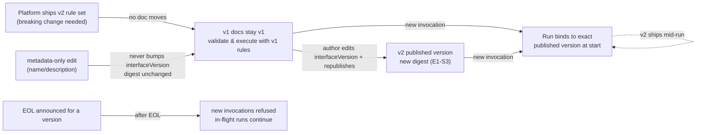

# E1-S4 decision: Interface versioning methodology and runtime impact

| Tracking | Value |
| --- | --- |
| Status | Decided |
| Source | [E1-S4 task at the migration revision](https://github.com/RostrumAI/rostrum/blob/4da89f6316abd44f6ef499a27b87c60aca35e610/docs/tasks/epic-01/e1-s4-define-versioning-methodology.md) |
| Last updated | 2026-08-18 |

## Decision

**Two version axes.** Two independent versions matter here, and this record keeps them separate. The **platform (engine) version** names a Rostrum release — the implementation of the validator, the daemon, and the Control API. The platform changes it, and one engine runs at a time: an upgrade ships a new release and applies its migrations. An engine upgrade must never change how any supported interface version reads or runs documents — the v1 rule set is frozen and shipped forward (E1-S1). If a change would alter v1 behavior, it is an interface-version breaking change and ships as a new rule set, never as a mutation of v1. The **workflow version** is what authors and callers interact with; it has two parts (E1-S3): the authored `interfaceVersion` token that selects the frozen rule set, and the per-publish published-version number. Authors change it by editing `interfaceVersion` in a draft and publishing. Everything below governs the workflow axis; the platform axis exists to make one guarantee — an engine release implements every supported interface version's rule set, so a v1 document validates and runs identically on any engine that supports v1.

**Change classification.** The public specification (E1-03) carries a field-classification table assigning every document field a class: **identity** (`id`), **metadata** (`name`, `description` in v1), **version selector** (`interfaceVersion`), or **operational** (everything else — `firstNode`, `inputs`, `steps`, `conditionals`, and step-internal fields). The table is in force from v1. A metadata change is an edit touching only metadata-class fields and cannot alter any run's behavior; an operational change can. v1 has exactly two metadata fields.

**Bump triggers.** An interface version bump happens only on a **breaking change**: any change to the frozen rule set that makes a previously valid v1 document invalid — including a step-type `config` schema change that invalidates a previously valid `config`, removal of a step type from the registry, reinterpretation of an existing construct that changes execution behavior for identical documents, and a normalization/digest contract change. Additive changes — new optional top-level fields, new step types, relaxed validation, new conditional operators — are absorbed within the current version per E1-S1 and never bump. Shipping a new interface version moves no documents; an author migrates by editing `interfaceVersion` in a draft and republishing. Deprecating a step type keeps it registered; removing it is breaking.

**Runtime impact.** A run executes the exact published version it was started against, to completion (**bind-on-start**). No interface version publication changes an in-flight run. New invocations change only when an author republishes with a new `interfaceVersion`, or when the platform deprecates a version. Deprecation windows exist from the start: the platform may announce an end-of-life (EOL) date for an interface version; before EOL the version remains fully supported, at EOL new invocations are refused with a documented error, and in-flight runs continue. "Supported" always means "validated and executed with that version's own semantics". There is no in-flight auto-upgrade in v1; it is revisited when Epic 03 designs durable run state.

**Metadata interaction.** Metadata-only edits never bump `interfaceVersion` and never change the digest. E1-S3 is amended: the digest is computed over the RFC 8785 canonical form with the metadata members removed, so the digest identifies the definitional content. A metadata-only republish is permitted and yields a version whose digest equals the previous version's digest — callers comparing digests see that the definition is unchanged.

The current v1 exact-match token contract (`"v1"`, exact match, no fallback) is preserved and is not altered by this record.

## Context

E1-S1 fixed the versioning mechanism and explicitly deferred the methodology: `interfaceVersion` is an exact-match capability token; Rostrum retains one immutable rule set per version (document schema plus step-type registry) and ships every version's rule set forward; additive change within a version is allowed only if every previously valid v1 document remains valid; breaking change requires a new interface version; there is no automatic upgrade or rewriting — a v1 document stays v1. Shipping every rule set forward is what makes the engine axis safe: any engine release can validate and execute every supported interface version with that version's own rules, so an engine upgrade never changes document semantics.

E1-S3 fixed the published-version axis: per-workflow monotonic integers, canonical storage, immutable version rows, and a digest computed at publish. Its digest scope is amended by decision 4a below; the amendment is recorded in the E1-S3 record. Epic 01 requires the three version kinds (interface version, draft revision, published version) to remain distinct and requires validation to select its rules from the declared `interfaceVersion` so a future release continues to recognize v1.

Epic 02 anchors the runtime policy: "The caller selects an exact published workflow version and supplies structured inputs", and "the daemon executes only immutable published workflow versions supported by the shared workflow library." Bind-on-start is the runtime policy consistent with that contract: a run's rule set is fixed by the version the caller selected, which is fixed by the version the author published.

The consumers of these rules are the validator (E1-04), the Control API (E1-06), the storage layer (E1-07), the public specification (E1-03), the daemon (Epic 02), the conformance suites (E2-07, E3-08), and the Cloud control plane, which reimplements the same contract.

Full option analysis remains in the [E1-S4 research at the migration revision](https://github.com/RostrumAI/rostrum/blob/4da89f6316abd44f6ef499a27b87c60aca35e610/docs/research/e1-s4-interface-versioning-methodology-options.md). Comparative platform research informed the choices; the recurring patterns were bind-on-start for active runs, cutover at publication for future invocations, and deprecation deadlines that bound old-version support.

## Why these choices

| Aspect | Choice | Reason |
| --- | --- | --- |
| Change classification | Field-classification table in the public spec, in force from v1; v1 metadata = `name`, `description` | Gives authors, validator, and daemon one explicit, testable answer to "does this edit change behavior"; the only v1 fields whose change cannot affect any run are the two display labels; a table prevents the boundary from drifting as fields are added |
| Bump trigger | Breaking changes only; additive changes absorbed within the current version | Matches E1-S1's evolution rules; authors on v1 keep a stable target; additive relaxations (new step types, optional fields, new operators) reach authors without fragmenting documents across versions |
| Breaking definition | A change that makes a previously valid v1 document invalid: config-schema invalidation, step-type removal, semantic reinterpretation, digest-contract change | Checkable against existing documents; semantic reinterpretation of a v1 construct ships as a new version's rule set, never mutates the frozen v1 rule set |
| In-flight runs | Bind-on-start: a run executes the exact published version it was started against, to completion | Deterministic and auditable — "which version produced this result" has one answer; matches Epic 02's exact-version contract; v1 has no replay/state machinery, so mid-run version crossing would be unsafe |
| Future invocations | Change only when an author republishes with a new `interfaceVersion`, or the platform deprecates a version | Version selection is the impact lever, not version shipping; author-driven migration per E1-S1's "no automatic rewriting" |
| Support windows | Deprecation windows (announced EOL) from the start; in-flight runs continue after EOL; new invocations refused at EOL | Gives the platform the option to support v1 forever without the obligation; bounded operational burden; mirrors the Zapier app-version lifecycle (legacy → deprecating → deprecated with an EOL date, after which affected Zaps pause) |
| In-flight auto-upgrade | Not in v1; deferred to Epic 03 | Requires replay-safe state migration (Temporal's model with `patch` markers); nothing in v1 provides it; adopting it now would trade run determinism for fix reach before the durable-state work exists |
| Metadata interaction | Metadata excluded from the digest (E1-S3 amended); metadata never bumps `interfaceVersion`; metadata-only republish yields an unchanged digest | A name-only change is not a definition change; a changed digest for a display-only edit misleads callers and version-history tooling (E1-S3 decision 4a) |
| v1 token | Exact-match `"v1"`, no fallback | Task constraint; the methodology for future transitions does not alter the v1 contract |
| Platform (engine) version | Rostrum release, platform-managed; one engine at a time; migrations applied at upgrade | An interface version is a contract, an engine version is an implementation; conflating them would let a release silently change v1 behavior. "One engine at a time" is an operational fact of shipping a daemon; the guarantee that makes it safe is that the engine implements every supported rule set and never mutates a frozen one |

## Specification outline

### 0. The two version axes

| Axis | What it identifies | Who changes it | How it changes | Impact of a change |
| --- | --- | --- | --- | --- |
| Platform (engine) version | A Rostrum release: the validator/daemon/Control API implementation and the rule sets it supports | The platform, per release | A new release ships; migrations run; one engine version at a time | No document or run changes; every supported interface version keeps validating and executing with its own rules |
| Interface version (`interfaceVersion`) | The frozen rule set (document schema + step-type registry) for reading a document | The platform ships new rule sets; the author chooses by editing the field | A new rule set is released; the author migrates by editing `interfaceVersion` and republishing | Breaking changes only; additive changes stay within the version; no document moves; unknown versions are a blocking finding |
| Published version (E1-S3) | One immutable published artifact of one workflow | The server, per successful publish | +1 per successful publish | Callers address it exactly; runs bind to it at start |

The engine axis and the interface axis meet in one rule: shipping a new engine release may add or retire interface-version support (retirement is the deprecation window in §3), but it never changes the semantics of a supported rule set.

### 1. Change classification (operational vs metadata)

The spec (E1-03) includes a field-classification table covering every v1 field:

| Field | Class |
| --- | --- |
| `id` (top level) | identity — changing it changes which workflow the document is (E1-S3 identity rule), not a versioning event |
| `name`, `description` | metadata — display-only; cannot affect any run |
| `interfaceVersion` | version selector — chooses the frozen rule set |
| `firstNode`, `inputs`, `steps`, `conditionals` | operational |
| Step fields (`id`, `type`, `config`, `inputs`, `outputs`, `successors`, `dependencies`, `conditional`, `loop`) | operational (step `id` is identity within the document; duplicates are validation errors) |
| Branch/default `label` | operational-by-default — human-facing routing documentation; display-only in effect but part of routing inspection |

- Step-type `config` fields are classified by each registry entry when it ships (E2-S3); the base-shape classes above are fixed by this record.
- Definitions: **metadata change** = an edit touching only metadata-class fields; **operational change** = any other edit. Classification governs versioning consequences only; the validator still re-validates every publish (E1-S3).
- Reconciliation with E1-S3's digest rule: the digest covers the definitional content, so a metadata edit does not change the digest — "metadata" and "definition identity" agree. This is the amendment to E1-S3.

### 2. Interface version bumps

Breaking changes (bump required):

1. a rule-set change that makes a previously valid v1 document invalid;
2. a step-type `config` schema change that invalidates a previously valid `config` (E1-S1) — bump or new type name;
3. removal of a step type from the registry;
4. reinterpretation of an existing construct that changes execution behavior for identical documents — must ship as a new version's rule set; the frozen v1 rule set is never mutated;
5. a change to the normalization/digest contract that breaks reproduction of stored digests.

Additive changes (never bump): new optional top-level field, new step type, relaxed `config` schema, new conditional operator, relaxed DAG rule.

Process: the platform ships the new rule set (`"v2"`, `"v3"`, …) when a breaking change is needed — a new rule set ships inside an engine release, but the release's own version number is the platform axis and carries no document semantics; no document moves. The author migrates by editing `interfaceVersion` in a draft, resolving blocking findings, and publishing — a new published version with a new digest (E1-S3). Unknown versions remain a blocking finding (E1-S1). Deprecating a step type: keep it registered and documented as deprecated, steer authors to the replacement; removal is breaking.

### 3. Runtime impact

- **Bind-on-start:** a run binds to the exact published version selected at invocation (Epic 02) and executes it to completion with that version's rule set. Later publishes, interface versions, or deprecations do not alter it. This holds for in-flight runs at every future transition.
- **Engine upgrades:** a new engine release may add or retire interface-version support (retirement runs through the deprecation window below); it never changes the semantics of a supported rule set. In-flight runs and future invocations of a supported version are therefore unaffected by an engine upgrade — only rule-set support changes, never behavior.
- **Future invocations:** the version named at invocation determines behavior. Epic 1/2 define no "latest published version" alias; if one is introduced later it must be explicit and documented (E2-S2 decision).
- **No in-flight auto-upgrade in v1.** Any future mechanism (revisited when Epic 03 designs durable run state) must be additive to bind-on-start — opt-in per run or per workflow — never a silent switch of a started run's version.
- **Deprecation windows:** the platform may announce an EOL date for an interface version. During the deprecation period the version stays fully supported. At EOL: new invocations of that version are refused with a documented error; in-flight runs continue; drafts and validation of that version's documents remain available — authoring never breaks, only new execution. Administering EOL (announce, schedule, list) is a future Control API surface, deferred.
- "Supported" always means "validated and executed with that version's own semantics" — never reinterpretation via a newer rule set.

### 4. Metadata-only changes

- Never bump `interfaceVersion`.
- Never change the digest: the digest is SHA-256 (lowercase hex) over the RFC 8785 canonical form **with the metadata members (`name`, `description` in v1) removed from the parsed document before canonicalization** (E1-S3 amendment). The digest identifies the definitional content; metadata edits leave it unchanged.
- A metadata-only republish is permitted under the E1-S3 publish contract (publish the draft's current revision; unique `(workflow_id, revision)`) and produces a new version row whose digest equals the prior version's digest — callers comparing digests see "definition unchanged". The published version's stored content is the full canonical document including the metadata, so retrieval still returns the exact published artifact.
- Optional polish (deferred to E1-06/E1-07): mark metadata-only versions on the version row so tooling can filter cosmetic entries.

### Interaction summary

## Alternatives considered

| Alternative | Rejected because |
| --- | --- |
| Classification by ad-hoc enumeration only (no spec table) | No durable rule for future fields; the boundary would drift; a table is testable and reviewable |
| Behavioral-equivalence test (identical runs ⇒ equivalent documents) | Undecidable with opaque step handlers; any implementation degenerates to field classification anyway |
| Semver-style triage at the document level (major/minor/patch) | E1-S1 rejected semver for the interface token; "patch = no behavior change" is exactly "metadata", adding no power |
| No classification at all | Questions 2 and 4 unanswerable; every change would look identical to versioning |
| Any rule-set change bumps, including additive | Contradicts E1-S1's additive-within-version allowance; fragments authors across versions for trivial relaxations |
| Bump also on capability additions | Overlaps with additive; E1-S1 already makes new step types safe (older releases reject them explicitly rather than misreading) |
| Auto-upgrade in-flight at safe boundaries | Needs replay/state compatibility v1 lacks; changes a started run's behavior; only safe for additive/metadata changes, which bind-on-start covers without machinery — deferred to Epic 03 |
| Drain + cutover as a separate policy | Collapses into bind-on-start plus a deprecation window; no separate mechanism needed |
| Hybrid per change class (propagate additive, pin breaking) | The propagate leg requires auto-upgrade machinery; in v1 the metadata case is already covered by digest stability and author re-publish |
| Indefinite support obligation (v1 runs forever, no EOL) | Makes "support v1 forever" an obligation rather than an option; no way to retire a rule set |
| Validation-forever / execution-windowed split | Two policies to maintain; validation support still requires retaining rule sets, so it buys little over EOL windows while adding complexity |
| Whole-document digest (E1-S3 pre-amendment) | A name-only edit would change the digest and version identity — misleading in revision and version history; superseded by decision 4a |
| Separate metadata store (display fields outside the definition) | Contradicts E1-S1's shape (metadata lives in the authored document) and adds a second retrieval path and update semantics |
| Metadata-only version marker as the mechanism | A flag does not fix the digest problem; retained as optional polish, not the mechanism |

## Deferred decisions

- EOL administration surface (announce, schedule, list deprecations) — future E1-06/E2 API work; the EOL semantics are fixed here.
- In-flight auto-upgrade — revisited when Epic 03 designs durable run state (checkpoints, waits, recovery); any mechanism must be opt-in and additive to bind-on-start.
- "Latest published version" alias for run requests — none in Epic 1/2; decided with E2-S2 when the run-request contract is defined.
- Step-type registry lifecycle markers (`sinceVersion`, `deprecatedIn`, `removedIn`) — E2-S3's step-catalog work.
- Automatic breaking-change detection at publish (Zapier-style schema comparison) — optional hardening for E1-S2/E1-04; not required by any Epic 1 acceptance criterion.
- Metadata-only version marker on version rows — E1-06/E1-07 polish.

## Verification

This record is complete when a reviewer can confirm, by reading it, that:

- the field-classification table names every v1 field with its class, and v1 metadata = `name`, `description`;
- the breaking definition is explicit and checkable, and additive changes never bump the interface version;
- runtime impact is explicit: bind-on-start for in-flight runs, future-invocation behavior, deprecation windows with EOL semantics (new invocations refused, in-flight runs continue), and no in-flight auto-upgrade in v1;
- the platform (engine) version axis is distinguished from the workflow version axis — who changes each, and the guarantee that an engine upgrade never alters a supported interface version's semantics;
- metadata-only changes never bump `interfaceVersion` and never change the digest, and the E1-S3 amendment (digest scope excludes metadata) is recorded there with recomputed fixture vectors;
- the comparative research on Zapier, Temporal, n8n, and similar platforms is referenced (research doc §5);
- the v1 exact-match token contract is preserved.

The product owner and implementing engineer approve this decision before E1-03, E1-04, E1-06, E1-07, and Epic 02 build on it.
