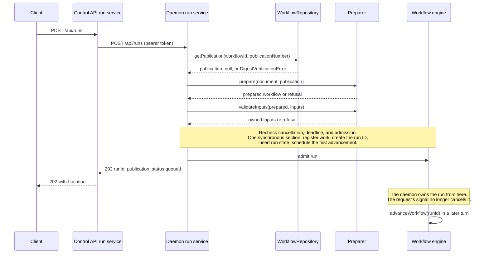
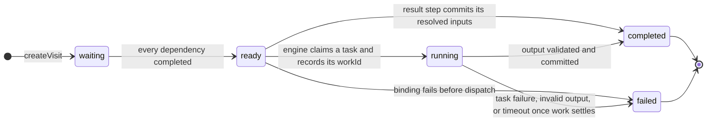
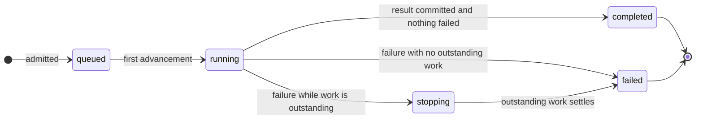
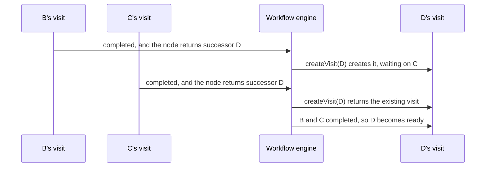
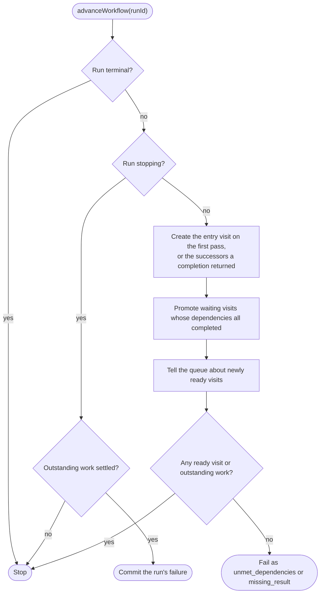
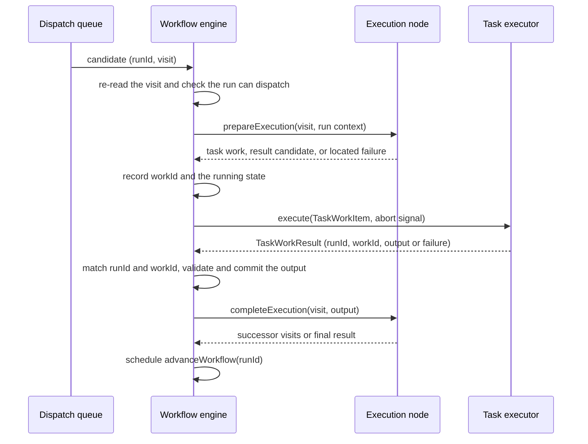

# Sequential workflow execution — technical design

- Epic: [M2 Epic 2: Execute sequential workflows](../epics/m2/2-execute-sequential-workflows.md)
- Owner: Stephen Pierre-Paul
- Status: proposed design, revised for owner review on 2026-09-22. Nothing described here is implemented. Owner decisions are labeled as such below; everything else is a proposal under review.
- Repository baseline: [`RostrumAI/rostrum`](https://github.com/RostrumAI/rostrum) `main` at [`16622bc`](https://github.com/RostrumAI/rostrum/commit/16622bc), inspected 2026-09-19, with no local changes to the files described here. Paths are relative to that repository unless they begin with `../`.
- Parent blueprint: not established yet. Stephen Pierre-Paul owns adopting it and linking this design before implementation starts, as the [delivery methodology](../epic-delivery-methodology.md#resuming-work-from-prior-combined-plans) requires. Review of this design can continue in the meantime.
- Superseded attempt: `feat/m2-sequential-checkpoint-1` ([rostrum #64](https://github.com/RostrumAI/rostrum/pull/64)) was closed without merging, and none of it is in `main`. This design does not bring back its generic JSON guards or its engine model. The review findings that still apply are listed under [Carried over from PR #64](#carried-over-from-pr-64).
- Next action: continue the owner's design review. Implementation waits for the parent blueprint and the reviews named in [What still needs review](#what-still-needs-review).

## Where we are

- Rostrum can validate and publish an immutable workflow. It cannot run one: `main` has no execution code of any kind.
- PR #64 tried to build shared contracts, preparation, and an engine. It was closed unmerged on 2026-09-19. Its shared contracts and preparation become Checkpoint 1 here; its engine model is replaced by the visit model in this document.
- The owner has made these decisions during review: successful runs and steps are called `completed` ([D6](#d6--step-and-run-states-with-completed-meaning-success)); breaking changes are allowed before production, including fixing self-dependency in v1 ([D11](#d11--breaking-changes-are-allowed-before-production)); static input/output compatibility is a shared workflow-library check that blocks publication unless every binding is proven to fit ([D12](#d12--static-inputoutput-compatibility-is-shared-by-publication-and-preparation)); and run responses have no size limits yet ([Limits and configuration](#limits-and-configuration)).
- The parent blueprint has not been adopted, so implementation cannot start yet.

## The problem

Today we can publish a validated, immutable workflow, but nothing executes it. The goal of this work is to let a caller invoke one exact publication through the Control API and then walk away. The daemon accepts the run, executes it on its own, and any client can come back later to see progress, the final output, or failures.

The Control API and the daemon are separate processes and can run different releases. A publication that passed validation when it was published might still use something this daemon release can't execute. So the daemon has to check that it can run a publication before it accepts a run. That way an unsupported publication is refused at invocation instead of failing halfway through. Once the daemon accepts a run, nothing outside it can change the run: not a newer publication, not the caller disconnecting, not a Control API restart.

We also want the pieces to line up with where execution is heading. Graph traversal (deciding what runs next) is kept separate from task execution (actually running a step). A later worker can then run a single task without owning the whole workflow. Each run owns its own step state rather than sharing a "current step" pointer.

## Scope

This work delivers:

- invoking an exact publication;
- sequential, deterministic execution that ends at a `result` step;
- passing data between steps through bindings;
- several independent runs at the same time;
- run inspection;
- graceful process shutdown;
- an in-memory dispatch queue, with separate handling for dependencies that can never be met and for tasks that take too long.

Within one run, at most one task executes at a time. Across runs, several tasks can be outstanding together. The queue separates "this step may run" from "this step is running", but it has no configurable daemon-wide capacity or fairness policy. That belongs to [Epic 4](../epics/m2/4-execute-parallel-paths-and-joins.md).

Out of scope:

- Conditionals, parallel paths within a run, joins, and loops. Invocation refuses them. Their future behavior has to fit the visit model described below, but this work adds no empty conditional or loop classes.
- Distributed queues, remote workers, leases, persistence, restart recovery, invocation deduplication, retries, cancellation APIs, and side-effecting handlers.

This design covers these Epic acceptance criteria:

- A valid invocation gets a stable run ID; a refused one creates no run.
- Execution continues after the initiating client disconnects.
- Overlapping runs can be told apart and don't affect each other.
- Inspection distinguishes queued, active, completed, and failed runs, and explains waiting and stopping work.
- Steps run in declared order and use only validated data.
- The final result is correct and terminal outcomes never change.

[M2 Epic 6](../epics/m2/6-complete-m2-conformance.md) later combines evidence across the M2 execution Epics. It is not a prerequisite for these checkpoints.

## What exists today

The inspected revision has authoring, validation, publishing, storage, and both service boundaries. It has no execution code: no execution contracts, run state, engine, task executor, run service, run route, or run table.

| Existing behavior | Where it lives | How this design uses it |
| --- | --- | --- |
| Document validation | `createWorkflowValidator` runs eight gated stages (`packages/workflow/src/validation/stages/`) and returns located findings (`packages/workflow/src/findings.ts`). When a task has `config`, the v1 rules require its `operation` to be a string and accept any other members (`packages/workflow/src/rules/v1.ts`). | Publishing already runs this. Invocation does not run it again; preparation only checks what this daemon can execute and the values supplied. Stage 8, input/output compatibility, emits nothing in v1 today (`input-output-compatibility-stage.ts`); [D12](#d12--static-inputoutput-compatibility-is-shared-by-publication-and-preparation) gives it a blocking check. |
| Canonicalization and digest | `PublicationCanonicalizer.canonicalize` returns `{canonicalText, digest}`. The stored text is the full RFC 8785 document. The digest covers the canonical form with the metadata members `name` and `description` removed (`packages/workflow/src/publish/publication-canonicalizer.ts`, `packages/workflow/src/rules/v1.ts`). | Unchanged. Preparation is a separate step; see [D2](#d2--preparation-checks-whether-this-daemon-can-run-a-publication). |
| Stored publications | `WorkflowRepository.getPublication(workflowId, publicationNumber)` returns a `Publication` (`publicationNumber`, `revisionId`, `workflowFormatVersion`, `canonicalText`, `digest`, `createdAt`) or null. It throws `DigestVerificationError` when the stored text can't be canonicalized, isn't canonical, or doesn't match its digest (`packages/database/src/repositories/workflow-repository.ts:307`). | This is the daemon's only new database read. |
| Daemon process | `Daemon.open` owns one `DatabaseHandle` and one application. `DaemonContext` is `{config, services, abortSignal}`, and today `services` holds only `system` (`apis/daemon/src/daemon.ts`). | Add `services.runs` next to `services.system`. The repository reuses the database handle the process already owns. |
| Controllers, authentication, OpenAPI | `defineDaemonController` and `defineControlController` bind controllers that each `http/routes.ts` registers statically. The daemon authenticates requests with a bearer token (`apis/daemon/src/auth.ts`). Each application generates a checked-in `openapi.json` with its `generate-openapi` script. | Run controllers follow the same pattern and add a `runs` tag in each application. |
| Control API's daemon client | `clients/daemon.ts` implements only `checkDaemonReadiness`. It uses direct Node HTTP(S), the newest configured token, abort handling, and a 64 KiB response limit (`apis/control-api/src/clients/daemon.ts`). | Gains invocation and retrieval calls that share one request helper. |
| Process lifecycle | `packages/server/src/lifecycle.ts` exports `ServiceRuntimeConfig`, `OpenedService`, and `boot`. Outstanding HTTP work is tracked in a private `Map<Request, AbortController>` inside `boot`. | Generalized into a work tracker. The process factory passes its registration capability to the service tier. |
| Request decoding | The framework decoder calls `JSON.parse` after `request.text()` (`packages/server/src/request.ts`). Authoring calls `parseWorkflow` after `request.arrayBuffer()` so it can reject duplicate keys and keep the source text (`apis/control-api/src/controllers/workflows/request-body.ts`). Neither sets a per-route byte limit. | Both parsers stay. Run requests get a byte limit before buffering; there is no custom JSON parser or depth scanner. |
| Configuration | `defineConfig` maps environment names such as `PORT`, `DATABASE_URL`, `DEPENDENCY_TIMEOUT_MS`, and `SHUTDOWN_TIMEOUT_MS`. Changes need a process restart; SIGHUP only logs (`apis/daemon/src/config.ts`, `apis/control-api/src/config.ts`). | The new run limits are declared the same way and are also restart-only. |

The daemon doesn't depend on `@rostrum/workflow` or `uuid` yet. Checkpoint 1 adds both: the first to reuse the document schema, operation declarations, schema compiler, compatibility check, and execution vocabulary; the second to create UUID v7 run and work IDs. The Control API and `packages/database` already depend on `uuid`. `@rostrum/workflow` adds `ajv`.

## How the pieces fit together

A **publication** is the immutable workflow definition Rostrum already stores. A **run** is one invocation of a publication with a fixed set of inputs. A run records its publication when it's accepted and never reads it again, so a later publication can't change it. Many runs can share one publication without sharing any execution state.

A **visit** is one step that a run has reached. Each run has a **run context** holding its accepted inputs and a map of visit states. The map records which steps were reached, their status, and their committed outputs or failures. A step with no visit is pending. This is ordinary in-memory state, not a database record or a history of every change.

The **preparer** turns a publication into something the daemon can execute. It checks that the operations and control flow are supported, indexes the steps, prepares bindings, and compiles the declared input and output checks. It does not repeat publication validation, but it does rerun the shared static compatibility check against this daemon's operation catalog. The result is a **prepared workflow**, which holds no live run progress.

The **workflow engine** owns runs and is the only thing that changes their visit states. It decides which visits are ready and puts them on an in-memory **dispatch queue**. The queue only suggests candidate work; the engine checks eligibility again before starting anything.

An **execution node** describes how one kind of step behaves: how it creates a visit, prepares its work, and handles completion. `TaskExecutionNode` moves on to its successors; `ResultExecutionNode` produces the workflow's final output. Both implement `ExecutionNode`. Nodes return decisions to the engine instead of changing run state themselves, so later conditional and loop behavior can reuse the same state owner.

A task's **operation** is the function it actually performs, such as greeting a name or adding two numbers. Its declaration (name, configuration, input and output schemas, and failure codes) lives in `@rostrum/workflow`, so publication and preparation read the same catalog. Its implementation lives only in the daemon. The **task executor** looks up that implementation and calls it. The engine hands it a `TaskWorkItem`: the run, work, and step IDs, the format version, the operation configuration, and the resolved input values. The executor returns a `TaskWorkResult`: the same run and work IDs plus either output values or a typed failure. These are plain data objects, not another queue or service. Cancellation is a separate signal. Neither object carries a database handle, HTTP context, engine callback, or compiled workflow.

The daemon's **run service** connects admission and inspection to the engine. It retrieves a publication, prepares it, registers the run as process-owned work, and then admits the run. The Control API has its own run service, which forwards invocation and inspection to the daemon. Controllers only call their own application's service. Inspection turns the daemon's current run state into a response; it never advances execution.

For example: an addition task finishes and the executor returns its sum to the engine. The engine validates and commits the output, asks the task node which successors to visit, and schedules the next advancement. The successor can then bind to the sum. The executor never chooses the successor.

## Decisions

Each decision below is labeled with its status. **Owner decision** means Stephen Pierre-Paul has approved it. **Proposed** means it is part of this design and still under review. Record approvals and changed contracts here before dependent implementation starts. Review comments and proposed designs are not implementation evidence.

### D1 — The engine lives in the daemon, and only the engine changes run state

Status: proposed. Keeping execution in the daemon, the controller/service split, and restart-only process configuration all carry over from the superseded M2 Epic 2 plan (2026-09-16).

The engine stays inside the daemon. No second program needs to execute workflows, so a separate runtime package would add nothing, and tests can drive the engine directly without starting a listener.

Only the engine commits run state. Node classes describe what a step does, the executor performs an operation and returns a result, and the engine decides what that result means for the run. With one writer, we don't have to reason about two components racing to update the same visit.

### D2 — Preparation checks whether this daemon can run a publication

Status: proposed. Defined on 2026-09-19 rather than inherited from the closed branch, and narrowed on 2026-09-20 to daemon capabilities and actual values. On 2026-09-22 the owner moved static input/output compatibility into the shared workflow library ([D12](#d12--static-inputoutput-compatibility-is-shared-by-publication-and-preparation)); preparation reruns it.

Publishing already validates a revision, canonicalizes it once (RFC 8785), and stores the canonical text with a SHA-256 digest computed without `name` and `description`. `WorkflowRepository.getPublication` checks canonical form and digest on every read. None of that changes.

Preparation answers a narrower question: can this daemon release execute this publication? It trusts the validation done at publish time and does not call `createWorkflowValidator` again. Because the two processes can run different releases, it still checks the daemon's supported format and capabilities.

`prepare` takes a parsed document plus, for an invocation, the run's publication (its workflow ID, publication number, format version, and digest), rather than the repository's `Publication` row. It collects every failure it finds instead of stopping at the first:

1. Parse the integrity-checked canonical text with `JSON.parse`, and check its format and document shape with the existing `WorkflowDocumentSchema`. This confirms the daemon can read the document without repeating graph, termination, or reference validation. Check that the document ID and format match the stored publication.
2. Check that every declared step is supported, not just the ones on the reachable path. A result step has no configuration; there's no conditional or loop behavior; and each step has at most one distinct successor. Refuse a step that depends on itself, even in a publication created before the validator fix.
3. Compile the workflow input schemas and step output schemas into checks for actual values, with the shared schema compiler (see [D3](#d3--declared-input-and-output-schemas-are-checked-with-ajv)). If this release can't interpret a schema, refuse it rather than silently ignoring a constraint the author expects to be enforced.
4. Run the shared static check ([D12](#d12--static-inputoutput-compatibility-is-shared-by-publication-and-preparation)) with this daemon's operation catalog: known operations, valid configuration, required and declared arguments and outputs, and bindings proven to fit. A publication that passed under a different Control API release can still be refused here.
5. Turn every binding into either a literal owned by the prepared workflow or a reference the engine can resolve during the run.
6. Build the **prepared workflow**: an immutable, process-local object holding its publication, the entry step, every declared step by ID, each step's successors and dependencies, its prepared bindings, its declared outputs, and the compiled checks.

Checking the invocation inputs is a separate function, `validateInputs(prepared, inputs)`, which runs once per run. Everything in `prepare` depends only on the publication and the daemon release.

The prepared workflow is not JSON. It holds maps and compiled validators, so it isn't persisted, hashed, or sent to another process, and it doesn't need to be. The publication is what processes share. It's immutable and identified by `(workflowId, publicationNumber, digest)`, so any daemon can rebuild an equivalent prepared workflow from it. Two daemons on the same release prepare a publication identically. Daemons on different releases may disagree, which is the point of a release-specific capability check. A future remote worker receives a `TaskWorkItem`, never a prepared workflow. When M3 recovers a stored run, the recovering daemon prepares the run's recorded publication again and fails the run if it can't. Only run state and the work and result messages are JSON data. "Preparation" means exactly this capability check and compilation step. It is not the metadata removal and canonicalization that publishing already does.

Preparation runs on every invocation, not once per publication, and this Epic doesn't cache it. Because `prepare` depends only on the publication and the release, a later per-process cache keyed by `(workflowId, publicationNumber, digest)` is safe and changes only its caller. The publication read still happens on each invocation, to confirm the row exists and passes its integrity check, and such a cache would need a size bound.

Because `prepare` takes a document rather than a stored publication, a later daemon endpoint can run it against a draft as a dry run. The Control API would show those results as their own category, "this daemon release can't run this", next to its authoring findings, without blocking saves or publication. That endpoint is future work; this Epic only keeps the signature open for it.

Preparation reuses already-parsed JSON and maintained schema validators. It does not add a `json-value.ts` guard for arbitrary JavaScript objects, a schema-rewriting pass, or a custom JSON tokenizer. HTTP inputs are already parsed, publication literals come from canonical JSON, and the built-in task outputs have concrete schemas. A future plugin or remote executor must define its own input boundary instead of quietly inheriting an unrestricted object contract.

When preparation refuses, it does so before any run exists, with a typed reason:

| Situation | Reason |
| --- | --- |
| Invalid stored JSON, a digest or canonicalization failure, or a document identity that doesn't match its publication | `corrupt_publication` |
| Unsupported document version or shape, step type, configuration, control flow, binding, or schema, or anything the shared static check rejects | `unsupported_execution` |
| Missing, undeclared, or invalid invocation inputs | `invalid_inputs` |

A refusal reports every failure it finds, sanitized and located with JSON Pointers. Publication findings remain the authoring validator's contract; these failures explain why this daemon can't accept an invocation.

### D3 — Declared input and output schemas are checked with Ajv

Status: proposed.

Authors describe the values a workflow accepts using JSON Schema. In the existing `sequential.json` fixture, the workflow input `inputs.name` is declared as `{"schema":{"type":"string"}}`, and the task output `outputs.greeting` has the same schema. These declarations say which values are allowed. They are not the values themselves. Step `inputs` are different again: they hold the literals or references that supply an operation's arguments.

The daemon checks values against these declarations at three points:

- Before accepting a run, it fills in the declared default for each omitted optional workflow input, then checks the invocation values against the workflow's input schemas.
- Before dispatching a task, it fills in the declared default for each unbound optional argument, then checks every argument against the operation's schema for it.
- When a task returns, it checks the output against the operation's output schema and the step's declared output schemas before any later step can use it.

A declaration such as `{"type":"number"}` has to reject a string amount, not convert it.

Publishing currently checks the document's structure and references, but not the contents of these embedded schemas or any actual run values. A declaration like `{"type":"strng"}` can be saved and published today and only fail at invocation. This design puts one JSON Schema compiler in `@rostrum/workflow` and uses it in two places. Publication validation compiles every declared input and output schema and reports an invalid declaration as a located finding, so drafts see it while they're edited. Preparation compiles the same declarations into checks for actual values. JSON parsing still uses the existing parsers.

We keep TypeBox for schemas Rostrum defines in code. For author-declared schemas, `@rostrum/workflow` adds Ajv's JSON Schema 2020-12 compiler (`ajv/dist/2020`). Its [compile API](https://ajv.js.org/api.html#ajv-compile-schema-object-data-any-boolean-promise-any) checks that a declaration is a valid schema before generating the value check, so we don't have to write schema validation ourselves. TypeBox's compiler can't do this on its own. In an in-memory probe on 2026-09-20, the installed TypeBox compiled `{"type":"not-a-json-schema-type"}` and then accepted a string. An unresolved `$ref` also compiled instead of being reported as a bad declaration.

Ajv turns a JSON Schema into a JavaScript function that checks a value. The `ajv/dist/2020` build implements the JSON Schema 2020-12 dialect, the same dialect the workflow document schema uses. The compiler is configured with these [options](https://ajv.js.org/options.html):

| Option | What it does | Setting and why |
| --- | --- | --- |
| `validateSchema` | Checks each declaration against the 2020-12 meta-schema before compiling it. | On, the default. This rejects `{"type":"not-a-json-schema-type"}`, which TypeBox accepted in the probe. |
| `strictSchema` | Throws on keywords Ajv doesn't recognize, such as a misspelled `tpye`. | On, the default. It reports typos instead of ignoring them. The cost is that authors can't add their own annotation keywords, such as `x-ui-hint`; allowing specific ones later means registering them with `addKeyword`. |
| `strictTypes` | Rejects schemas that are legal but loosely typed, such as `{"minimum":1}` without `"type":"number"`. | Off. These are rules beyond standard JSON Schema, and authors shouldn't have to learn them. |
| `strictTuples` | Rejects `prefixItems` that isn't paired with `minItems` and `items`. | Off, for the same reason. |
| `validateFormats` | Enforces `format` values such as `email`. | Off. JSON Schema 2020-12 treats `format` as an annotation by default. |
| `coerceTypes`, `useDefaults`, `removeAdditional` | Convert `"5"` to `5`, insert `default` values, and strip extra properties. | Off, the defaults. A check never changes the value it checks. |
| `loadSchema` | Fetches remote schemas for `compileAsync`. | Not provided, and only synchronous `compile` is used, so a `$ref` never reaches the network. Ajv resolves local references itself. A schema marked `$async` is refused. |
| `addUsedSchema` | Registers every compiled schema that has an `$id` on the Ajv instance, so other schemas can reference it. | Off. Otherwise two workflows declaring the same `$id` would collide or see each other's schemas. Compiled checks live with the prepared workflow, not in a global cache keyed by author-supplied IDs. |
| `code.regExp` | Replaces the regular-expression engine used for `pattern` and `patternProperties`. | Proposed: a linear-time engine such as RE2 (see the risk below). Check that the `re2` native module works under Bun before adopting it. |

A missing reference or unsupported schema becomes a located finding at publication and a located `unsupported_execution` refusal at preparation. We don't add a schema walker to rewrite annotations or resolve references.

Compile errors point at the input or output declaration in the document. Value mismatches point at the supplied value. If the evaluator throws unexpectedly, that becomes `unsupported_execution` before admission, or fails the affected visit as `execution_error` after admission. Failure messages never include the raw exception or supplied data.

Schema evaluation runs inside the daemon process, and that has a real risk. A schema can include a regular expression through `pattern`, and an expensive match can block the process even when the input is small. A request-size limit caps bytes, not computation, and a timer can't interrupt blocked JavaScript. A linear-time regular-expression engine supplied through `code.regExp` would remove the backtracking case, which is the main way a small schema and a small input can block the process, but it doesn't bound other evaluation cost. Hard isolation for hostile schemas or inputs is outside this local-execution Epic. Before anyone enables that use, the product and security owners must design an isolated or bounded evaluator. Successful local execution must not be presented as evidence that this risk is solved.

### D4 — The daemon owns a run from the moment it accepts it

Status: proposed.

Invocation follows the existing tier boundaries: Control API controller → Control API run service → authenticated daemon client → daemon controller → daemon run service. The Control API doesn't read the publication to decide whether it's executable, and it doesn't create the run ID.

The daemon handles an invocation in this order:

1. Retrieve the selected publication through `WorkflowRepository.getPublication`. A missing row becomes `publication_not_found`, and `DigestVerificationError` becomes `corrupt_publication`. A database connection or query failure means the service is unavailable, not that the content is corrupt.
2. Record the run's publication: the requested `workflowId` plus the retrieved publication number, format version, digest, and canonical text. The repository's `Publication` type doesn't include `workflowId`, and preparation still has to confirm that the document identity matches it.
3. Call the preparer. Unknown operations and configuration, conditionals, loops, and more than one distinct successor are refused as `unsupported_execution`. Supported definitions with disconnected steps are still accepted and inspectable. A self-dependency is refused with a located failure before any run exists.
4. Validate the invocation inputs. Take one owned copy of the inputs for the run instead of copying them again at each layer.
5. After the asynchronous publication read, check again that the request hasn't been cancelled, hasn't passed its deadline, and that the process is still admitting runs. Then, in one synchronous section: register the run as independent process work, create the run ID, insert its state, and schedule its first advancement. If this section can't finish, remove the half-created state, release the registration, and dispatch nothing.
6. Return 202 with the `runId`, the run's publication, and `status: queued`. Sending that response is independent of execution, so a GET that follows immediately may already see a finished run.



Before step 5, cancelling the request prevents admission. After step 5, the run belongs to the daemon, and the request's signal no longer cancels it. Accepted runs and their inspection need no further database reads. A later database outage therefore affects readiness and new invocations, but not runs that were already accepted.

Inspecting a known run returns 200 with its current state, including when the run has failed. Neither invocation nor inspection waits for the workflow to finish.

### D5 — Each run keeps one current state object per visit

Status: owner direction (2026-09-20, [review comment](https://github.com/RostrumAI/rostrum-dev-docs/pull/21#discussion_r4055080365)): a visit has one latest state object, not a stored history of transitions.

The engine owns a map of runs. Each run owns its inputs and a `Map<nodeId, VisitState>`. Nodes can read this run context but can't change either map; their returned decisions tell the engine which change to make. A second entry in the map means a second visit was reached, not a newer version of an earlier status.

For this Epic, each reached step is visited once. Its `metadata` is the empty list, so its run-local `nodeId` is just the published `stepId`. Lookups also include the run ID, so two runs of the same publication never share a visit. There's no need to hash a UUID just to use it as a key.

Building a visit's identity is the job of node creation. We aren't implementing loops or retries now, but the identity scheme must not rule them out later:

- A future loop must include the loop step and the iteration in the visit's metadata, because two loops can share the same body definition.
- Every predecessor that asks for the same target step and metadata must get the same identity. Which predecessor asked, or in what order they arrived, must not be part of it.
- Attempts and `workId` are kept separate from visit identity.

So the visit **metadata** has a concrete shape now, even though Epic 2 only uses its empty value. It records which loop iterations a visit sits inside, and it's part of the visit's identity. `createVisit(target, metadata)` receives the target step and its metadata: an ordered list of frames such as `{ loopStepId, iteration }`, outermost first. A predecessor passes its own metadata along, and a future loop node adds or replaces its frame when it starts an iteration. The visit key is the step ID plus a canonical encoding of the frames. `VisitState` keeps the metadata so later bindings can resolve loop variables from it. Frames hold only identity; attempt counts and work IDs never go in them.

Each `VisitState` is a plain object with the identity, step ID, metadata, status, creation time, and fields specific to that state. As work progresses, the engine replaces the object under the same key: waiting, then ready, then running, then a terminal state. A running visit has a work ID and start time. A completed visit has a completion time and its validated output. A failed visit has a completion time, a located failure, and a start time only if execution actually started. Earlier versions aren't kept; there's no append-only history. Because each state is its own shape, output can never show up on failed or unfinished work. There is no database row or event log in this Epic.



A step with no visit is `pending`; it isn't a state the map holds.

### D6 — Step and run states, with `completed` meaning success

Status: owner decision (2026-09-20). The [Epic](../epics/m2/2-execute-sequential-workflows.md#understanding-execution-progress) uses the same terms.

`completed` means success. "Terminal" covers both `completed` and `failed`.

Steps have six states:

| Step state | What it means |
| --- | --- |
| `pending` | No visit exists yet. Inspection works this out from the prepared definition; the engine doesn't create visits for every step up front. |
| `waiting` | A visit exists, but at least one declared dependency hasn't completed. Inspection lists the unsatisfied dependency step IDs in `waitingFor`. |
| `ready` | All dependencies are satisfied and the visit can be dispatched. A queue entry is not permission to skip the engine's claim check. |
| `running` | The engine has claimed the visit and recorded which work owns it, before calling the executor. |
| `completed` | The full output passed validation and was committed. Later steps can now bind to it, and execution can continue. |
| `failed` | The visit can't succeed. A binding failure can put a visit here before the executor is ever called. Output from failed work is never published. |

`steps` is listed in document order for display; that isn't execution order. `currentSteps` uses the same order and lists only ready and running work. A disconnected step that was never reached stays pending, even after the run completes.

Runs have four states: `queued`, `running`, `completed`, and `failed`. The engine works out the run state like this, with failure taking priority:

- Before the first advancement, the run is `queued`.
- Once advancement starts, it's `running`.
- When an unhandled failure happens, dispatch stops. While an executor is still outstanding, the run stays `running` with `stopping: true`. When that work settles, the run becomes `failed`.
- If nothing failed, committing the result makes the run `completed`.



In the diagram, `stopping` is a `running` run with `stopping: true`, not a fifth status.

Timestamps are stored when each transition happens, not recalculated on each GET. A terminal run has no active work and its outcome can't change.

### D7 — Control edges create visits; dependencies decide when they run

Status: proposed.

Steps have two kinds of links: control edges (successors) and dependencies. They do different jobs. Control edges decide **which visits exist**. Dependencies decide **which existing visits may execute**. Traversal is worked out from visits and these links, never from an array index or a current-step pointer.

For example, say A leads to B and C, and both lead to D. B finishes first, so B's completion creates D's visit. D's dependencies include C, which hasn't finished, so D stays waiting. When C finishes, it finds the same D visit instead of creating a second one, and that satisfies D's last dependency.



That example explains why the two links are separate; it isn't something Epic 2 can run. `packages/workflow/src/fixtures/valid/fan-out-fan-in.json` is a pure fan-in fixture whose join has dependencies but no incoming control edge, and the graph-stage suite accepts that shape. Epic 4 has to reconcile it, and the dominator rules, with executable parallel graphs under the versioning policy. Removing the preparation refusal alone won't deliver joins.

Node classes supply the step-specific decisions:

- `ExecutionNode.createVisit` gives the target identity and the initial waiting state.
- `prepareExecution` resolves and validates inputs and returns one of: task work, a local result candidate, or a located failure.
- `completeExecution` takes an accepted output and returns either the successor visits to create (each a target step and its metadata) or the run's final result.

The engine applies all these decisions through the same transition path, whatever the node type. `TaskExecutionNode` returns the task's successors once its output is committed. `ResultExecutionNode` returns its resolved input object as the final result and creates no successor. Neither class dispatches work or writes visit state. Future conditionals and loops can change which successor visits come back without adding a second scheduler. Those constructs are fields on workflow steps in v1, not new step type names to invent here.

The engine's main loop is `advanceWorkflow(runId)`. It's a synchronous pass that never awaits a handler or runs one inline:

1. If the run is terminal, stop. If the run is stopping, start no new work, and only finish the failure once outstanding work has settled.
2. On the first pass, create the entry visit and record the run's start time. After a successful completion, make sure the successor visits returned by the node exist. Asking to create a visit that already exists returns it unchanged.
3. Check waiting visits against the completed dependencies in this run, and promote any that are satisfied to ready. A failed dependency never satisfies a dependency.
4. Tell the dispatch queue about newly ready visits. Duplicate notifications for the same run and visit are merged. The queue is an index of work, not the source of truth.
5. Once this pass's changes are all applied, check whether the run can still make progress (see [A run that can't make progress](#a-run-that-cant-make-progress)).



The queue consumer claims work separately. It re-reads the visit, checks that the run can still dispatch and has no running task, resolves the inputs, and records the `workId` and running state before calling the executor. Duplicate or stale queue entries do nothing, so a ready visit can't be dispatched twice even if advancement was requested several times before the consumer got to it.

A task's full path, from queue entry to the next advancement, looks like this. [D8](#d8--tasks-run-operations-completions-return-to-the-engine) describes the completion checks.



Advancement and dispatch run in scheduled event-loop turns, with a per-run flag that merges repeated requests. They never recurse through already-resolved promises or run a whole chain inside one microtask loop. Each turn starts at most one task per run and then yields, so HTTP requests and other runs can make progress. A task that's taking a long time must not stop the queue from starting work for a different run. No process-wide lock is needed: state changes contain no `await`, and task work only begins after the claim has been recorded.

### D8 — Tasks run operations; completions return to the engine

Status: proposed.

The executor receives a work item with the run, work, and step IDs, the workflow format version, the validated operation configuration, and the fully resolved input object. Its abort signal comes from the daemon's ownership of the run, not from the invoking request. It returns a success or failure result identified by run ID and work ID.

Each operation has a declaration and an implementation. The declaration holds its name, configuration schema, its arguments (each a schema plus an optional default, the same shape as a workflow input), its output schema, and the failure codes it can return. It lives in `@rostrum/workflow`, so publication validation and preparation read the same catalog ([D12](#d12--static-inputoutput-compatibility-is-shared-by-publication-and-preparation)). The implementation has its own daemon module and is paired with its declaration in a small static registry that the local executor uses. The executor looks up an operation and calls it; it doesn't collect every operation's logic in one file. This Epic provides three operations:

| Operation | Behavior | Expected failure |
| --- | --- | --- |
| `greet` | Takes a string `name` and returns `greeting` containing `Hello, <name>!`. | Invalid inputs are refused before dispatch. |
| `add` | Adds finite `left` and finite `right`. `right` is optional, with a declared default of `0`. Returns `value`. | A non-finite result is `numeric_overflow`. |
| `divide` | Divides finite `dividend` by finite `divisor`. Returns `value`. | Dividing by zero (either sign) is `division_by_zero`; a non-finite result is `numeric_overflow`. |

The operations use ordinary JSON-number arithmetic, with no coercion and no decimal-money guarantees.

The operation contract is asynchronous. An implementation receives its validated configuration, its resolved inputs, and an abort signal, and returns a promise of its output. I/O is allowed by that contract. The three operations here happen not to do any, and side-effecting operations are out of scope for this Epic, but nothing in the executor, timeout, or completion path assumes an operation finishes synchronously. When an operation needs outside resources, such as an HTTP client or credentials, the daemon supplies them when it builds the registry at startup; they never travel in a `TaskWorkItem`. Retries and idempotency for side effects belong to the later Epics that introduce them.

If an operation throws or rejects unexpectedly, the executor turns that into a sanitized `task_error`. The engine also watches every executor promise for rejection, so a bug in the executor can't leave a run stuck.

Bindings use the prepared bindings instead of parsing reference strings again. Literal values already belong to the prepared definition, and workflow inputs belong to the run. A reference to a step output resolves only against a completed visit and its committed output members. Author-chosen key names need careful lookups; see [Carried over from PR #64](#carried-over-from-pr-64). An argument with a declared default is optional: when a task leaves it unbound, the executor receives the default, so an implementation always gets every argument. Optional means the value may be left out, not that a dependency may be. An explicit reference is never replaced by the default, and a reference that doesn't resolve is a failure. JSON Schema's own `default` keyword stays an annotation and never supplies a value.

When work finishes, the result goes back to the engine, not to a node that looks up global state:

1. Match both the run ID and the work ID against the dispatched work and its still-running visit. Unknown, wrong-run, stale, and duplicate deliveries can't commit anything or release successors. If a known dispatch's promise comes back with a mismatched identity, fail that dispatch as `execution_error` rather than leaving it running forever.
2. For a task failure, attach the known step ID and commit the sanitized failure. For a success, validate the full operation output and every declared output member. The built-in operations return flat objects of strings or finite numbers, and their concrete output schemas reject anything else. They aren't an arbitrary plugin boundary that needs a second generic JSON validator.
3. Once every check passes, make one owned, immutable copy of the output and commit it with the completed visit state in the same synchronous step. Invalid, partial, or later-mutated handler output must never become another step's input.
4. Ask the node what comes next and schedule advancement. A repeated delivery can't repeat this step, because the work is already settled. When the promise actually settles, clear the work's timer and abort listener and release its ownership.

The result step goes through the same binding and declared-output checks, but it isn't sent to the executor. Its values come from invocation inputs, publication literals, or validated task outputs. Its resolved input object is the final output, exactly, including an empty object. The completed result visit and the run's final result are committed together. No failure path ever produces a successful final output.

### D9 — Share the run vocabulary, not the invocation API

Status: proposed, adopted after review on 2026-09-19.

`@rostrum/workflow` gains an execution module with the things both services have to describe identically: run and step status values, failure codes and the failure shape, run-refusal reasons, and the acceptance and inspection payloads that carry them.

Each application declares its own request bodies, error envelopes, headers, and status codes. The Control API's public contract and the daemon's authenticated internal contract are owned and deployed separately. A single shared invocation schema would tie them together for no benefit. The run-state vocabulary, on the other hand, has to agree between them, which is why that part is shared.

### D10 — Failure causes are reported through `ExecutionFailure.code`

Status: proposed.

Dead-run and timeout causes are reported through `ExecutionFailure.code`, next to the run status and `stopping` flag, rather than through a separate, loosely related substatus field.

The new shared `ExecutionFailure` shape has a code, a message, a JSON Pointer path, and a step ID when a step is responsible. The codes are `self_dependency`, `unmet_dependencies`, `missing_result`, `task_timeout`, `execution_error`, `task_error`, `numeric_overflow`, `division_by_zero`, and the static-check codes below. Preparation uses `self_dependency` and the static-check codes from [D12](#d12--static-inputoutput-compatibility-is-shared-by-publication-and-preparation): `unknown_operation`, `invalid_config`, `invalid_schema`, `invalid_default`, `missing_argument`, `undeclared_argument`, `undeclared_output`, `io_type_mismatch`, and `io_unprovable`; the others describe failures in accepted runs. Dependency paths point into the publication. Operation errors point into the operation's input or output. Timeouts and engine-wide errors use the empty pointer when there's no narrower location. Messages are sanitized.

All failure codes are declared in one catalog in `packages/workflow/src/execution/schemas.ts`, including codes only one operation returns, such as `division_by_zero`. Operation declarations list which of these codes they can return instead of defining their own, so the errors of every node and operation type are found in one file.

### D11 — Breaking changes are allowed before production

Status: owner decision, accepted 2026-09-19 and recorded in [Pre-production compatibility](../decisions/pre-production-compatibility.md).

Before the first production deployment, we propose needed breaking changes and update v1 in place, rather than preserving unreleased behavior through shims. Fixing direct self-dependency is approved under this policy and doesn't need a separate compatibility decision. The v1 specification has been amended; the validator code hasn't been changed yet.

### D12 — Static input/output compatibility is shared by publication and preparation

Status: owner decision (2026-09-22; extended on 2026-09-23 to every constraint JSON Schema can express, with unknown operations and invalid configuration rejected at publication, declared defaults for optional inputs, and condition operand checks). This changes v1 in place under [D11](#d11--breaking-changes-are-allowed-before-production). The [v1 specification](../specifications/workflow-interface-v1.md#input-and-output-compatibility) has been amended; the validator code hasn't been changed yet.

Today nothing checks, before a run, whether the value a binding supplies can match what its consumer needs. Say a `divide` step feeds an `add` step, but the `divide` step declares its `value` output as `{"type":"string"}`. That document publishes, and the run only fails when the step executes. Stage 8 of publication validation exists for this kind of check, but it emits nothing in v1. Publication also accepts any operation name and any `config`.

The rule is: every constraint JSON Schema can express is checked before a run, wherever the value it applies to is known at publication. The only values left entirely to the runtime checks in [D3](#d3--declared-input-and-output-schemas-are-checked-with-ajv) are invocation inputs, which arrive with each run.

`@rostrum/workflow` gains the operation catalog and one static check that both services call:

- The Control API runs it as stage 8 of publication validation. Every finding is blocking, so drafts show it while they're edited and publishing fails.
- The daemon runs it again during preparation with its own copy of the catalog. The two processes can run different releases, so a publication that passed at the Control API can still be refused as `unsupported_execution` with the matching failure.

The check covers:

| What | Rule | Finding / preparation failure |
| --- | --- | --- |
| Operation | A task's `config.operation` names an operation in the catalog. | `workflow.operation.unknown` / `unknown_operation` |
| Configuration | The rest of the task's `config` is valid against that operation's configuration schema. `config` is literal, so this is an ordinary Ajv validation and is complete. | `workflow.operation.invalid-config` / `invalid_config` |
| Declared schemas | Every workflow input and step output declaration is a valid JSON Schema 2020-12 schema ([D3](#d3--declared-input-and-output-schemas-are-checked-with-ajv)). | `workflow.io.invalid-schema` / `invalid_schema` |
| Defaults | Every declared default, on a workflow input or a catalog argument, is valid against its own schema. | `workflow.io.invalid-default` / `invalid_default` |
| Arguments | A task binds every argument its operation declares without a default, and nothing the operation doesn't declare. | `workflow.io.missing-argument` / `missing_argument`, `workflow.io.undeclared-argument` / `undeclared_argument` |
| Declared outputs | Each output a step declares is a member its operation's output schema requires, so a reference to it always resolves, and every value the operation can return for it fits the declaration. | `workflow.io.undeclared-output` / `undeclared_output`, or a mismatch below |
| Bindings | Every value a producer can supply is accepted by its consumer. | `workflow.io.type-mismatch` / `io_type_mismatch` |
| Unprovable bindings | A binding the check can't prove is blocked, not deferred to the runtime. | `workflow.io.unprovable` / `io_unprovable` |
| Condition operands | Each condition leaf's referenced value provably suits its operator, and its comparison value fits (see below). | `workflow.condition.operand-mismatch`, or `workflow.io.unprovable` |

**Producers and consumers.** A binding's consumer is the operation's input schema for that argument; result steps have no consumer, so anything fits. Its producer is one of:

- a literal, which is validated against the consumer's full schema with Ajv, so every keyword is enforced;
- a workflow input, described by its declared schema. An optional input's default is valid against that schema, so the reference always resolves to a value the schema allows;
- a step output, described by the operation's output schema for that member, which the declarations rule guarantees fits inside the step's own declaration.

**Condition operands.** Conditionals aren't executed in this Epic, but publication validates them, so their leaves get the same must-always-fit treatment. The producer is the referenced value's schema. `gt`, `gte`, `lt`, and `lte` need it contained in `number`, with a number `value`. `contains` needs it contained in `string`, with a string `value`, or in `array`. `in` and `notin` need an array `value`. `eq`, `neq`, `in`, and `notin` also need the comparison value, or at least one element of it, to be allowed by the producer's schema, since otherwise the condition's outcome is fixed. `truthy` and `falsy` accept anything.

**Must always fit.** A binding passes only when the producer's schema is contained in the consumer's: every value the producer allows, the consumer accepts. Overlap isn't enough. A workflow input declared `{"type":"number"}` bound to an argument that requires `{"type":"number","minimum":0}` is blocked, because `-1` passes the first and fails the second. The author fixes it by declaring the input with `"minimum": 0` or tighter. `integer` counts as contained in `number`.

**What the check can compare.** Containment is proven keyword by keyword over a fixed set:

- `type`, `const`, `enum`;
- `minimum`, `maximum`, `exclusiveMinimum`, `exclusiveMaximum`, `multipleOf`;
- `minLength`, `maxLength`, and `pattern` when the consumer's pattern is identical to one of the producer's;
- `items`, `prefixItems`, `minItems`, `maxItems`;
- `properties`, `required`, `additionalProperties`, `minProperties`, `maxProperties`;
- `allOf`; `anyOf`, where each producer branch must fit, or the producer must fit one consumer branch; and local, non-recursive `$ref` into `$defs`, by inlining.

Annotations don't constrain values and are ignored: `title`, `description`, `default`, `examples`, `$comment`, `deprecated`, `readOnly`, `writeOnly`, and `format`, which [D3](#d3--declared-input-and-output-schemas-are-checked-with-ajv) treats as an annotation.

If the consumer uses anything else, such as `not`, `oneOf`, `if`/`then`/`else`, `uniqueItems`, `contains`, `patternProperties`, `propertyNames`, `dependentRequired`, `dependentSchemas`, the `unevaluated*` keywords, a recursive `$ref`, or a `pattern` the producer doesn't repeat, the binding is unprovable and blocked with a finding that names the keyword. A producer keyword outside the set is ignored. That only makes the producer look wider than it is, so the check can refuse a binding that would have worked, but never pass one that can fail. Authors keep every JSON Schema feature in a declaration that no binding compares, and in literal values.

The checker is ours, in `@rostrum/workflow`: a table of per-keyword rules, not a general schema reasoner. Catalog operations are held to the same bar. Their input, output, and configuration schemas use only the comparable set, and their output schemas are as tight as their implementations guarantee, because authors can't tighten an operation's output.

The runtime value checks in [D3](#d3--declared-input-and-output-schemas-are-checked-with-ajv) stay. They're the only check on invocation inputs, and they catch an operation implementation that breaks its own declaration.

The other capability checks stay in the daemon: supported format, step types, and control flow. Self-dependency is checked in both places, as [Self-dependency](#self-dependency) describes. The Control API reads operation declarations, never their implementations.

The consequence is that a publication's validity now depends on the operation catalog in the Control API's release. Before production, v1 changes in place. After that, changing an operation's schemas so that existing publications become mismatches follows the specification's breaking-change rules.

### What still needs review

Everything not marked as an owner decision is waiting on the owner's continuing review. Beyond that:

- The API reviewer checks that callers can tell refusal, acceptance, progress, and terminal outcomes apart.
- The execution reviewer checks visit ownership, duplicate dispatch, failure handling, and shutdown ordering.

The checkpoints below say when each review is needed. Status terminology and pre-production compatibility are settled and don't need to be revisited.

Implementation still needs an adopted parent blueprint and these reviews. Stephen Pierre-Paul owns that handoff. This design doesn't introduce a new deployment mode or claim to isolate hostile workloads; see the limits under [D3](#d3--declared-input-and-output-schemas-are-checked-with-ajv).

## Edge cases

### Self-dependency

A step that lists itself in `dependencies` would wait for itself forever. The current validator accepts this, because cycle detection only looks at control edges and a step trivially dominates itself (see [Discoveries](#discoveries)).

We fix this in two places. Publication validation rejects direct self-dependency in v1, including on unreachable steps, under the approved [pre-production policy](../decisions/pre-production-compatibility.md). The finding points at the offending array member, is registered in the existing findings catalog, and gets graph-stage test coverage. The specification already states this rule; the code change is still to do. Preparation also refuses self-dependency, with `self_dependency`, so publications created before the fix can't start a run that would hang.

### A run that can't make progress

A graph that can't advance is different from a slow operation. After successors are created and dependencies promoted, a run that isn't terminal and has no ready visit and no outstanding work has nothing left that could move it forward:

- If waiting visits remain, the run fails with `unmet_dependencies`, naming the affected step and pointing at an unsatisfied dependency in the publication. No polling timer or health check is needed to notice this.
- If no visits are waiting and there's no successful result, the run fails with `missing_result`. This catches a lost continuation or broken prepared state, instead of treating an empty queue as success.
- Pending steps that were never reached don't make an otherwise successful run dead. Neither does a ready visit that's waiting for the queue consumer.

### A failure while other work is still running

Any unhandled failure closes dispatch for that run immediately. Work that's already executing can finish, but its completion can't start a successor or overwrite the recorded failure. Other runs aren't affected. While the run is stopping, `currentSteps` shows only work that's still executing, not abandoned ready entries. Earlier successful outputs stay available for inspection.

### A task that never finishes

The daemon gets a new setting, `runTaskTimeoutMs` / `RUN_TASK_TIMEOUT_MS`, with a proposed default of 30,000 ms. The deadline starts when the task is claimed, not while it waits in the queue. Whichever comes first, an accepted completion or the timeout, wins.

A timeout records `task_timeout`, stops new dispatch, and aborts that task's controller. While the executor promise is still unsettled, the visit stays running and the run shows as stopping. When the promise settles, the visit is finished with the timeout failure and any late output is thrown away. The timeout must not claim that resources were released when they weren't.

Interruption is cooperative. The abort signal asks a handler to stop, but it can't force JavaScript to stop. A handler that doesn't cooperate stays tracked until it settles or the process is forced to shut down. Synchronous work also blocks the timer itself, so this timeout is not a sandbox. Worker isolation and health checks are outside this Epic.

### The caller loses the run ID

If the request times out or disconnects after the daemon has accepted the run, the caller never learns the run ID. M2 can't fix this: another POST creates another run, even with the same publication and inputs. Invocation idempotency belongs to [M3 durable acceptance](../epics/m3/1-recover-durable-runs.md). Deduplicating completions within a run doesn't change this.

### The daemon restarts

Runs live only in memory. Restarting the daemon loses every M2 run, even after a clean drain, and their IDs return 404 afterward. Restarting the Control API doesn't touch daemon work.

### Carried over from PR #64

These review findings from the closed attempt still apply:

- **Unusual key names.** Authors choose input and output names, so a plain `object[key]` lookup can go wrong. `outputs["constructor"]` finds `Object.prototype.constructor` and makes a missing output look present. Assigning to `__proto__` changes an object's prototype instead of adding a key. An output named `a.b` must be read as one key, not a path. Binding maps keep these names by using `Map`s or own-property definitions and lookups, not truthiness or the prototype chain. Tests should prove the binding keeps the supplied value. We don't need a generic object-introspection framework for this.
- **Identifier format.** Identifier fields use one UUID v7 pattern. Export the workflow package's existing pattern for the daemon's execution schemas instead of defining a second one.
- **Self-dependency** is covered [above](#self-dependency).

## HTTP API

Both applications get `controllers/runs/invoke.ts` and `controllers/runs/inspect.ts`, with the invocation request schema in `invoke.schema.ts` beside its route, and shared response shapes and error mapping in the area's `schemas.ts` and `errors.ts`, following the existing controller pattern. Register them in `http/routes.ts`, add a `runs` tag to each application's tag list, and expose the injected run service through each process's service context. Controllers must not import repositories or construct services.

Both services expose `POST /api/runs` and `GET /api/runs/:runId`. Each application declares its own invocation request schema, because the two surfaces are owned separately (see [D9](#d9--share-the-run-vocabulary-not-the-invocation-api)). The request carries an exact workflow ID, a positive publication number, and optional object inputs, and allows no unknown envelope fields. A missing inputs object means empty inputs. Acceptance returns a relative `Location: /api/runs/<runId>`. Every run response sets `Cache-Control: no-store`; the daemon already does this for all responses, and the Control API's run controllers must add it. The daemon keeps its existing bearer authentication.

Each application keeps one error envelope. The Control API extends its `ErrorResponseSchema` with an optional run-refusal member carrying the shared refusal reason and located failures. The daemon gets an application schema module so its currently inline boundary error shape is declared once, with the same member. Workflow findings keep their current meaning and shape. Execution failures must not be disguised as workflow validation findings, and workflow-specific schemas don't go in the generic server package.

| Outcome | HTTP response |
| --- | --- |
| Invocation accepted | 202 with the acceptance payload and `Location`. |
| Known run, including a failed one | 200 with the run's current state. |
| Malformed JSON, invalid envelope, or invalid path ID | 400 with the application error envelope. No run is created. |
| Invocation body over the configured limit | 413 while the body is being read. The publication isn't looked up. |
| Missing publication, or an unknown or restart-lost run | 404: `publication_not_found` for invocation, `run_not_found` for inspection. |
| Unsupported execution or invalid workflow inputs | 422 with the matching refusal reason and located failures. |
| Corrupt stored publication | 500 with `corrupt_publication` and a sanitized refusal. Never return the stored content or the underlying exception. |
| Database unavailable, or the process has stopped admitting | 503 with a service-availability or draining code, not a made-up domain refusal. |
| Daemon connection, TLS, or authentication failure, or a malformed daemon response | Control API returns 502 with distinct sanitized daemon failure codes. A valid upstream `service_draining` becomes 503. |
| Daemon request deadline | Control API returns 504 `daemon_timeout`. POST is never retried automatically. |

The Control API's `clients/daemon.ts` gains invocation and retrieval calls, plus a private request function shared with the readiness check. It keeps direct Node HTTP/HTTPS transport, certificate checks, the newest configured bearer token, and abort handling. The readiness check keeps its 64 KiB response limit; run calls read the whole response. The existing `dependencyTimeoutMs` budget covers the whole request, including reading the body. The client validates response schemas and identities: an acceptance must match the requested workflow and publication, and an inspection must match the requested run. Valid responses are forwarded as-is, without rebuilding execution state or exposing the daemon's URL.

### Request size and JSON parsing

Both applications currently read the whole request body into memory before deciding whether to accept it, because their parsers need it: `JSON.parse` and `parseWorkflow` both work on complete input, and a 1 MiB envelope doesn't justify a streaming JSON parser. The only size limit today is Bun's default `maxRequestBodySize` of 128 MiB, because `boot` never sets one (`packages/server/src/lifecycle.ts`). A client could leave out `Content-Length` and keep streaming, and checking the parsed object afterward would be too late to stop that allocation. So invocation bodies get a byte limit. The decoder counts bytes as they arrive and returns 413 before the publication lookup once the limit is exceeded. This is a transport limit, not a JSON grammar check.

`packages/server/src/request.ts` gets one bounded byte reader. It uses the standard request body stream and releases its reader on success, cancellation, or failure. It doesn't look at braces, strings, escapes, or nesting. Both run decoders then pass the bytes to the existing `parseWorkflow` parser for strict JSON decoding, and check the resulting envelope with TypeBox. Despite its name, `parseWorkflow` runs no workflow validation stages here; it's just the strict parser.

Each application picks run decoding based on its own registered request schema and hands other requests to its existing decoder. That dispatcher is built with the configured limits in the app factory, so OpenAPI generation still doesn't need a listener. Authoring's byte-exact document extraction and its error behavior stay as they are. There's no custom depth scanner and no `RUN_MAX_VALUE_DEPTH` setting. Byte limits don't protect against expensive parsing or schema evaluation.

`boot` also passes `maxRequestBodySize` to `Bun.serve` explicitly, from a new service setting, so every route has a process-wide ceiling that operators can see and lower. Its default keeps today's 128 MiB, so nothing changes until someone lowers it. Each run limit must fit within it.

## Limits and configuration

Each setting goes through the application's existing configuration schema, defaults, environment mapping, and startup validation. Changing a setting requires a restart.

| Setting | Default and constraint | Used by |
| --- | --- | --- |
| `maxRequestBodyBytes` / `MAX_REQUEST_BODY_BYTES` | 128 MiB, Bun's current default. A positive safe integer. | `boot`, for every route in both services. |
| `runMaxRequestBytes` / `RUN_MAX_REQUEST_BYTES` | 1 MiB. A positive safe integer no larger than `maxRequestBodyBytes`. | Both services' run body decoders. |
| `runTaskTimeoutMs` / `RUN_TASK_TIMEOUT_MS` | 30,000 ms. A positive safe integer within the runtime timer's range. | Daemon task claims only. Independent of HTTP and shutdown deadlines. |

Run responses have no size limit yet. A refusal lists every failure found, inspection returns every committed output, and the Control API's daemon client reads run responses in full. Only the existing readiness check keeps its 64 KiB response limit. Response limits can be added later if real workloads need them.

The Control API forwards invocation bodies to the daemon, so the daemon's `RUN_MAX_REQUEST_BYTES` must be at least the Control API's. M2 has no negotiation between them.

Finished runs stay in memory until the daemon exits; nothing evicts them. Nothing limits the size of a run's outputs, total memory use, or total schema evaluation time. Operators need to know this; this work doesn't quietly add a retention or global capacity policy.

## Shutdown

We extend the existing lifecycle instead of adding a daemon-only drain callback. `boot` creates a generic work tracker before opening the application and passes a narrow registration capability to the process factory as a second argument. `Daemon.open`, `ControlApi.open`, the direct callers in boundary tests, and the lifecycle fixtures are updated together. The process owns closing admission, aborting everything, and closing resources; services only get the ability to register work and mark it finished.

The existing map of outstanding HTTP requests becomes one user of the tracker, and its handler and response-body behavior stays the same. A registration owns an abort controller and a release operation that is safe to call more than once. Aborting a registration doesn't release it. A run gets its own registration, separate from its POST request, and keeps it through queued turns, gaps between tasks, and executor settlement. After the registration is released, the run's final state can stay in memory.

On SIGTERM or SIGINT:

1. Stop accepting new HTTP requests and new runs immediately, and start the existing single shutdown deadline.
2. Let already-accepted runs keep dispatching their remaining steps. Those continuations aren't new work.
3. Wait for HTTP work and run registrations to finish, then close the database and other resources within the remaining time. Runs that failed but have fully settled don't prevent a clean exit.

If the deadline passes, abort outstanding work, force-close connections, try a bounded resource close, and exit with a nonzero code. Repeated signals don't reset the clock. A publication query that's still pending stays tracked until it actually settles, even if its caller has already timed out, and its late result must not admit a run. A clean drain and an abort request are not the same evidence of completion.

While the process is draining, new HTTP requests are refused, including GET inspection, as they are today. We don't promise that runs can be inspected from outside once admission has closed. SIGHUP still just logs that a restart is required.

## Where the code goes

New code is grouped by concern, not collected under one `execution/` folder. Schemas follow the existing placement rule: a route-specific schema sits beside its controller as `<route>.schema.ts`, an area's shared schemas go in that area's `schemas.ts`, and an application-wide schema goes in `src/schemas.ts`. TypeBox schemas are only for data that crosses a boundary: HTTP, between services, or storage. Everything else is a plain TypeScript type declared in the module that owns it. There are no separate type files and no barrel modules.

### Daemon

```text
apis/daemon/src/
  schemas.ts                         daemon error envelope, including the run-refusal member
  controllers/runs/
    invoke.ts   invoke.schema.ts     POST /api/runs
    inspect.ts                       GET /api/runs/:runId
    schemas.ts  errors.ts            run response shapes and error mapping both routes share
  services/runs/
    run-service.ts
    preparation/
      publication-preparer.ts
      prepared-workflow.ts
      value-checks.ts
    engine/
      workflow-engine.ts
      run-state.ts
      bindings.ts
      run-observation.ts
      nodes/
        execution-node.ts
        task-execution-node.ts
        result-execution-node.ts
    tasks/
      task-executor.ts
      local-task-executor.ts
      operations/
        greet.ts  add.ts  divide.ts
        operation-registry.ts
```

`preparation/`, `engine/`, and `tasks/` are three separate concerns, and each depends only on those before it. `tasks/` never imports `engine/`, which is the boundary a later remote worker needs. Operation implementations sit under `tasks/` because only the executor uses them.

| File under `services/runs/` | What it does |
| --- | --- |
| `run-service.ts` | `RunService.invokeWorkflow` retrieves, prepares, and admits a run; `getRun` returns its current state or not-found. The daemon's run controllers call it. Startup injects the repository, preparer, engine, and the process's work registration. |
| `preparation/publication-preparer.ts` | `prepare(document, publication)` runs the capability checks, including the shared static check, and builds the prepared workflow. `validateInputs(prepared, inputs)` fills in defaults and checks one run's inputs. Reuses document schemas, reference helpers, and the operation catalog from `@rostrum/workflow`; doesn't call the publication validator. |
| `preparation/prepared-workflow.ts` | Declares the prepared workflow, its prepared steps, and prepared bindings. They're immutable and process-local, so they're plain types, not schemas. |
| `preparation/value-checks.ts` | Uses the shared schema compiler to build value checks and maps its errors to located execution failures. No parser, JSON guard, or schema-rewriting framework. |
| `engine/workflow-engine.ts` | Owns accepted runs, advancement, ready notifications, claims, completion matching, deadlines, and lifecycle release. |
| `engine/run-state.ts` | Declares run state, the `VisitState` variants, and visit metadata, and defines the allowed transitions as pure functions. Only the engine applies them. |
| `engine/bindings.ts` | Resolves prepared bindings against accepted inputs and completed visits. Operations receive resolved values, never references. |
| `engine/run-observation.ts` | Builds consistent inspection snapshots from run state. |
| `engine/nodes/execution-node.ts` | The `ExecutionNode` base class: `createVisit`, `prepareExecution`, and `completeExecution`. |
| `engine/nodes/task-execution-node.ts`, `result-execution-node.ts` | One node type per module. Later conditional and loop nodes are added beside them. |
| `tasks/task-executor.ts` | Declares `TaskWorkItem`, `TaskWorkResult`, and the executor interface. They stay in-process in this Epic, so they're plain types; a runtime schema waits for a real remote worker. Contains no operation code. |
| `tasks/local-task-executor.ts` | Looks up the registered operation, calls it, and returns its identified result or a sanitized failure. Gets no engine, database, or HTTP context. |
| `tasks/operations/greet.ts`, `add.ts`, `divide.ts` | One implementation per module, each typed against its declaration from `@rostrum/workflow`. |
| `tasks/operations/operation-registry.ts` | Pairs each catalog declaration with its implementation in one static map, and receives any outside resources an implementation needs at startup. There's no dynamic plugin loader. |

### Control API

```text
apis/control-api/src/
  controllers/runs/
    invoke.ts   invoke.schema.ts
    inspect.ts
    schemas.ts  errors.ts
  services/runs/
    run-service.ts
  clients/daemon.ts                  gains the invoke and inspect calls
```

`services/runs/run-service.ts` calls the authenticated daemon client; it never builds an engine or queries publications. The [HTTP API](#http-api), [Limits and configuration](#limits-and-configuration), and [Shutdown](#shutdown) sections cover the controller, client, configuration, and process-factory changes in both applications.

### Workflow package

The package already groups its code into `parse/`, `publish/`, `rules/`, and `validation/`. The new code follows that:

```text
packages/workflow/src/
  execution/
    schemas.ts
  operations/
    greet.ts  add.ts  divide.ts
    operation-catalog.ts
  declared-schemas/
    declared-schema-compiler.ts
    schema-containment.ts
  compatibility/
    static-compatibility-check.ts
    condition-operands.ts
  validation/stages/
    input-output-compatibility-stage.ts
```

| File under `packages/workflow/src/` | What it does |
| --- | --- |
| `execution/schemas.ts` | The shared statuses, failure-code catalog, refusal vocabulary, and acceptance and inspection schemas, with their `Static` types. No invocation request schema and no engine behavior. The new `@rostrum/workflow/execution` subpath in `package.json` points straight at this file, with no barrel. |
| `operations/greet.ts`, `add.ts`, `divide.ts` | One operation declaration per module: name, configuration schema, arguments (each a schema plus an optional default), output schema, and the failure codes it can return. No implementation. |
| `operations/operation-catalog.ts` | Declares `OperationDeclaration` and lists the declarations in one static catalog that publication validation and preparation both read. |
| `declared-schemas/declared-schema-compiler.ts` | The configured Ajv compiler for author-declared schemas ([D3](#d3--declared-input-and-output-schemas-are-checked-with-ajv)). Publication uses it to report invalid declarations and defaults; preparation uses it to build value checks. |
| `declared-schemas/schema-containment.ts` | Decides whether one schema is contained in another over the comparable keyword set, or reports the keyword that makes it unprovable. It knows nothing about workflows, and it's the hardest part of [D12](#d12--static-inputoutput-compatibility-is-shared-by-publication-and-preparation), so it's tested on its own. |
| `compatibility/static-compatibility-check.ts` | The D12 check. It takes a document and a catalog and returns every located finding. The daemon calls it directly, so it lives outside the publication pipeline. |
| `compatibility/condition-operands.ts` | The condition-leaf operator rules from D12. |
| `validation/stages/input-output-compatibility-stage.ts` | Stage 8: calls the static check and reports its results as blocking findings, registered in the existing findings catalog. |

Export the existing UUID v7 pattern from `packages/workflow/src/schema.ts` for the execution schemas.

Update `packages/workflow/package.json`, `apis/daemon/package.json`, and the lockfile together. `@rostrum/workflow` adds `ajv`; the daemon adds `@rostrum/workflow` and `uuid`.

Inside the engine, serializable run data is kept apart from runtime machinery. Prepared definitions, executor promises, abort controllers, timers, work registrations, and scheduling flags never appear in task messages or inspection responses. The process builds its dependencies at startup; there are no mutable module-level service instances.

## Checkpoints

The implementing engineer owns each checkpoint and records its pull request and evidence in [Progress](#progress). Every checkpoint leaves the repository runnable. API and specification owners review public contracts and format compatibility. An execution and concurrency reviewer reviews state transitions, admission races, completion ownership, and shutdown.

### Checkpoint 1: Execution contracts and preparation

**Outcome and scope:** `@rostrum/workflow` exports the shared execution vocabulary. The daemon can prepare a stored publication and refuse unsupported behavior or invalid inputs before any run exists. No run is created and no task executes yet.

**Dependencies and work:** needs the reviewed parent blueprint and this design; no code beyond `main`. Add the shared execution schemas and subpath, the operation catalog, the shared schema compiler, and the static compatibility check to `@rostrum/workflow`, and make stage 8 blocking. Add daemon preparation, operation implementations, bindings, and value checks. Add the dependencies listed under [Where the code goes](#where-the-code-goes) and export the existing UUID v7 pattern. Fix self-dependency in the graph stage under the approved pre-production decision. Keep execution-capability checks separate from publication validation, and document their lasting contract in [workflow format v1](../specifications/workflow-interface-v1.md).

**Owner and review:** the implementing engineer. API and specification reviewers check refusal reasons and locations, the shared inspection schemas, and the v1 changes. This review doesn't reopen the owner's `completed` or pre-production decisions.

Change workflow input declarations to `{ schema, default? }` in the document schema, and migrate the fixtures that declare inputs. Their digests change, so regenerate the affected digest vectors.

**Verification:** keep the digest-vector tests, with the regenerated vectors. Add graph-stage tests for reachable and unreachable self-dependency. Add stage 8 tests for every rule in D12, including unprovable bindings. Test preparation refusals, literal-key bindings, declared-schema checking, and complete refusal lists. Preparing the [worked example](#worked-example) directly, with no HTTP or Postgres, resolves its bindings and refuses a string amount, a missing input, an undeclared input, and an unknown operation, each with its own reason and location. `bun run check` and `bun test` pass. No schema-enum snapshot or JSON-guard suite is needed.

**Recovery and handoff:** nothing in production uses the vocabulary yet. Revert the workflow-package and daemon changes together so no consumer is left on a half-published contract.

### Checkpoint 2: A publication executes directly

**Outcome and scope:** the daemon runs an accepted, prepared publication through to its result. Run state, node behavior, bindings, local task execution, and inspection snapshots are all in place.

**Dependencies and work:** needs Checkpoint 1. Build the engine, run state, node classes, and local executor. Add a reusable fixture, `packages/workflow/src/fixtures/valid/sequential-calculation.json`. Add `apis/daemon/src/scripts/smoke-execution.ts` and the daemon's `smoke:execution` script. The script uses real preparation, operations, bindings, traversal, and result commitment, with no HTTP or Postgres.

**Owner and review:** the implementing engineer. Get the execution and concurrency review before connecting the engine to HTTP.

**Verification:** `bun run --filter @rostrum/daemon smoke:execution` produces the calculation result and a located division failure. Focused engine tests prove that held runs stay independent, that claims and completions are safe to repeat, and that dependency gating, dead-run detection, and timeout settlement all work.

**Recovery and handoff:** execution isn't exposed yet. If a check fails, fix the engine or contracts; don't work around it with a special smoke-only handler. Don't add a production sleep or fail operation, or a task-control endpoint.

### Checkpoint 3: Invocation owns work beyond the request

**Outcome and scope:** a caller publishes, invokes, gets 202, and later retrieves the outcome through the Control API, even after disconnecting. Accepted work is tracked by the process's lifetime, not its request's.

**Dependencies and work:** needs Checkpoint 2. Add run services and controllers to both applications, the client calls, error envelopes, decoder dispatchers, configuration, and the lifecycle registration capability. Wire everything together at startup, update existing factory callers, and regenerate both OpenAPI documents. Run acceptance must not ship before lifecycle tracking; otherwise a disconnected request could leave execution running untracked.

**Owner and review:** the implementing engineer. The shared lifecycle signature and the public error mapping are reviewed together.

**Verification:** controller, client, and lifecycle tests prove the [HTTP outcome table](#http-api), the request limits, that nothing is admitted after a timeout, that work is owned independently of its request, and that continuations run during drain. Regenerate both OpenAPI documents with the existing scripts, then run both existing service smoke commands.

**Recovery and handoff:** if HTTP integration needs rework, keep the Checkpoint 2 prepare-and-execute path. Remove the run routes entirely rather than expose endpoints whose accepted work isn't tracked. There's no database migration or data rollback involved.

### Checkpoint 4: Real services meet the Epic

**Outcome and scope:** the Epic's acceptance criteria hold across real service processes, and the lifecycle and operator limits are demonstrated.

**Dependencies and work:** needs Checkpoint 3. Add `scripts/smoke-sequential.ts` and a root command, `bun run smoke:sequential`. It uses `startTestPostgres` from `@rostrum/database/testing`, the existing migrations, the daemon's process harness, and a new Control API process helper in `apis/control-api/src/scripts/process.ts` modeled on the daemon's. Pass the new `RUN_MAX_*` and `RUN_TASK_TIMEOUT_MS` environment settings through in those helpers. Update the root setup README with how to invoke a run, the memory and request limits, how the timeout behaves, the lack of isolation for hostile schemas or inputs, and the M2 restart and idempotency limits.

**Owner and review:** the implementing engineer. An independent implementation review comes first, followed by the named human reviews.

**Verification:** the [real-service scenarios](#real-service-scenarios) pass against the actual entry points. Controlled lifecycle fixtures demonstrate held and uncooperative work without test-only controls in production code. Run `bun run check`, `bun run lint`, and `bun test` once against the integrated implementation. After confirming its disposable-database requirements there, add the new smoke command to `.github/workflows/ci.yml`, keeping the existing daemon boundary smoke.

**Recovery and handoff:** recovery means restarting the process and accepting that M2 run state is lost. It isn't durable run recovery. Old run IDs keep returning 404 after a restart. Record any remaining acceptance gap in [Progress](#progress).

## Verification

These are the procedures for accepting the implementation. None of them have been run as part of writing this design. Reuse the existing fixtures and helpers. Add tests for observable failures, boundaries, and races; don't add tests that just check class layout, queue internals, message wording, or copied fields.

### Worked example

The new calculation fixture has two required workflow inputs, `amount` and `people`, and an optional `surcharge` with a default of `0`. It adds `amount` and `surcharge`, divides the sum by `people`, and returns `total` and `perPerson` through an explicit result step. The task steps bind to the original workflow inputs and the validated addition output; the result step binds to both task outputs.

- With amount 90, surcharge 10, and people 4, the result is total 100 and perPerson 25.
- With amount 90 and people 4 and no surcharge, the default applies: total 90 and perPerson 22.5.
- With people 0, invocation succeeds but the division fails. The addition output stays inspectable, the result step never runs, and there is no final output.
- A string amount, a missing input, or an undeclared input is refused before any run or task exists.
- Reordering the fixture's step array doesn't change either outcome.

Also reuse `minimum.json` for an empty result and `sequential.json` for the greeting. Don't invent a second greeting contract just for the smoke command.

### Focused checks

| Location | Setup and what we should see |
| --- | --- |
| New `packages/workflow/src/execution/schemas.test.ts` | Waiting snapshots identify unmet dependencies. Stopping snapshots include failures and outstanding work. A terminal failure can't carry a successful output or active work. No tests that only pin enum lists or wording. |
| New daemon preparation and input/output-schema tests | A number declaration rejects a string without coercing it. Malformed schemas and unresolved external references are refused before admission. Valid local references work. `format` annotations don't reject values. Literal prototype-sensitive and dotted names keep their values. An omitted optional input or unbound optional argument receives its declared default; an explicit `null` doesn't, and an unresolved explicit reference fails rather than falling back to the default. A refusal lists every failure found, not just the first. |
| New `engine/workflow-engine.test.ts` | Reverse the declared step order; repeat advancement, queue delivery, and completion; return an immediately resolved result. Each reached task runs once, each successor sees only committed output, and wrong-run or stale results can't corrupt another visit. |
| The same engine suite, with controlled visit states and executors | Create one visit whose dependencies aren't all completed, then satisfy them and see exactly one dispatch. No outstanding work plus unmet dependencies fails with a location. No continuation and no result fails with a different code. A pending disconnected step doesn't fail a successful run. These internal cases don't enable parallel invocation. |
| The same engine suite, with controlled settlement and clock | Hold one run while a second completes or fails; their inputs and outcomes stay separate. A task deadline stops new work, stays stopping until the task actually settles, and ignores late output. Terminal state doesn't change on repeated delivery or inspection. |
| New tests next to `static-compatibility-check.ts`, `schema-containment.ts`, and the stage 8 suite | Each row of the D12 table produces its finding with a location: an unknown operation, invalid `config`, an invalid declaration, an invalid default, a missing and an undeclared argument, a `gt` on a string output, an undeclared output, a `divide` step declaring `value` as a string, and a string literal bound to `add`'s `left`. A `{"type":"number"}` input bound to a `minimum: 0` argument is a mismatch; the same input declared with `minimum: 1` passes, as does `integer` into `number`. A consumer using `not`, or a differing `pattern`, is unprovable. A producer using `not` against a plain consumer passes. Every catalog schema uses only the comparable set. Preparation reports each finding as its failure code. |
| New tests next to the operation modules | Divide by zero and negative zero, and trigger arithmetic overflow, through the local executor. Check for the specific domain failure, not just that a promise resolves. |
| New engine and snapshot checks | Return an operation output with the wrong type, a missing required member, or a non-finite number; no invalid output reaches a successor. Mutating a returned object can't change committed output. |
| New run-service and controller or client tests next to those modules | Cover every HTTP outcome in the table. Malformed and wrong-identity upstream responses fail safely. POST is never retried. Both services accept and refuse the same invocation envelopes. Authoring's existing decoder and error shapes still work. Race cancellation against admission with a delayed publication lookup, and check that no late run appears. |
| Existing `packages/server/src/lifecycle.test.ts`, `lifecycle.fixture.ts`, and restart tests | Hold an HTTP body, a queued run, and task work during drain. A clean exit waits for all of them. Accepted continuations still run. An uncooperative task forces a bounded nonzero exit. Repeated signals close resources only once. SIGHUP changes nothing. |

### Real-service scenarios

These commands are introduced in Checkpoints 2 and 4; they don't exist on the current baseline. After `bun install` in the `rostrum` checkout, run `bun run --filter @rostrum/daemon smoke:execution` for the no-HTTP calculation, then `bun run smoke:sequential` for the service scenarios.

The service script sets up and tears down its own environment. It creates a disposable database with `startTestPostgres`, applies the existing migrations, and starts the real application entry points with temporary loopback-only configuration and tokens. If `DATABASE_URL` is set, it uses the helper's temporary-database behavior instead of writing to an existing application database. In a `finally` block, it stops both services, stops or removes the disposable database through the helper, and deletes the temporary configuration and token files. The implementing engineer records the command's output and exit status.

`smoke:sequential` publishes and invokes the calculation through the Control API, gets the run ID, and later retrieves the exact result or the division failure. It also covers these service-level requirements:

- **Overlapping runs.** Start overlapping invocations of one publication with different inputs. Each gets its own ID and an outcome based on its own inputs; a failure in one doesn't fail another.
- **Disconnects and restarts.** Disconnect after acceptance and reconnect from another client. Restart only the Control API and retrieve the same daemon-owned run. Repeated POSTs create different runs; repeated GETs change nothing.
- **Newer publications.** Publish a newer publication after invoking. The accepted run still reports its original publication number and digest, and the matching result.
- **Database loss.** Remove database access after acceptance. Existing runs keep executing and GET still works; readiness and new invocations report a dependency failure. If a task must be held at this point, use a controlled test composition rather than a production delay operation.
- **Limits.** Configure non-default request limits. Oversized streamed invocations fail before lookup. An inspection response larger than the readiness check's 64 KiB limit comes back intact.
- **Daemon restart.** Shut down and restart the daemon; old run IDs return 404. Use the lifecycle fixture for deterministic in-flight drain and forced-exit races, since fast arithmetic can't reliably hit those timings.

After implementation, record command output, pull-request links, review outcomes, and any remaining acceptance gap in [Progress](#progress). A passing direct smoke doesn't stand in for the service scenarios, and a passing service smoke doesn't prove that blocked JavaScript can be interrupted.

## Discoveries

- **Publishable doesn't mean executable.** The current validator allows unknown operation names and accepts any JSON in workflow input and step output schema declarations. Invocation needs capability and value checks, not a second run of the publication pipeline. Fixing self-dependency in publication validation is a separate, approved v1 change.
- **Self-dependency passes validation today.** Running `createWorkflowValidator` on a document where a step lists itself in `dependencies` returned no findings and `validForPublication: true` (checked 2026-09-19). Cycle detection only covers control edges, and a step trivially dominates itself.
- **Pure fan-in joins already pass.** The graph suite accepts joins whose dependencies aren't dominators (`fan-out-fan-in.json`, "accepts pure fan-in joins whose dependencies are not dominators"). Enabling parallel execution in Epic 4 needs more than removing the preparation refusal.
- **No per-route byte limits.** The application decoders don't limit request size per route. `boot` doesn't set Bun's `maxRequestBodySize`, so the only process-wide limit is Bun's 128 MiB default. The readiness client's 64 KiB response cap is an existing example of bounded reading. Invocation body limits address buffering, not JSON syntax, nesting, or computation cost.
- **The daemon already has what it needs for storage.** It owns a database handle and a service tier, so the publication read adds no new process resource. It has no `@rostrum/workflow` dependency yet; preparation and the shared vocabulary will be its first uses.
- **No run persistence exists.** There's no run table, repository, or migration. M2 run state is in memory by design, and Checkpoint 4 says so plainly rather than implying recovery.
- **Stage 8 is empty.** `input-output-compatibility-stage.ts` emits nothing in v1 and reserves `workflow.io.type-mismatch`. [D12](#d12--static-inputoutput-compatibility-is-shared-by-publication-and-preparation) fills it.
- **Prepared definitions are process-local.** Maps and compiled validators can't be persisted or sent as JSON just because their source document is JSON. They don't need to be, because any daemon can rebuild one from the shared publication.

## Progress

- [x] Re-baseline this design against `rostrum` `main` and the closed checkpoint-1 attempt (2026-09-19).
- [x] Address the owner's review comments through 2026-09-19, including the compatibility decision and `completed` terminology (2026-09-20). The owner's review is still in progress.
- [x] Address the owner's follow-up review questions: removed response caps, shared static compatibility, visit metadata frames (then called activations), the asynchronous operation contract, and diagrams (2026-09-22).
- [ ] Adopt and link the parent blueprint, then complete the reviews in [What still needs review](#what-still-needs-review). Stephen Pierre-Paul owns the handoff.
- [ ] Checkpoint 1: execution contracts and preparation.
- [ ] Checkpoint 2: direct daemon-local execution.
- [ ] Checkpoint 3: invocation and inspection through both services.
- [ ] Checkpoint 4: real-service, lifecycle, and operator evidence.

## Outcome

This design is ready for continued owner review, not for implementation. Implementation is blocked until Stephen Pierre-Paul adopts the parent blueprint and the design review is finished; then the implementing engineer can start Checkpoint 1. The `completed` terminology and the pre-production compatibility policy are approved owner decisions. The rest of the execution design is proposed and unimplemented. After implementation and acceptance, lasting contracts move into the specification and code, and this design is retired under the [delivery methodology](../epic-delivery-methodology.md).
