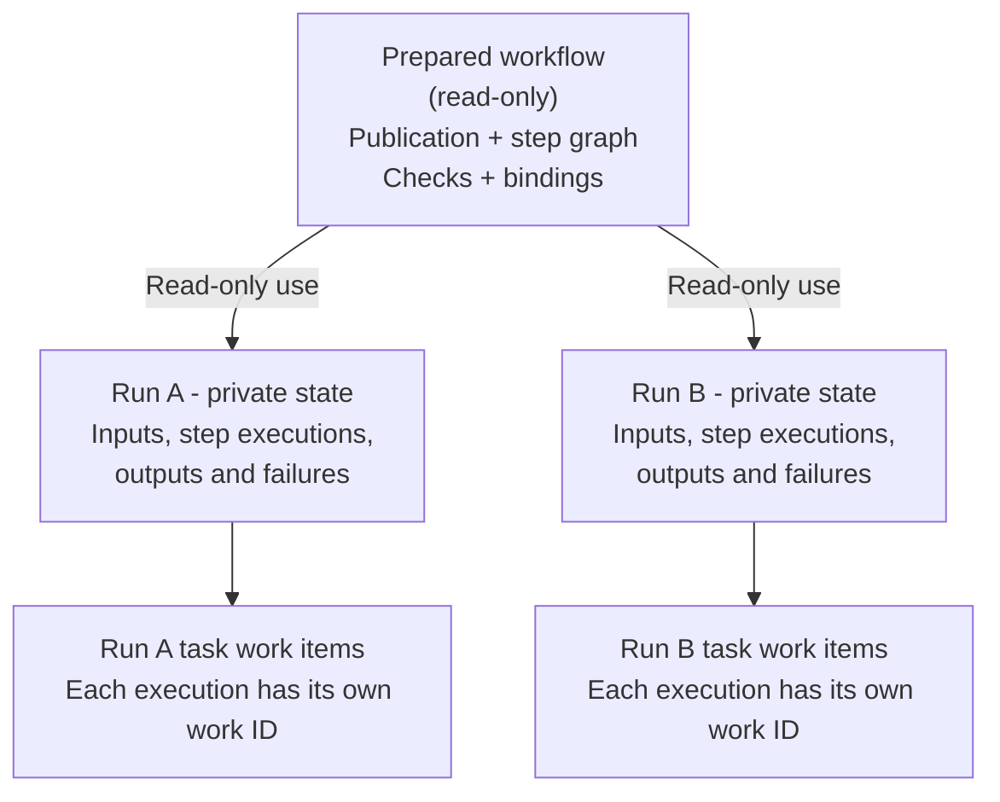
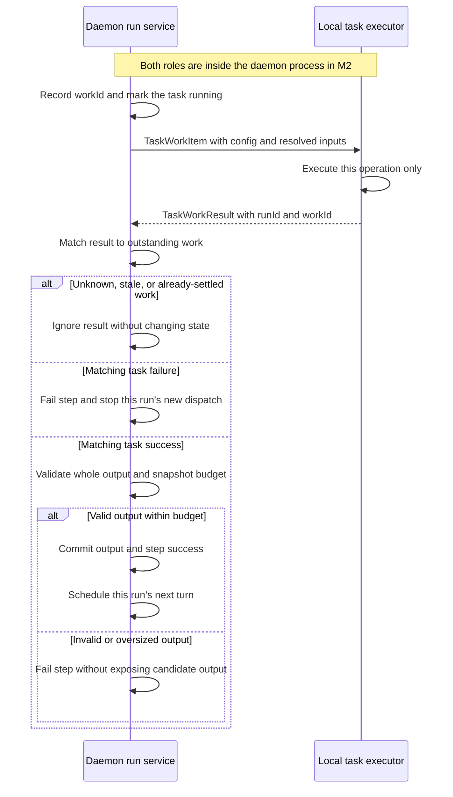
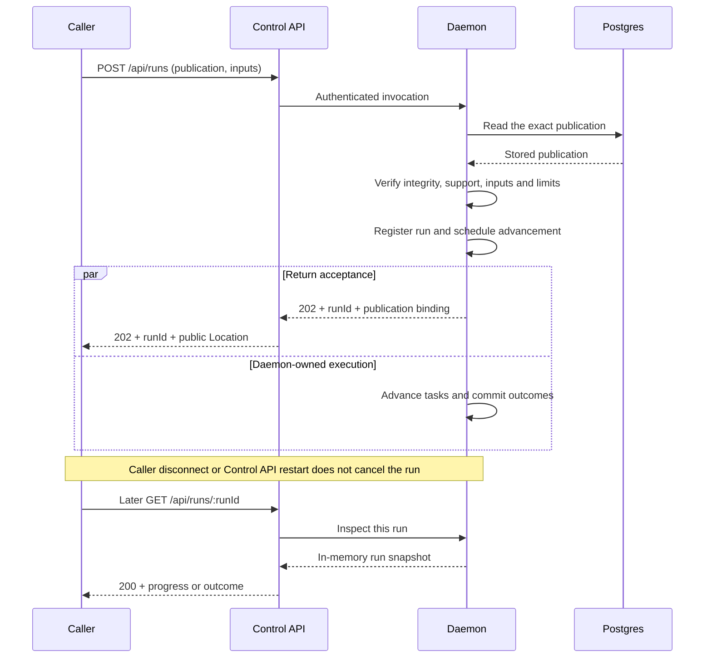
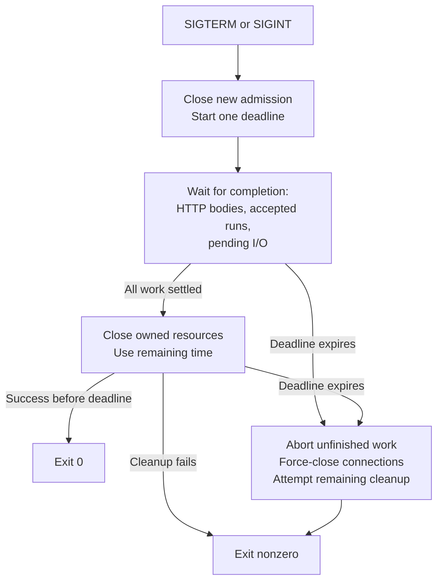

# Implement sequential workflow execution

- **Epic:** [M2 Epic 2: Execute sequential workflows](../epics/m2/2-execute-sequential-workflows.md)
- **Status:** Proposed technical design; execution is not implemented.
- **Repository baseline:** [2176f0b](https://github.com/RostrumAI/rostrum/commit/2176f0b), checked 2026-09-16.

## Purpose

Make a published workflow runnable. A caller starts it through the Control API, receives a run ID, and can disconnect. The daemon continues the work; the caller can return later to inspect progress, results, or failures.

The daemon coordinates the workflow, but each task execution is a separate unit of work. M2 executes those units locally. The boundary should let a later worker implementation execute a task without taking ownership of the workflow.

## Current repository state

We already have publishing and communication between services. This Epic builds on those foundations:

- **Authoring and storage:** the Control API creates, validates, and publishes workflows. Postgres stores immutable publications; `WorkflowRepository.getPublication` retrieves one and verifies its integrity.
- **Workflow definitions:** `@rostrum/workflow` provides document validation, graph/dependency rules, reference syntax, and digest calculation. It does not execute steps.
- **Daemon connection:** the daemon runs separately and exposes authenticated health/readiness endpoints. The Control API has an authenticated daemon client in `src/clients/daemon.ts`.
- **Application layout:** controllers handle HTTP in `src/controllers/`, business logic lives in `src/services/`, and `src/http/routes.ts` registers controllers explicitly. Process startup constructs and injects service instances.
- **Lifecycle:** `@rostrum/server` already tracks HTTP requests and response bodies, propagates cancellation, and shuts down under one deadline. It does not yet track work that outlives a request. Configuration changes require restart; SIGHUP only logs that requirement.
- **Existing limits:** the daemon readiness client caps response bodies at 64 KiB. Application body decoders currently buffer whole requests without their own size/depth bounds; the run-route limits below are new work.

## Scope

**Included:**

- Invoke an exact publication with validated inputs.
- Execute a sequence of deterministic tasks ending in an explicit `result` step.
- Pass literals, workflow inputs, and successful step outputs into later steps.
- Represent each task execution as a work item with an identifiable completion.
- Run independent invocations concurrently, including the same publication with different inputs.
- Inspect run/step states, completed outputs, and failures while the daemon remains running.
- Track accepted work through client disconnect and graceful daemon shutdown.

**Not included:**

- Conditional execution, parallel paths within a run, joins, loops, or daemon-wide worker-capacity scheduling. These remain with M2 Epics 3–5.
- Remote worker processes, a distributed queue, load balancing, leases, or worker recovery. A task boundary is not a distributed execution system.
- Persistent runs, restart recovery, invocation idempotency, retries, cancellation, or human waits. Durable invocation and idempotency belong to [M3 Epic 1](../epics/m3/1-recover-durable-runs.md).
- Automatic triggers, scripts, model calls, side-effecting operations, or a plugin system.

## Decisions

These are proposals for this PR, not claims of implemented or approved behavior:

- **Keep execution in the daemon.** There is no second execution consumer that justifies `packages/runtime`. Keep the engine testable without starting a server, but do not make it a workspace package for that reason alone.
- **Separate coordination from task execution.** The daemon selects work and commits outcomes; a task executor receives one work item and returns one result. The initial executor is local to the daemon process.
- **Prepare a graph, not a flattened sequence.** Share immutable definitions while keeping each run's progress separate. The first executor supports only sequential graphs; later Epics extend selection and activation rules.
- **Use asynchronous invocation.** POST returns 202 after the daemon accepts a run, not after the workflow finishes. GET returns the current observation.
- **Make workload limits operator settings.** Body/snapshot sizes are deployment choices; depth also needs a conservative implementation ceiling. The rationale and configuration contract are below.
- **Generalize outstanding-work tracking.** Extend the existing HTTP lifecycle tracker to cover accepted runs, rather than adding a run-specific shutdown callback.
- **Traverse the graph by visits, not by a chain.** Control edges create the next visits; declared `dependencies` decide when a visit may run. The engine holds no current-step pointer, so fan-out, joins, conditionals, and loops change what a node returns rather than how a run is represented.
- **Keep visit records append-only and derive the rest.** The frontier, the step observations, and the run status are folds over the records, so no cached state can disagree with them, and M3 durability becomes persisting the records instead of redesigning the state machine.
- **Treat quiescence as a failure.** A run with no running visit, no ready visit, and blocked visits left over can never progress. The daemon fails it with a located cause instead of leaving a caller polling a run that never changes.
- **A step may not depend on itself.** Publication validation refuses a self-dependency, because such a step can never become eligible and would surface only as quiescence at run time.

Review API/data contracts and presence rules with the API/specification owners, and task completion/shutdown with a concurrency reviewer. Preserve [workflow v1 compatibility](../specifications/workflow-interface-v1.md#breaking-and-additive-changes), the [controller/service boundary](../decisions/controller-service-vocabulary.md), and the [restart-only lifecycle](../research/restart-only-server-framework.md#decision).

## Progress

- [x] Agree invocation, task-work, and observation contracts (checkpoint 1). Configuration and lifecycle contracts remain with checkpoints 3 and 4.
- [ ] Rework checkpoint 2 around the visit-based run state and the advancement pass described under Implementation approach; PR [#64](https://github.com/RostrumAI/rostrum/pull/64) is superseded on the engine side.
- [ ] Build and demonstrate daemon-local execution directly.
- [ ] Connect invocation and inspection through both services.
- [ ] Verify independence, work tracking, shutdown, and operator setup.

## Checkpoints

The implementing engineer owns these steps. Each checkpoint must leave the repository runnable and record its implementation PR and verification result here.

### 1. Define contracts and prepare publications

- Add shared execution data contracts, the daemon-local task executor interface, and preparation that validates capabilities and compiles value schemas without executing work.
- Clarify presence/reference/result rules in the workflow specification; preserve existing publication validation and digest vectors.
- **Done when:** supported publications produce a prepared graph; unsupported behavior and invalid inputs reject before any run exists. Contract changes have API/specification review.
- **Implementation PR:** [#64](https://github.com/RostrumAI/rostrum/pull/64), branch `feat/m2-sequential-checkpoint-1`. Shared contracts are in `packages/workflow/src/execution.ts` (`@rostrum/workflow/execution`); the task boundary and preparation are in `apis/daemon/src/services/runs/execution/`, with `README.md` beside them.
- **Verification:** `bun run check` clean; `bun run lint` clean apart from pre-existing warnings in untouched files; `bun test` 505 pass, 0 fail, including the shared-contract, preparation, schema, and JSON-guard tests added here. A direct preparation run (no HTTP, no Postgres) resolved the worked example's bindings and accepted its frozen inputs, refused a string amount, a missing input, and an undeclared input as `invalid_inputs` with distinct codes and locations, refused an unknown operation as `unsupported_execution`, and refused unparseable stored content as `corrupt_publication`. The specification's [execution preparation](../specifications/workflow-interface-v1.md#execution-preparation) section states the clarified rules; publication validation and its digest vectors are unchanged.
- **Review:** the shared contracts and the specification clarification require API/specification review. The repository's automated review runs on the pull request, and a self-review pass fixed three boundary defects before it (references to non-schema positions, uninspectable values throwing instead of refusing, and lenient array-index pointers). Human contract review is still outstanding, so this checkpoint's contract work is implemented but not yet accepted.

### 2. Build the local execution cycle

- Implement per-run state, bindings, operations, task dispatch/completion, and explicit result completion inside the daemon.
- Add a direct-execution smoke command that needs neither HTTP nor Postgres.
- **Done when:** the worked example succeeds, invalid outputs cannot reach dependent work, duplicate completions cannot advance twice, and a held task does not block another run.

### 3. Connect invocation and observation

- Add run services/controllers to both applications, extend the daemon client, register the routes, and regenerate both OpenAPI documents.
- Integrate runs with the generalized work tracker as part of admission; accepted work must not become untracked when its POST response finishes.
- **Done when:** a caller publishes, invokes, receives 202, and retrieves the outcome through the Control API. Invalid requests create no run; accepted execution no longer needs the database.

### 4. Prove lifecycle and operating behavior

- Add the real-service `smoke:sequential` command using disposable Postgres and a Control API process helper modeled on the existing daemon helper.
- Complete the verification cases below, document the configuration settings and M2 state-loss/idempotency limitations, and obtain independent acceptance review.
- **Done when:** disconnect, concurrent work, database loss, graceful drain, and forced shutdown behave as specified. Revisit the design if these require persistence or distributed scheduling; do not introduce those implicitly.

## Implementation approach

### Where the code belongs

- **Daemon run service:** add `apis/daemon/src/services/runs/run-service.ts`. It owns publication preparation, admission, run IDs, the in-memory run map, advancement, and observation. Construct it once in `Daemon.open` and expose business operations through `context.services.runs`.
- **Daemon execution modules:** put preparation, bindings, state transitions, operation definitions, and the local task executor under `apis/daemon/src/services/runs/execution/`. They receive explicit dependencies and can be exercised directly without booting the process. No mutable module-level engine or run registry.
- **Control API run service:** add `apis/control-api/src/services/runs/run-service.ts`, backed by `src/clients/daemon.ts`. It forwards invocation and inspection to the daemon and classifies upstream failures. It does not read publications to decide execution support, allocate run IDs, or advance workflows.
- **Controllers:** add `src/controllers/runs/` in both applications and register them in `src/http/routes.ts`. Controllers decode requests and map service outcomes to HTTP; repositories and lifecycle ownership remain private to services/process composition.
- **Shared data, not a shared engine:** add an `@rostrum/workflow/execution` entry point for invocation, acceptance, observation, and failure schemas/types used by both APIs. Keep task-executor internals in the daemon and HTTP status/header declarations in controllers. Do not move authoring-only schemas or put workflow business schemas in the generic server framework.
- **Lifecycle:** extend `packages/server/src/lifecycle.ts` with generic work registration/completion. Update both process factories and lifecycle fixtures together; there is no additional run-specific drain hook.

“Manual invocation” describes the caller initiating POST, not a special workflow type. Any supported publication can be invoked with its declared inputs. A UI, script, or other API client uses the same path; future trigger mechanisms do not make the Control API an execution engine.

### Prepared graph and run state

Each invocation owns its state and work IDs. An immutable prepared definition may be reused without sharing progress or introducing a required compilation cache:

- A **prepared workflow** contains the exact publication binding, entry step, step definitions keyed by ID, successor/dependency relationships, compiled value checks, and input bindings. Reuse `WorkflowGraph` and the existing reference grammar rather than create another interpretation of the document.
- Preparation checks that this release can execute every declared step. M2 Epic 2 permits one reached successor at a time, dependencies on earlier reached steps, and a terminal result. Duplicate edges to one target do not execute it twice; supported disconnected steps remain pending and inspectable.
- A **run** separately owns invocation inputs, step-execution records, ready/running work, committed outputs, failures, and terminal state. Sharing prepared definitions must never share this mutable state between invocations.
- A **step definition** is not a **step execution**. M2 activates each reached step once. A later loop may activate the same definition in multiple iteration scopes, and M3 may create multiple attempts for one activation. Generate work IDs for executions rather than using `stepId` as a globally unique work identity.
- Do not encode progress solely as a numeric index into a prepared array. Later conditionals select outgoing edges, parallel paths make several activations ready, and loops create iteration-scoped activations. Those changes belong in daemon scheduling/state, not in task handlers.

This preserves the graph structure without implementing conditionals or loops early. Current unsupported constructs still reject at invocation; preparation does not silently flatten them or change which documents can be published.

### Run state, traversal, and node visits

A **step definition** is what the document declares. A **visit** is one activation of a definition within one run. M2 creates one visit per reached step, but a visit is never identified by `stepId` alone: a loop creates further visits of the same definition, and M3 creates further attempts inside one visit. The pair that identifies a visit is `(stepId, activation)`, where `activation` is `null` outside loops and `{ loopStepId, index }` inside one. v1 forbids nested loops, but two loops may share a body step, so the loop step is part of the key.

Each visit is an append-only JSON record:

| Field | Meaning |
| --- | --- |
| `nodeId` | The visit's own identity, minted by the daemon. |
| `stepId` | The definition this visit activates. |
| `activation` | Which activation of that definition: `null`, or `{ loopStepId, index }`. |
| `status` | `blocked`, `ready`, `running`, `succeeded`, or `failed`. |
| `workId` | The outstanding execution while `running`. |
| `output`, `failure` | The settled result, present only after settlement. |
| `createdAt`, `startedAt`, `completedAt` | Timestamps for inspection. |

The run owns its records; nothing looks up a run from a visit. Caller-facing inspection projects a definition with no visit, and a `blocked` visit, to `pending`; `ready`, `running`, `succeeded`, and `failed` keep their names.

**Creation follows control edges.** When a visit succeeds, the engine asks the node for the activations to ensure and creates a visit for each. A task step returns its `successors`; a conditional node later returns the chosen branch, and a loop node its next iteration or its successor. Creation is idempotent on `(stepId, activation)`: a second predecessor proposing the same visit finds the existing record and appends nothing.

**Eligibility follows declared dependencies.** A created visit stays `blocked` until every step in its `dependencies` has a succeeded visit in the same activation scope. Both mechanisms are required: control edges decide that a visit exists, dependencies decide that it may run. A step reached by two predecessors is created by the first and released by the second, and a dependency that fails releases nothing.

**Completion is idempotent on `(workId, status === "running")`.** A result whose `workId` does not match the visit's outstanding work, or that arrives for a settled visit, changes nothing. Creation and completion are separate guards with separate keys.

**Advancement is one synchronous pass per trigger.** A trigger is a settled visit or an accepted run. The pass runs to a fixpoint and never awaits:

1. Create a visit for every activation of every settled visit.
2. Promote `blocked` to `ready` where the dependency gate is satisfied.
3. Dispatch at most one `ready` visit, recording `workId` and `running` before the executor is called, so an executor that settles synchronously cannot outrun its own record.

Because the pass contains no `await`, it is atomic against other triggers on the event loop and needs no per-run lock. Dispatch is the only work that leaves the pass; its completion re-enters as a new trigger.

**A run that cannot progress fails.** A pass that finds no `ready` visit, no `running` visit, and at least one `blocked` visit has a run that will never change again: nothing is in flight to open a gate. The daemon fails that run with a located failure naming the unmet dependency. A self-dependency reaches this state today (see Discoveries); in a correct document it is an engine invariant.

**Run status is derived from the records.** No visits is `queued`; any visit ready, running, or blocked is `running`; a failure that stopped dispatch while work settles is `running` with `stopping: true`; a settled `result` visit is `succeeded`; a terminal failure is `failed`. Deriving the status keeps the observation coherent by construction.

### One task execution, from ready to completed

The hand-off below starts after input validation. Only the daemon can commit a task outcome and release more work:

1. **Select:** the run's advancement pass creates visits from settled predecessors, releases those whose dependency gate is satisfied, and marks the next eligible visit ready (see run state, traversal, and node visits).
2. **Bind:** resolve literals/references and validate the operation's complete input object. A binding/input failure fails that step without invoking the task executor.
3. **Dispatch:** allocate a unique `workId`, record the outstanding step execution, mark it running, and send one `TaskWorkItem` to the executor. Record ownership before calling code that may settle synchronously.
4. **Execute:** the executor selects the operation implementation and calls it once. It returns a success value or typed failure; unexpected throws/rejections become a sanitized task failure.
5. **Match:** the daemon matches the result to the outstanding run/work IDs. Unknown, stale, or already-settled results cannot change state. A repeated completion must not commit output or release a successor twice.
6. **Commit:** validate the whole output against operation and author-declared schemas, enforce the snapshot budget, then commit the owned output and successful step state together. Invalid output fails the step without exposing any portion downstream.
7. **Continue:** the next advancement pass creates the settled visit's successors, then dispatches them or completes the run through `result`; the worker does not choose the continuation.

The internal boundary is deliberately small:

- `TaskWorkItem` contains `runId`, `workId`, `stepId`, `workflowFormatVersion`, validated task `config` (including `operation`), and the fully resolved JSON `inputs`.
- `TaskWorkResult` identifies `runId` and `workId`, then contains either a successful output or a typed failure. Use distinct success/failure shapes, not optional fields whose combinations are ambiguous.
- Neither message contains a database handle, request context, engine callback, prepared graph, or mutable references into run state. All execution data can be serialized; local cancellation is an out-of-band executor concern, not JSON data or the initiating caller's signal.
- Inputs can combine original workflow values and several earlier step outputs. A task therefore has everything needed for its own operation without looking up or owning the rest of the workflow.

In M2, a local executor in the daemon process implements this boundary; no worker threads, broker, HTTP completion endpoint, or persistent queue is added. Completion schedules daemon advancement through an ordinary in-process call. Serialize transitions within each run, not across all runs, and allow at most one running task per sequential run.

A later remote worker can implement the same responsibility, but the message shape alone does not provide reliable distribution. That work must address durable dispatch/results, worker compatibility, authentication, claims/leases, backpressure, and duplicate delivery. M3 supplies durable progress and attempts, but its first Epic still excludes distributed scheduling. Neither design promises exactly-once external effects.

### Operations, data, and final results

- `greet` takes `name: string` and returns `{ greeting: "Hello, <name>!" }`, preserving the existing greeting fixture.
- `add` takes finite `left` and optional finite `right` (default zero), returning `{ value }`. `divide` takes finite `dividend`/`divisor`, returning `{ value }`. Non-finite results fail as `numeric_overflow`; either sign of zero fails division as `division_by_zero`.
- Use ordinary JSON-number arithmetic, without numeric-string coercion or decimal-money guarantees. Task config is exactly the supported operation declaration; input/output objects reject unknown operation fields. Built-ins perform no I/O or external side effects.
- Require every declared workflow input and successful step output; reject undeclared invocation inputs. Omission, `null`, and a supplied reference are different: an optional binding can be absent, but an explicit reference must resolve. Schema defaults do not fill missing values.
- Resolve only whole reference bindings. Nested reference-shaped objects remain data; dotted names remain flat keys, not object paths. Use own-property lookup, including for prototype-sensitive names, and expose only fully validated, immutable outputs.
- Validate schema fragments themselves against offline JSON Schema 2020-12 resources before compiling them with TypeBox. Reject unsupported dialects, external/unresolved references, recursive reference cycles, and invalid fragments before acceptance. Catch compiler/evaluator failures; do not leave an accepted run stuck on an uncaught exception.
- Format annotations must not reject otherwise valid values. Apply any execution-only schema adjustment at schema positions, preserving stored documents and literal values inside `const`/`enum`.
- `result` is controlled by the daemon, not dispatched to a worker. Its resolved input object is exactly the final output, including `{}`. Validate its declared outputs before committing result data and terminal success together.
- On failure, stop dispatch for that run and settle any running work before marking it failed. Inspection can show `running` with `stopping: true` during that drain. Keep prior successful outputs, publish no final result, clear terminal `currentSteps`, and never change a terminal outcome.

### Invocation and the HTTP contract

Acceptance separates the HTTP request from daemon-owned execution. This example shows a successful invocation and later inspection; reply delivery and execution do not wait for each other:

- Both services expose `POST /api/runs` and `GET /api/runs/:runId`. The daemon routes retain private bearer authentication; all run responses use `Cache-Control: no-store`.
- POST accepts an exact `workflowId`, integer `publicationNumber`, and object `inputs` (absent means `{}`). Reject unknown envelope fields. New run-route IDs use lowercase UUID v7; existing authoring-route behavior stays unchanged.
- The daemon reads the selected publication through the existing repository, verifies its identity/format, checks execution support, validates inputs, and budgets the initial observation. Missing publications, unsupported execution, invalid inputs, and corrupt storage remain distinct failures, not accepted runs.
- After asynchronous preparation, recheck request cancellation/deadline and process admission. Register the run's work ownership and insert its state without an intervening `await`, then schedule advancement. If registration/admission fails, create no run and dispatch no task.
- After that point, the run needs neither the initiating request nor further database reads. Disconnect and Control API timeout cannot undo acceptance. Accepted runs and GET remain available during a later database outage.

**Why 202 rather than 200?**

- [202 Accepted](https://developer.mozilla.org/en-US/docs/Web/HTTP/Reference/Status/202) communicates that execution was accepted but is not complete. A 200 contract could be defined, but 202 makes the asynchronous behavior explicit instead of implying this response contains the workflow outcome.
- Return `runId`, the immutable publication binding, `status: "queued"`, and `Location: /api/runs/<runId>`. The status records acceptance; a following GET may already see running or terminal work. The Control API constructs a public relative Location, not a daemon URL.
- GET returns 200 when inspection succeeds, even for a failed workflow. Its snapshot contains the publication binding, run status/timestamps, all step states and successful outputs, ready/running `currentSteps`, failures, and a final output only on success. Unknown or restart-lost IDs return 404.
- The client validates upstream identities and response shapes. A valid domain rejection stays a domain rejection; transport failure, timeout, and malformed upstream data remain distinguishable. Bound response consumption as well as connection time; do not automatically retry POST.

**Invocation idempotency:**

- M2 deliberately does not deduplicate invocations. Two accepted POSTs with identical publications/inputs create two independent run IDs; identical input is not evidence of a retry.
- If acceptance arrives, the caller can safely repeat GET. If the POST response is lost, it cannot know whether the daemon accepted the run; retrying may create another. An in-memory key map would still lose this protection on restart, so do not present it as reliable idempotency.
- [M3 Epic 1](../epics/m3/1-recover-durable-runs.md#durable-acceptance-and-progress) owns the durable solution: commit the invocation key, selected publication, inputs, and run identity before acknowledging. Concurrent retries with the same key and request recover the same run; conflicting reuse is rejected. Distinct keys preserve independent invocations.
- Key scope/lifetime and response replay remain decisions for that M3 plan. Bringing the guarantee into M2 would require explicitly changing its durability scope. Task-completion deduplication above is separate: it protects one run's transitions, not repeated requests to start runs.

### Limits and configuration

Limits bound the cost of one request or observation. Without them, a caller or task can force large buffers, retained outputs, repeated serialization, or recursive validation deep enough to exhaust the stack. They do not bound total retained-run memory or guarantee cheap schema evaluation.

Add settings through each application's existing configuration schema/default/environment mapping, with restart required for changes:

- `runMaxRequestBytes` / `RUN_MAX_REQUEST_BYTES`: default **1 MiB**. Both services reject an oversized run invocation with 413 while reading it, not after buffering the whole body. Apply it to run routes without changing the authoring upload contract.
- `runMaxSnapshotBytes` / `RUN_MAX_SNAPSHOT_BYTES`: default **8 MiB**. The daemon budgets retained observations; the Control API caps snapshot consumption. Operators may raise or lower this byte limit for their workloads.
- `runMaxValueDepth` / `RUN_MAX_VALUE_DEPTH`: default **128**, configurable downward. Count the root object/array as level one; use the same bound for runtime values and author schema fragments. Raising the hard ceiling requires validator/stack-safety evidence, not merely a config edit.

Validate byte settings as positive safe integers, require space for the diagnostic reserve, and reject request settings incompatible with the listener's body ceiling. Configure matching run limits in both services and demonstrate non-default values in the service smoke. There is no automatic negotiation: mismatched settings are a deployment error and can cause the Control API to reject a request or snapshot the daemon would otherwise accept. Increasing limits also requires enough process memory; it is not a workflow-format change.

Keep these protections fixed rather than add operator knobs for every internal buffer:

- Preserve the existing **64 KiB readiness-client cap**; add the same cap for run acceptance/error envelopes, which contain bounded protocol data rather than arbitrary results.
- Reject raw invocation JSON beyond **256 container levels** before recursive parsing. This guard must recognize quoted strings and escapes; subsequent runtime checks apply the configured value-depth limit.
- Reject non-JSON/cyclic/non-finite handler values before copying or serializing them. Depth checks must run before recursive value validation or cloning.

To keep every accepted run inspectable:

- Before acceptance, budget all step records, timestamp/state growth, and **64 KiB reserved for failure diagnostics**. Reject a publication whose output-free snapshot cannot fit.
- Before each output commit, charge its actual encoded JSON size. Count the final result twice where it appears both as step output and run output. If it would exceed the limit, fail that step as `run_snapshot_limit`, retain earlier outcomes, and publish none of the candidate output.
- Bound/sanitize failures and verify UTF-8 size accounting, including escaping and multibyte strings. Never truncate an observation or expose raw exceptions, connection details, or input values in diagnostics.
- Keep completed runs until daemon exit, without eviction. Per-run caps reduce individual cost; aggregate memory still grows with accepted runs. Capacity/retention policy is not silently added to this Epic.

### Generalized work tracking and shutdown

The tracker waits for completion, not merely an abort signal. One shutdown deadline covers both the drain and resource closure:

Accepted runs can dispatch their remaining tasks while draining. Terminal runs release their registrations even when they failed; retained snapshots do not block a clean exit.

- Create one process-owned work tracker in `boot`. Each registration has an identity, an `AbortController`, and an explicit completion/release operation. Its registry contains unfinished work, not every retained run or every signal ever created.
- Adapt existing HTTP tracking to it: register an admitted request before dispatch and release it after handler work and response-body completion/cancellation. Keep outstanding operations owned until they actually settle, even if the caller has disconnected.
- Give process-composed services a narrow registration capability; keep stop-admission, abort-all, and resource-close capabilities with the lifecycle owner. Controllers retain request cancellation and business-service operations, not direct lifecycle controls.
- Register an accepted run independently of its POST request and release its registration only after terminal commitment and outstanding task work settle. Its cancellation signal is process-owned, never the caller's signal. Completed run snapshots can remain in memory without keeping shutdown active.
- Track the run across queued work and gaps between tasks. Closing admission rejects new root requests/runs, but already accepted runs may dispatch their remaining tasks during drain. Do not count only currently executing handlers or reject their continuations as new invocations.
- On SIGTERM/SIGINT, synchronously close admission and start the existing single shutdown deadline. Wait for HTTP connections/bodies and all registered work, then close database/process resources using only the remaining budget.
- At the deadline, abort outstanding controllers, force-close connections, attempt bounded resource closure, and exit nonzero. Aborting is best-effort interruption, not a successful drain; repeated signals must not restart the clock.
- Publication queries currently have no reliable per-query cancellation. Racing one against a timeout must not release its work registration while the query still owns database resources; refuse late run admission and observe settlement or let the process deadline force exit.

Implement this by extracting/extending the current `outstanding` request map in `lifecycle.ts`, not by keeping a separate run-only drain callback alongside it. Thread the registration capability through the process factory into the daemon run service; update both factories and lifecycle fixtures when the shared signature changes.

SIGHUP continues to change nothing. Restarting only the Control API never cancels daemon work. Restarting the daemon loses all M2 runs, including after a clean drain; a forced exit is not a durable failed/cancelled outcome.

## Verification

### Worked execution

Use one reusable fixture: add `amount` and `surcharge`, divide the total by `people`, then return `{ total, perPerson }` through `result`.

- `{ amount: 90, surcharge: 10, people: 4 }` dispatches add with `{ left: 90, right: 10 }`, commits `{ value: 100 }`, then dispatches divide with `{ dividend: 100, divisor: 4 }`. The result is `{ total: 100, perPerson: 25 }`.
- `people: 0` is accepted, then fails at division. The addition output remains visible and the result never runs. A string amount or missing required workflow input rejects before acceptance.
- Reuse the minimum/result-only and greeting fixtures in `packages/workflow/src/fixtures/valid/`. Reordering the document's steps must not change execution.

### Boundary checks

- Hold a task while another run completes or fails. Release it and verify each run retains its own inputs, work IDs, states, and outcomes.
- Duplicate a completion, deliver a stale/wrong-run result, and inspect repeatedly: no second dispatch, overwritten output, or changed terminal result. Invalid/partial outputs never release dependent work.
- Exercise missing bindings, optional omission versus unresolved references, empty result, schema/format/depth failures, and prototype-sensitive or dotted names.
- Publish a newer version while a run is held; its original publication binding and output must remain unchanged.
- Disconnect the caller, interrupt POST near acceptance, and restart only the Control API. Observe no automatic retry or post-acceptance cancellation; repeated explicit POSTs still create independent runs in M2.
- Remove database access after acceptance: execution and GET continue while readiness and new preparation fail. A timed-out preparation must not admit a run later.
- Configure matching non-default limits in both services. Exercise oversized streaming requests, multibyte output, snapshots above 64 KiB, and an inspectable `run_snapshot_limit` failure without truncation.
- Shut down with an HTTP response body, a queued run, and a running task outstanding. A clean exit waits for all three; accepted continuations still finish after admission closes. An uncooperative operation forces bounded nonzero exit, and old run IDs are absent after restart.
- Change configuration/token files and send SIGHUP; active configuration and runs remain unchanged. Restart is required to apply changes.

Run the example directly and through actual service entry points. Use test-only controlled executors for held-work/fault cases, not production `sleep`, `fail`, or task-control endpoints. Tests should assert observable transitions and outcomes, not incidental queue mechanics. Dispose only test-owned processes and Postgres; separate-network conformance remains Epic 6 work.

### Commands

- Add `bun run --filter @rostrum/daemon smoke:execution` for direct daemon-local execution, preserving the daemon's existing boundary smoke command.
- Add root `bun run smoke:sequential` for publication, invocation, and inspection through real service processes.
- Run focused execution, shared-contract, controller/client, configuration, and lifecycle checks. Keep `packages/server/src/restart.test.ts`; do not recreate a reload suite.
- Regenerate both OpenAPI documents, then run both existing service smoke commands, `bun run check`, `bun run lint`, and `bun test` against the integrated implementation.

## Discoveries

- Publishable does not yet mean executable: validation permits missing task config, unknown operation names, and malformed value-schema fragments. Execution preparation must reject these without changing publication validity.
- TypeBox compilation can accept malformed schemas and asserts formats by default. Schema validation and annotation handling are separate from successful compilation.
- Existing shutdown already distinguishes request cancellation from tracked completion. Extending that mechanism avoids a competing shutdown system for runs.
- TypeBox's `Static` degrades to `never` under this repository's compiler when a schema is built from a computed array (`Type.Union(codes.map(...))`). The failure-code and rejection-reason sets stay single-sourced and compile correctly as a JSON Schema `enum`.
- The installed TypeBox compiler enforces some keywords outside 2020-12 (`dependencies`, `dependentRequired`) and ignores unknown ones, so an unrecognized assertion keyword would silently weaken validation. Fragments are therefore validated against offline 2020-12 meta-schemas before compilation, and the capabilities this release cannot vouch for are refused.
- A plain self-`$ref` exhausts the compiler stack while compiling, so recursive fragments are refused rather than compiled.
- TypeBox's `Errors()` returns a bounded batch of failing items per call: a document with 40 malformed steps produced 16 shape findings. The refusal list is capped by preparation itself, not by the library.
- Reading a canonical document through a strict parse and then narrowing it to a typed document keeps the untyped-to-typed transition at one reviewed place; preparation re-runs the shared validator so a daemon never executes content that this release's rules would not accept.
- A step that lists itself in `dependencies` passes publication validation today: the validator returned `validForPublication: true` with no findings. Cycle detection runs over control edges only, and the dominator sets include the node itself, so the merge-after-branch check accepts a self-dependency. Such a step can never become eligible, so a run would reach it only as quiescence. The gap predates this branch, and the fix belongs in the graph stage.

## Decision log

- 2026-09-16: retain the delivered controller/service split and restart-only framework.
- 2026-09-16 review revision: propose daemon-local execution, a per-task work/result boundary, graph-preserving preparation, configurable workload limits, and generalized work tracking. Keep invocation idempotency with the governing M3 durability Epic.
- 2026-09-17 checkpoint 1: shared execution contracts live in `@rostrum/workflow/execution`; the prepared graph is a serializable projection of the validated document (steps keyed by id with successors, dependencies, bindings, and compiled checks) rather than a retained `WorkflowGraph` instance, so one prepared definition can be shared without mutable engine state.
- 2026-09-17 checkpoint 1: a task step's `config` is exactly the supported operation declaration. Preparation refuses an unknown operation, an undeclared configuration member, configuration on a `result` step, more than one distinct successor, a `loop`, or a `conditional`, without changing which documents publish.
- 2026-09-17 checkpoint 1: document-level problems refuse as `unsupported_execution` and input problems as `invalid_inputs`; a refusal carries at most 32 sanitized failures, each located by JSON Pointer at the offending member, including missing and undeclared members.
- 2026-09-17 checkpoint 1: declared value fragments are validated against offline 2020-12 resources before TypeBox compilation. `format` is an annotation stripped from the compiled copy's schema positions, schema defaults are never applied, and `$id`, dynamic-scope keywords, external or unresolved references, and recursive references refuse as unsupported.
- 2026-09-17 checkpoint 1 open item for checkpoint 3: both services must keep the single application error envelope. How a domain `RunInvocationRejection` and its failures appear in that envelope is checkpoint 3's contract decision.
- 2026-09-17 run-state design: a run is a set of append-only visit records keyed by `(stepId, activation)`. Control edges create visits, declared dependencies gate eligibility, one synchronous advancement pass runs to a fixpoint after each settled visit, and run status is derived from the records. The engine-side shape of PR [#64](https://github.com/RostrumAI/rostrum/pull/64) is superseded by this model; the shared execution contracts and preparation are unaffected.
- 2026-09-17 run-state design: the activation discriminator is `{ loopStepId, index }`, null outside loops. `nodeContext` was rejected because context already names the controller, request, and validation contexts in this repository, and a bare `loopIndex` because two loops may share a body step.
- 2026-09-17 run-state design: creation and completion are separately idempotent — creation on `(stepId, activation)`, completion on `(workId, running)` — and a pass that finds nothing runnable while visits remain blocked fails the run.
- 2026-09-17 validation gap: the graph stage must refuse a step that lists itself in `dependencies`; the engine's quiescence failure is the backstop, not the fix.
- Record approvals or changed contracts here before dependent implementation; review comments and proposed designs are not implementation evidence.

## Outcome

Checkpoint 1 landed the shared execution contracts, the task boundary, and preparation that refuses unsupported publications and invalid inputs before a run exists (implementation PR [#64](https://github.com/RostrumAI/rostrum/pull/64)). Execution itself has not shipped: complete checkpoints 2 through 4, record their implementation PRs and verification results, then move lasting contracts into the specification/code and retire this plan.
