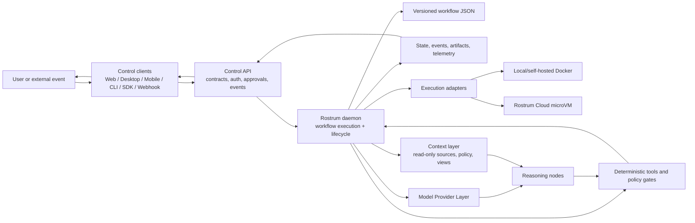

# Rostrum product strategy

Status: Draft for architecture and product discussion  
Source: [AI Workflow Engine Market Research - synthesis](../research/ai-workflow-engine-market-research-synthesis.md)  
Audience: Founders, product, engineering, and design

## Contents

- [1. Executive summary](#1-executive-summary)
- [2. The problem Rostrum solves](#2-the-problem-rostrum-solves)
- [3. Product concept: workflows as reusable execution graphs](#3-product-concept-workflows-as-reusable-execution-graphs)
- [4. What needs to be built](#4-what-needs-to-be-built)
- [5. How the pieces interact](#5-how-the-pieces-interact)
- [6. Open-source and cloud boundary](#6-open-source-and-cloud-boundary)
- [7. Recommended build shape](#7-recommended-build-shape)
- [8. What technical Epics must resolve](#8-what-technical-epics-must-resolve)
- [9. Decisions to facilitate next](#9-decisions-to-facilitate-next)
- [10. Working definition of done for the product concept](#10-working-definition-of-done-for-the-product-concept)

## 1. Executive summary

Rostrum is a platform for defining and executing reliable automation and AI workflows. A Rostrum "workflow" is a reusable, versioned workflow graph, not a system prompt or an open-ended chat session. The graph combines reasoning nodes with deterministic nodes for operations that must be literal, inspectable, and repeatable. Natural-language intake is outside Rostrum's core responsibility: callers provide structured workflow inputs, while a domain-specific workflow may accept a prompt or route a request to another workflow.

Users can define a workflow once and invoke it from several places: the web/desktop control application, a mobile-friendly surface, an SDK or API, or an external event such as a pull request, CI failure, data arrival, or production alert. Every invocation supplies a workflow identifier and structured inputs. A workflow may contain a prompt-taking node or decider, but that is workflow behavior rather than implicit Rostrum intake.

The product centers on the execution lifecycle:

1. Receive a workflow invocation or event.
2. Validate and bind the workflow's declared inputs.
3. Build or load the workflow graph.
4. Execute the graph durably across bounded loops and isolated runtimes.
5. Persist state, logs, decisions, and artifacts.
6. Pause for policy decisions or human approval when required.
7. Expose progress and controls to users.
8. Produce a verifiable result, with the evidence to back it, rather than just a final answer.

The market research points to graph constraints, typed handoffs, deterministic verification, durable checkpoints, isolated execution, and a clear separation between orchestration and user interface as the main sources of reliability.

## 2. The problem Rostrum solves

Many AI automation systems combine planning, tool use, transformation, verification, and explanation inside one loosely controlled reasoning loop. That is convenient for small tasks but difficult to trust for important work. The failure modes Rostrum is intended to address are:

- unclear or hallucinated sequencing of work;
- agents deciding when to stop without an enforceable completion condition;
- runaway retries and uncontrolled cost;
- one agent validating its own assumptions;
- lost state when work is paused or the interface disconnects;
- unsafe commands, credentials, scripts, and generated code running in the wrong environment;
- poor visibility into what a remote or parallel workflow is doing;
- workflows that cannot be reused consistently across local and hosted execution;
- expensive models rereading the same context because a transfer moved only a prose plan;
- scripts and tool output flowing between nodes without schemas, limits, or policy boundaries.

Rostrum's value is to turn an unpredictable model or automation step into a governed execution process. Models can still reason, propose, and adapt inside a workflow, but the system determines what each node is allowed to do, what trajectory state may be handed off, how script output is bound to downstream inputs, what evidence is required, and when the workflow is complete or blocked.

## 3. Product concept: workflows as reusable execution graphs

A workflow is Rostrum's primary unit of behavior. It packages:

- a workflow graph of nodes, branches, loops, and completion conditions;
- input and output contracts between nodes;
- the agents, models, tools, and policies available to each node;
- the runtime target and resource limits;
- approval requirements and escalation behavior;
- the artifacts and evidence the workflow must produce.

Workflows should be composable and versioned. A workflow can be run repeatedly against different structured inputs, data sets, repositories, events, or requests without changing the fundamental execution semantics.

The initial workflow families should represent distinct operating constraints rather than merely different prompts. These are reference shapes and showcase candidates, not hard-coded product scope:

| Workflow family | What it is for | Defining constraint |
| --- | --- | --- |
| Review-only | Analyze a change, repository, or design and return findings | Read-only; no source mutation |
| Planning | Produce requirements, architecture, risks, and an implementation plan | Documentation artifacts only |
| Guided build | Implement an approved plan through verification and correction | Approval before mutation and bounded fix loops |
| Fast fix | Resolve a narrowly scoped failure or maintenance task | Minimal planning; narrow blast radius |
| Autonomous project | Coordinate a large body of dependent work | Explicit task graph, worker isolation, and domain-specific gates |

These workflows cover the core examples in the research while leaving room for future domains beyond the first software workflow collection.

## 4. What needs to be built

### 4.1 Workflow definition and graph model

Rostrum needs an open workflow model that can express sequential work, branching, parallel fan-out, joins, cycles, retries, approvals, timeouts, escalation, and explicit input/output bindings. It should be possible to inspect a workflow as a graph and validate it before execution. Workflow invocation is based on a declared input schema; the platform does not need to interpret an unstructured prompt to execute a workflow.

This layer is the stable contract between all Rostrum deployments and interfaces. It should support typed state, structured node inputs and outputs, explicit side effects, and a clear distinction between "reasoning" and "execution."

### 4.2 Durable orchestration runtime

The orchestration runtime is the system that executes a workflow. At a high level it needs to:

- schedule ready nodes and manage dependencies;
- persist checkpoints and resume after interruption;
- manage parallel branches and child workflows;
- enforce time, attempt, token, and financial budgets;
- route failures through retry, fix, escalation, or halt paths;
- wait for human approvals without losing state;
- emit a consistent event stream for interfaces and integrations;
- record the evidence needed to explain why a workflow succeeded, failed, or stopped.

This is the central product capability. Interfaces, triggers, and execution targets should invoke and observe it rather than reimplement it.

### 4.3 Model provider layer and runtime

Rostrum needs a Model Provider Layer that is separate from both workflow execution and the Context Layer. It should own provider authentication, model/capability discovery, request and response normalization, routing, fallback, and usage accounting. The model runtime consumes that layer to execute reasoning nodes under structured contracts and context boundaries. The Context Layer supplies approved information; it does not broker model calls.

The runtime should support fresh contexts for separate roles and a first-class transfer node. A workflow may begin a conversation with a stronger model for repository or context exploration, planning, or an initial edit, then transfer the execution trajectory to a cheaper or faster model after a declared condition. The transfer node should configure target selection, context pruning, continuation state, and failure behavior. It should preserve the relevant context, tool history, structured task state, and first valid action. A prose-only handoff would force the next model to reread the same material. A verifier should still evaluate an artifact against the original contract without inheriting the implementer's assumptions.

### 4.4 Context layer

Rostrum needs a first-class, read-only context layer that lets workflows declare which project information an agent may access without handing source-system credentials to the agent. Context sources may include repositories, issue trackers, Slack, Discord, documentation sites, incident systems, and other approved systems.

The context layer should be as pass-through as possible. A context connector authenticates to the source, retrieves only the permitted material, applies policy and redaction, and delivers a context view or bundle to the node. Rostrum should not persist source content or maintain a general-purpose cache by default. It may retain connection metadata, provenance, hashes, policy decisions, and redacted operational metadata. Persisting source content should require explicit opt-in and retention policy.

The context layer should remain read-only in the first product scope. Context access and external write actions are separate concerns: a workflow may later publish a result through an integration, but agents should not receive write access merely because they can read context.

The context layer needs four conceptual parts:

- **Context source:** a connector to an external system.
- **Context policy:** the allowed source, scope, fields, time range, data classification, and node access.
- **Context view:** the filtered and redacted data delivered to a node.
- **Context provenance:** source identity, retrieval time, selectors, and integrity metadata.

### 4.5 Deterministic tool and policy runtime

Deterministic nodes are first-class workflow components. They should cover the operations that should not be delegated to model judgment, including:

- reading and writing files under an explicit workspace policy;
- Git branch, commit, diff, and remote operations;
- test, build, lint, and security commands;
- repository and issue context loading;
- artifact collection and transformation;
- branching on structured results such as exit codes or policy checks;
- approval and notification actions;
- external API calls through controlled integrations.

Sandboxed scripts should also be deterministic nodes. A script author supplies an OCI image, Dockerfile/build context, or equivalent runnable definition and owns the language runtime, dependencies, command behavior, and output format. Rostrum delivers declared inputs, runs the container in an isolated target, captures stdout, stderr, exit status, files, artifacts, and resource usage, and applies author-defined output bindings to downstream node inputs. Rostrum validates a declared output schema when one exists, but it does not infer the script's output contract or manage its dependencies.

Every tool invocation needs an explicit boundary: allowed inputs, side effects, credentials, runtime target, timeout, and approval policy. This is also where Rostrum turns raw command output into structured observations for later nodes.

### 4.6 Execution target and sandbox layer

The same workflow should be runnable in multiple environments, chosen according to trust, cost, speed, and hardware needs. Rostrum should treat execution targets as replaceable adapters behind a common contract. Model execution, tool execution, and sandboxed script execution must all be explicit target operations rather than hidden host-process behavior.

The initial target spectrum should be intentionally small:

- Docker for local and self-hosted execution;
- microVMs for Rostrum Cloud execution.

Each implementation run or parallel task gets its own container or microVM, separate from the user's host repository and machine. Git branches, commits, diffs, and pushes remain useful for change tracking and collaboration, but Git worktrees are not the isolation mechanism. The execution target receives a source snapshot, creates or checks out a branch, and pushes the resulting branch or commit to the configured origin according to policy.

The sandbox layer should provision a workspace, mount only the required data, expose approved tools, isolate credentials, collect logs and artifacts, and destroy or recycle the environment according to policy.

### 4.7 State, event, artifact, and telemetry services

Durable workflows require more than a job queue. Rostrum needs a persistent execution record containing graph state, node attempts, inputs, outputs, approvals, tool calls, costs, logs, and artifacts.

An event stream should make the execution record observable in real time. Artifacts should be addressable independently of a chat transcript, since plans, diffs, test reports, logs, and review findings are products of the workflow and may be inspected or approved before continuation. External context bodies should not be persisted as ordinary artifacts unless a user or policy explicitly requests that behavior.

### 4.8 Control API and service boundary

The Control API is the product contract between the Rostrum daemon, control clients, integrations, and hosted services. It is both a configuration/control API and an observation API; there should not be a second, client-specific source of truth. At a high level it should support:

- registering and versioning workflows;
- validating, simulating, publishing, and selecting workflow versions;
- starting, pausing, resuming, canceling, and retrying runs;
- subscribing to run events;
- inspecting graph state, node traces, approvals, and artifacts;
- submitting approval decisions;
- managing users, teams, groups, project membership, and approver policies;
- managing workspaces, projects, credentials, policies, and runtime targets;
- managing context sources, context policies, and context provenance;
- receiving external events and reporting outcomes.

For local and self-hosted use, the Control API is served by or alongside the local Rostrum daemon. For hosted use, the same contract is implemented by the tenant-aware control plane and routes work to remote execution infrastructure. The daemon is responsible for execution; the API is responsible for the contracts and commands that govern it.

### 4.9 Control clients

Rostrum should have multiple clients over the same API rather than multiple sources of truth.

#### Shared web control application

The web control application should be the primary client for workflow authoring, graph visualization, simulation, review, configuration, and run operations. Its UI and Control API libraries should also power the desktop application. It should:

- visually create and edit workflow graphs, including contracts, branches, loops, approvals, policies, and completion conditions;
- co-author revisioned drafts with semantic comparison, comments, review, and immutable publication;
- import and export workflow JSON for Git-based branch and pull-request review;
- validate a workflow before publication;
- configure each node's allowed simulation outputs and effects using a rich mock-data library;
- review workflow JSON proposed by an AI author through the same validation and simulation path;
- compare workflow versions and inspect the impact of changes;
- show active and historical runs, artifacts, traces, policies, approvals, and evidence;
- provide responsive approval and intervention views suitable for mobile browsers.

The web client must work against a local/self-hosted daemon as well as a remote Control API. It is a presentation and interaction layer, not a second orchestration system.

#### Desktop control application

The initial desktop client should package the shared web application in Electron or an equivalent desktop-capable web shell. It adds local-daemon discovery, workflow JSON file handling, desktop notifications, deep links, external-tool handoffs, and local/remote connection profiles. It must not own workflow state, business logic, scheduling, model calls, or approval records.

#### Mobile-friendly access

Mobile should initially be treated as a responsive control and approval surface, not as a third execution environment. Its highest-value actions are receiving notifications, inspecting a concise run status, reviewing an artifact or approval request, and pausing or approving an execution. A native mobile application can be considered later if usage warrants it.

#### CLI

The workflow CLI should be added in a late roadmap milestone after the workflow, Control API, and client contracts stabilize. It should validate workflow JSON locally or through the Control API, upload and download revisions, inspect normalized structure, and compare revisions semantically. It should return stable machine-readable diagnostics so an AI coding agent can use it in a create, validate, repair, and upload loop. The open-source authoring skill should teach the Control API workflow first and add the CLI workflow when the CLI ships.

#### SDK and integration clients

Typed SDKs should expose programmatic workflow invocation and run lifecycle behavior: asynchronous start, event observation, explicit waits, controls, decisions, and artifact retrieval. Applications, CI systems, and internal platforms use the SDK or Control API; webhook and chat/incident integrations use the same contracts rather than bypassing the orchestration runtime.

### 4.10 Triggers and integrations

Rostrum should be event-driven as well as manually invoked. Important trigger categories include:

- workflow invocations with declared structured inputs through the web/desktop application, API, SDK, or an integration;
- Git repository and pull-request events;
- CI failures and deployment events;
- observability or incident alerts;
- commits, file changes, and scheduled jobs;
- messages or commands from collaboration tools;
- API calls from another engineering system.

Integrations should translate external events into normalized Rostrum inputs and publish structured outcomes back to the originating system.

### 4.11 Governance, identity, and usage accounting

Rostrum needs a governance layer before autonomous workflows can safely operate at scale. At a high level this includes:

- users, teams, projects, and permissions;
- policies for tools, files, networks, models, and runtimes;
- ephemeral execution identities and isolated credentials;
- approval and audit records;
- quotas, budgets, rate limits, and kill switches;
- usage metering for model tokens, node executions, runtime time, and storage;
- billing integration for hosted service usage.

Governance is not an administrative add-on. It is part of the execution contract because the graph must know what it is allowed to do and what evidence is required before it can continue.

## 5. How the pieces interact

The intended relationship is a shared execution core with replaceable clients, triggers, and runtimes.

The important architectural rule is the separation of three top-level components: the Rostrum daemon executes workflows; the Control API defines the contracts, authorization, approvals, and observation/control operations; and control clients provide interfaces over that API. The web application, desktop application, mobile-responsive views, CLI, SDK, and integrations use the same authoritative records. A run must continue if a client disconnects, and the daemon must never require a client process to remain alive.

## 6. Open-source and cloud boundary

Rostrum should be open-source wherever the capability can run locally or be self-hosted. This keeps the workflow model portable, makes the execution contract auditable, and allows teams to adopt Rostrum without committing immediately to the hosted service.

### Open-source core

- workflow graph specification;
- context source, policy, view, and provenance contracts;
- workflow JSON schema, validation, CLI, and authoring skill;
- revisioned collaboration, Git bridge, visual authoring, per-node simulation contracts, and mock library;
- orchestration runtime and durable execution model;
- node, tool, model, and integration adapter interfaces;
- deterministic tool and policy framework;
- container-defined script-node contracts and author-defined output bindings;
- Model Provider Layer contracts and self-hosted provider adapters;
- provider-neutral model trajectory and transfer-node contracts;
- local and self-hosted Docker execution targets;
- local state, event, artifact, and telemetry implementations;
- self-hostable Rostrum daemon and Control API;
- web and desktop control applications, mobile-responsive views, CLI, and SDK;
- reference integrations and development tooling;
- conformance tests and example workflows.

### Cloud or closed-source services

- Rostrum-hosted multi-tenant control plane;
- managed scheduling, fleet coordination, and hosted execution;
- Rostrum Cloud microVM fleet infrastructure;
- hosted identity, secret storage, credential brokering, and enterprise policy services;
- hosted event ingestion, notifications, and operational observability;
- usage metering, billing, quotas, and account administration for the SaaS product;
- cloud-only proprietary integrations, operational tooling, and premium service features.

The boundary should be an implementation boundary, not a different product model. The hosted service should run the same public workflow definitions and use the same client-facing contracts wherever possible. Cloud-only behavior should be expressed as replaceable services behind documented interfaces.

## 7. Recommended build shape

The canonical priority order lives in the [product roadmap](product-roadmap.md#3-delivery-milestones). Each product milestone is delivered by one or more technical Epics when its implementation boundaries are clear. At the architecture level, the dependency order is:

1. define the shape of a workflow and validate its JSON, execute its basic graph locally, make runs durable, then add side-effecting Docker tools/scripts;
2. add model providers and model nodes, then add read-only project context;
3. add per-node simulation before investing in the full web/desktop operating experience;
4. add the SDK and external integrations after the execution and client contracts stabilize;
5. add multi-user co-authoring after single-user authoring, simulation, and operation work;
6. add the workflow CLI after its public workflow and Control API contracts stabilize;
7. prove breadth through the showcase suite before adding the Rostrum Cloud execution boundary.

This order keeps collaboration and hosted scale from delaying the first useful, inspectable workflow engine.

## 8. What technical Epics must resolve

This strategy does not specify detailed screens, endpoint schemas, database tables, node-by-node behavior, model-provider prompts, the final state-storage implementation, specific Docker or microVM implementations, pricing, or implementation plans. The high-level direction for workflow JSON, explicit inputs, revisioned Git collaboration, per-node simulation, the Model Provider Layer, container-defined scripts, and visual authoring is decided. Technical Epics specify the required engineering outcomes and acceptance criteria.

Each technical Epic defines:

- One coherent technical outcome.
- Scope and non-goals.
- Inherited contracts and invariants.
- Functional, failure, and safety requirements.
- Local, self-hosted, and cloud boundaries where relevant.
- Dependencies, technical risks, and decisions that require approval.
- Independently demonstrable acceptance criteria.

Together, the technical Epics cover workflow definition; authoring, collaboration, and per-node simulation; the Context Layer; orchestration; the Model Provider Layer and runtime; deterministic tools and container-defined scripts; execution targets; the Control API; web and desktop applications; triggers and integrations; hosted governance services; and the late-stage workflow CLI.

## 9. Decisions to facilitate next

The most important discussion questions are architectural rather than cosmetic:

1. Which draft storage, semantic-merge, and real-time collaboration model best supports the workflow JSON contract?
2. Which Electron or equivalent desktop shell best supports shared UI code, local-daemon discovery, signing, and updates?
3. Which Hermes-inspired Docker hardening and lifecycle behaviors are required for the first local/self-hosted release?
4. Where should self-hosted provider adapters execute, and how should scoped provider credentials reach them?
5. Which cloud capabilities are necessary for the first hosted release beyond microVM execution?

## 10. Working definition of done for the product concept

At a high level, Rostrum is on the right track when a caller can register or select a workflow, validate and simulate it, invoke it with schema-validated inputs, watch a durable graph execute across model, script, deterministic, integration, and human nodes, inspect the evidence produced at each step, approve or reject gated actions, recover from a disconnected client, and receive a verifiable final result. A domain-specific decider workflow may accept a prompt and route it elsewhere, but that behavior remains a workflow built on Rostrum rather than an implicit platform feature. The same workflow should be able to run locally and, behind the same contracts, on Rostrum's hosted infrastructure.
